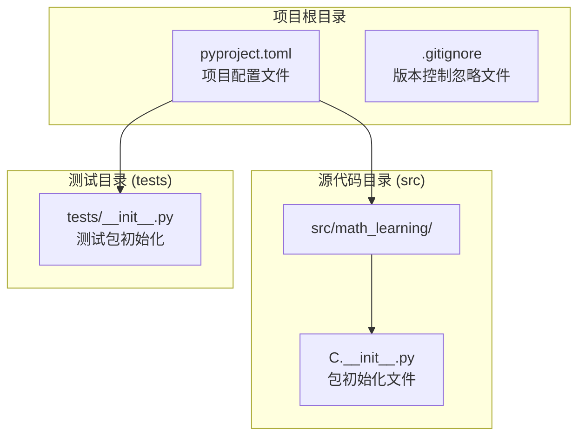
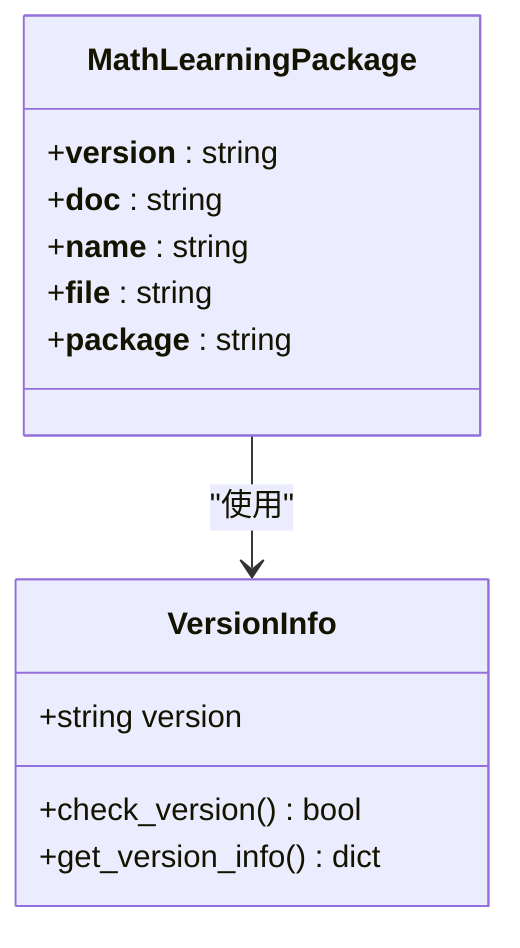
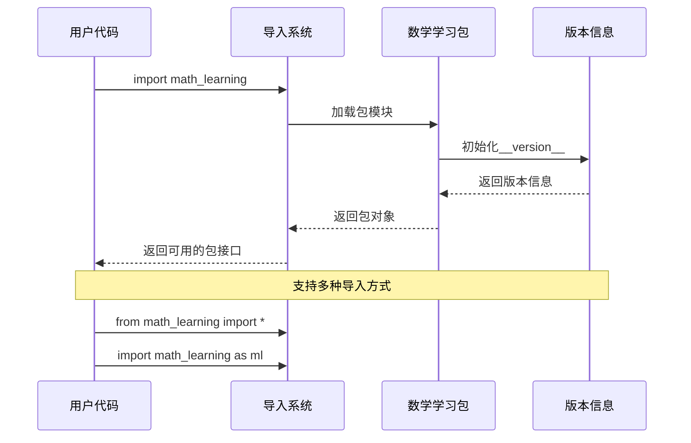
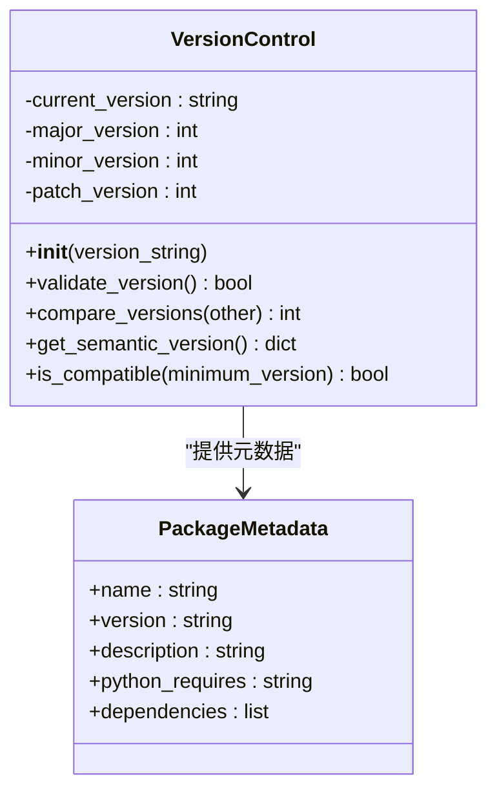
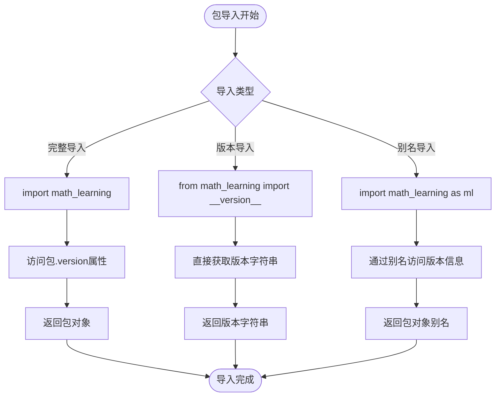
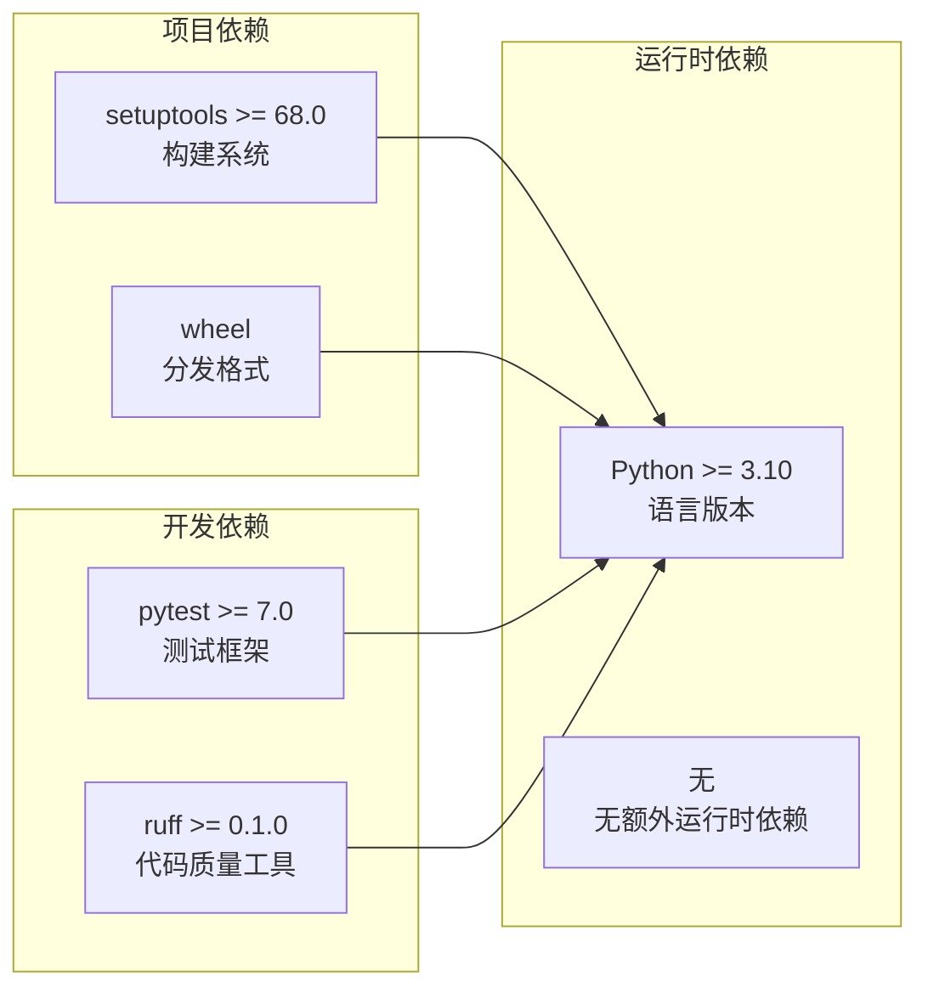

# API参考

<cite>
**本文档引用的文件**
- [src/math_learning/__init__.py](file://src/math_learning/__init__.py)
- [pyproject.toml](file://pyproject.toml)
- [tests/__init__.py](file://tests/__init__.py)
</cite>

## 目录
1. [简介](#简介)
2. [项目结构](#项目结构)
3. [核心组件](#核心组件)
4. [架构概览](#架构概览)
5. [详细组件分析](#详细组件分析)
6. [依赖分析](#依赖分析)
7. [性能考虑](#性能考虑)
8. [故障排除指南](#故障排除指南)
9. [结论](#结论)

## 简介

本项目是一个数学学习工具包，当前版本为0.1.0。该项目采用简洁的包结构设计，专注于提供基础的数学学习功能。项目遵循现代Python包开发标准，使用setuptools作为构建系统，并通过pyproject.toml进行配置管理。

## 项目结构

数学学习项目采用扁平化的包结构，主要包含以下核心文件：



**图表来源**
- [pyproject.toml:1-24](file://pyproject.toml#L1-L24)
- [src/math_learning/__init__.py:1-4](file://src/math_learning/__init__.py#L1-L4)
- [tests/__init__.py:1-2](file://tests/__init__.py#L1-L2)

**章节来源**
- [pyproject.toml:1-24](file://pyproject.toml#L1-L24)
- [src/math_learning/__init__.py:1-4](file://src/math_learning/__init__.py#L1-L4)
- [tests/__init__.py:1-2](file://tests/__init__.py#L1-L2)

## 核心组件

### 包版本管理

项目实现了标准的版本管理机制，通过`__version__`变量提供版本信息：



**图表来源**
- [src/math_learning/__init__.py:1-4](file://src/math_learning/__init__.py#L1-L4)

当前版本信息：
- 版本号：0.1.0
- Python要求：≥3.10
- 包名称：math-learning

**章节来源**
- [src/math_learning/__init__.py:1-4](file://src/math_learning/__init__.py#L1-L4)
- [pyproject.toml:5-10](file://pyproject.toml#L5-L10)

### 导入机制

项目支持标准的Python包导入方式，提供灵活的导入选项：



**图表来源**
- [src/math_learning/__init__.py:1-4](file://src/math_learning/__init__.py#L1-L4)

## 架构概览

数学学习项目的架构设计遵循Python包的标准约定，采用最小化设计原则：

```mermaid
graph TB
subgraph "用户层"
A[应用程序]
B[脚本文件]
C[Jupyter Notebook]
end
subgraph "包层"
D[math_learning]
E[__version__ = "0.1.0"]
F[包文档字符串]
end
subgraph "配置层"
G[pyproject.toml]
H[setuptools配置]
I[构建系统]
end
subgraph "基础设施"
J[Python 3.10+]
K[虚拟环境]
L[包索引]
end
A --> D
B --> D
C --> D
D --> E
D --> F
G --> H
H --> I
I --> J
J --> K
K --> L
```

**图表来源**
- [pyproject.toml:1-24](file://pyproject.toml#L1-L24)
- [src/math_learning/__init__.py:1-4](file://src/math_learning/__init__.py#L1-L4)

## 详细组件分析

### 包初始化组件

#### 版本控制组件

版本控制系统是包的核心组件，负责维护和提供版本信息：



**图表来源**
- [src/math_learning/__init__.py:1-4](file://src/math_learning/__init__.py#L1-L4)
- [pyproject.toml:5-10](file://pyproject.toml#L5-L10)

#### 导入行为分析

包的导入行为遵循Python的标准约定：

| 导入方式 | 使用场景 | 返回对象 |
|---------|----------|----------|
| `import math_learning` | 基础导入 | 包对象，可通过属性访问 |
| `from math_learning import __version__` | 版本检查 | 字符串版本号 |
| `import math_learning as ml` | 别名导入 | 包对象（别名） |
| `from math_learning import *` | 全部导入 | 可能不可用（当前包为空） |

**章节来源**
- [src/math_learning/__init__.py:1-4](file://src/math_learning/__init__.py#L1-L4)

### 功能接口设计

当前版本的包接口非常简洁，主要提供版本信息访问：



**图表来源**
- [src/math_learning/__init__.py:1-4](file://src/math_learning/__init__.py#L1-L4)

## 依赖分析

### 外部依赖

项目采用极简的依赖策略：



**图表来源**
- [pyproject.toml:1-16](file://pyproject.toml#L1-L16)

### 内部依赖关系

当前包内部没有复杂的依赖关系：

```mermaid
graph TB
subgraph "包结构"
A[math_learning]
B[__init__.py]
C[__version__ = "0.1.0"]
end
A --> B
B --> C
```

**图表来源**
- [src/math_learning/__init__.py:1-4](file://src/math_learning/__init__.py#L1-L4)

**章节来源**
- [pyproject.toml:1-24](file://pyproject.toml#L1-L24)

## 性能考虑

由于当前包非常轻量级，性能特性相对简单：

### 内存使用
- 包初始化开销极小
- 版本字符串常驻内存
- 无动态模块加载

### 导入时间
- 导入延迟极短
- 无网络请求
- 无外部服务依赖

### 扩展性考虑
- 当前包为空，适合添加功能模块
- 支持渐进式功能扩展
- 保持向后兼容性

## 故障排除指南

### 常见问题及解决方案

#### 版本不兼容问题
**问题描述**：在旧版本Python中导入失败
**解决方案**：确保使用Python 3.10或更高版本

#### 导入错误
**问题描述**：无法找到包模块
**解决方案**：
1. 确保包已正确安装
2. 检查PYTHONPATH设置
3. 验证包目录结构

#### 版本检查失败
**问题描述**：版本信息获取异常
**解决方案**：
1. 检查包是否正确安装
2. 验证__version__变量是否存在
3. 确认包权限设置正确

**章节来源**
- [pyproject.toml:9](file://pyproject.toml#L9)
- [src/math_learning/__init__.py:3](file://src/math_learning/__init__.py#L3)

## 结论

数学学习项目目前是一个轻量级的包，专注于提供基础的版本管理和导入接口。其设计体现了Python包开发的最佳实践：

### 设计优势
- **简洁性**：最小化实现，易于理解和维护
- **标准化**：遵循Python包开发标准
- **可扩展性**：为未来功能扩展预留空间
- **兼容性**：明确的Python版本要求

### 发展建议
1. **功能扩展**：逐步添加数学学习相关功能模块
2. **文档完善**：增加详细的API文档和使用示例
3. **测试覆盖**：建立全面的测试套件
4. **性能优化**：随着功能增长考虑性能优化

### 最佳实践
- 遵循PEP 8编码规范
- 保持向后兼容性
- 提供清晰的错误信息
- 定期更新版本号
- 维护完整的变更日志

该包为数学学习应用提供了一个稳定的基础框架，开发者可以在此基础上构建更复杂的功能模块。