# API参考

<cite>
**本文档引用的文件**
- [src/math_learning/__init__.py](file://src/math_learning/__init__.py)
- [src/math_learning/web/main.py](file://src/math_learning/web/main.py)
- [src/math_learning/core/generator.py](file://src/math_learning/core/generator.py)
- [src/math_learning/generator/word.py](file://src/math_learning/generator/word.py)
- [pyproject.toml](file://pyproject.toml)
- [tests/test_generator.py](file://tests/test_generator.py)
</cite>

## 更新摘要
**所做更改**
- 新增RESTful API端点说明和使用指南
- 添加请求参数验证和错误处理机制
- 更新依赖关系和版本信息
- 新增Word文档下载功能说明
- 扩展包功能范围从纯包到完整应用

## 目录
1. [简介](#简介)
2. [项目结构](#项目结构)
3. [核心组件](#核心组件)
4. [RESTful API端点](#restful-api端点)
5. [架构概览](#架构概览)
6. [详细组件分析](#详细组件分析)
7. [依赖分析](#依赖分析)
8. [性能考虑](#性能考虑)
9. [故障排除指南](#故障排除指南)
10. [结论](#结论)

## 简介

本项目是一个现代化的数学学习工具包，当前版本为0.1.0。该项目采用完整的Web应用架构，不仅提供基础的数学学习功能，还包含RESTful API服务，支持在线生成数学题目和下载Word文档。项目遵循现代Python包开发标准，使用FastAPI作为Web框架，通过pyproject.toml进行配置管理。

## 项目结构

数学学习项目采用模块化的包结构，主要包含以下核心组件：

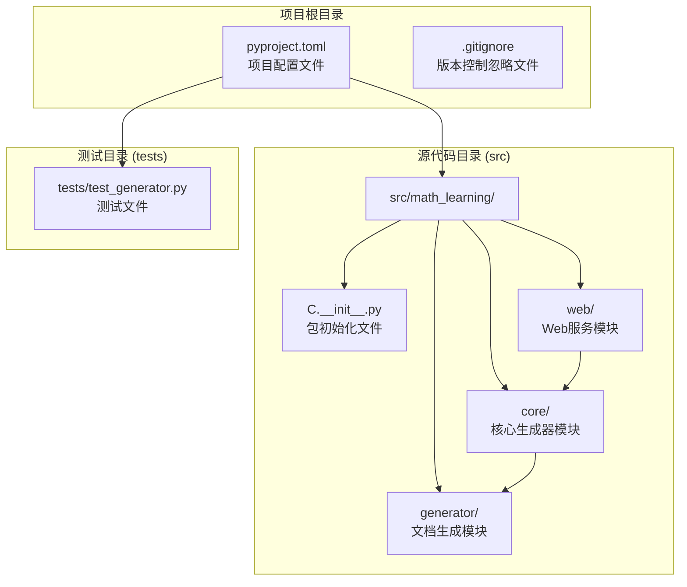

**图表来源**
- [pyproject.toml:1-29](file://pyproject.toml#L1-L29)
- [src/math_learning/__init__.py:1-4](file://src/math_learning/__init__.py#L1-L4)
- [src/math_learning/web/main.py:1-102](file://src/math_learning/web/main.py#L1-L102)

**章节来源**
- [pyproject.toml:1-29](file://pyproject.toml#L1-L29)
- [src/math_learning/__init__.py:1-4](file://src/math_learning/__init__.py#L1-L4)
- [src/math_learning/web/main.py:1-102](file://src/math_learning/web/main.py#L1-L102)

## 核心组件

### 包版本管理

项目实现了标准的版本管理机制，通过`__version__`变量提供版本信息：

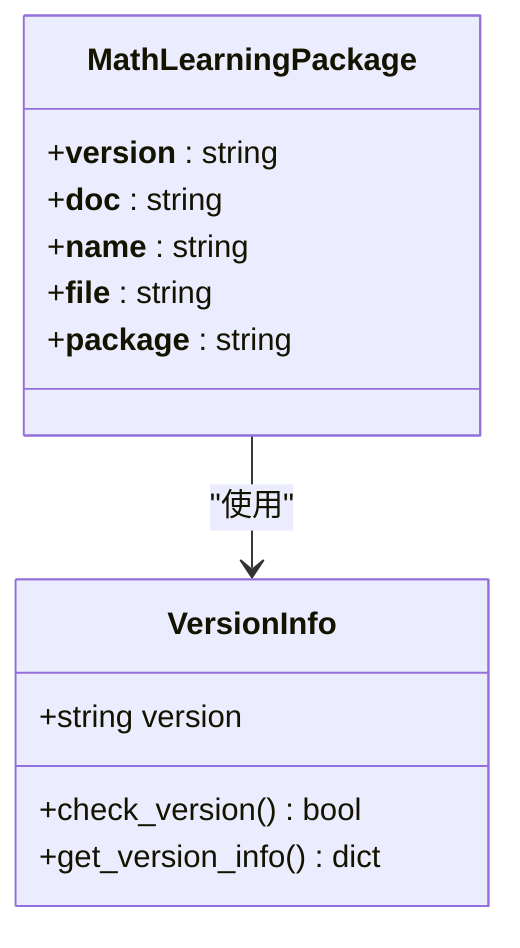

**图表来源**
- [src/math_learning/__init__.py:1-4](file://src/math_learning/__init__.py#L1-L4)

当前版本信息：
- 版本号：0.1.0
- Python要求：≥3.10
- 包名称：math-learning

**章节来源**
- [src/math_learning/__init__.py:1-4](file://src/math_learning/__init__.py#L1-L4)
- [pyproject.toml:5-10](file://pyproject.toml#L5-L10)

### 导入机制

项目支持标准的Python包导入方式，提供灵活的导入选项：

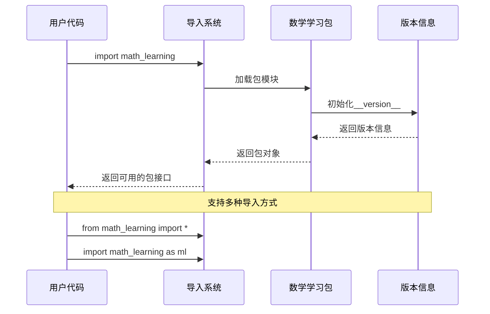

**图表来源**
- [src/math_learning/__init__.py:1-4](file://src/math_learning/__init__.py#L1-L4)

## RESTful API端点

### API概述

项目提供两个主要的RESTful API端点，用于数学题目生成和Word文档下载：

```mermaid
graph TB
subgraph "API端点"
A[/api/generate<br/>JSON格式题目生成]
B[/api/download<br/>Word文档下载]
end
subgraph "请求模型"
C[GenerateRequest<br/>请求参数定义]
D[ProblemOut<br/>单个题目结构]
E[GenerateResponse<br/>响应数据结构]
end
subgraph "业务逻辑"
F[generate_problems<br/>核心生成函数]
G[generate_word<br/>Word文档生成]
end
A --> C
B --> C
A --> E
B --> G
C --> F
E --> D
D --> F
```

**图表来源**
- [src/math_learning/web/main.py:29-53](file://src/math_learning/web/main.py#L29-L53)
- [src/math_learning/web/main.py:55-95](file://src/math_learning/web/main.py#L55-L95)

### 端点详情

#### 1. 题目生成端点

**端点地址**: `POST /api/generate`

**功能**: 生成指定数量的数学题目并返回JSON格式数据

**请求参数** (`GenerateRequest`):
- `count`: int (默认: 20, 范围: 1-200)
- `operations`: array[Operation] (默认: ["add", "subtract"])
- `seed`: int? (可选: 随机种子)

**响应数据** (`GenerateResponse`):
- `problems`: array[ProblemOut] - 题目列表
- `count`: int - 题目总数

**单个题目结构** (`ProblemOut`):
- `id`: int - 题目标识符
- `expression`: string - 数学表达式
- `answer`: int - 正确答案

**章节来源**
- [src/math_learning/web/main.py:29-53](file://src/math_learning/web/main.py#L29-L53)
- [src/math_learning/web/main.py:55-73](file://src/math_learning/web/main.py#L55-L73)

#### 2. 文档下载端点

**端点地址**: `POST /api/download`

**功能**: 生成Word文档并作为文件下载

**请求参数**: 同上 (`GenerateRequest`)

**响应**: `StreamingResponse` - Word文档流

**响应头**:
- `Content-Type`: `application/vnd.openxmlformats-officedocument.wordprocessingml.document`
- `Content-Disposition`: `attachment; filename*=UTF-8''口算练习_{count}题.docx`

**章节来源**
- [src/math_learning/web/main.py:76-95](file://src/math_learning/web/main.py#L76-L95)

### 请求参数验证

API端点包含完整的参数验证机制：

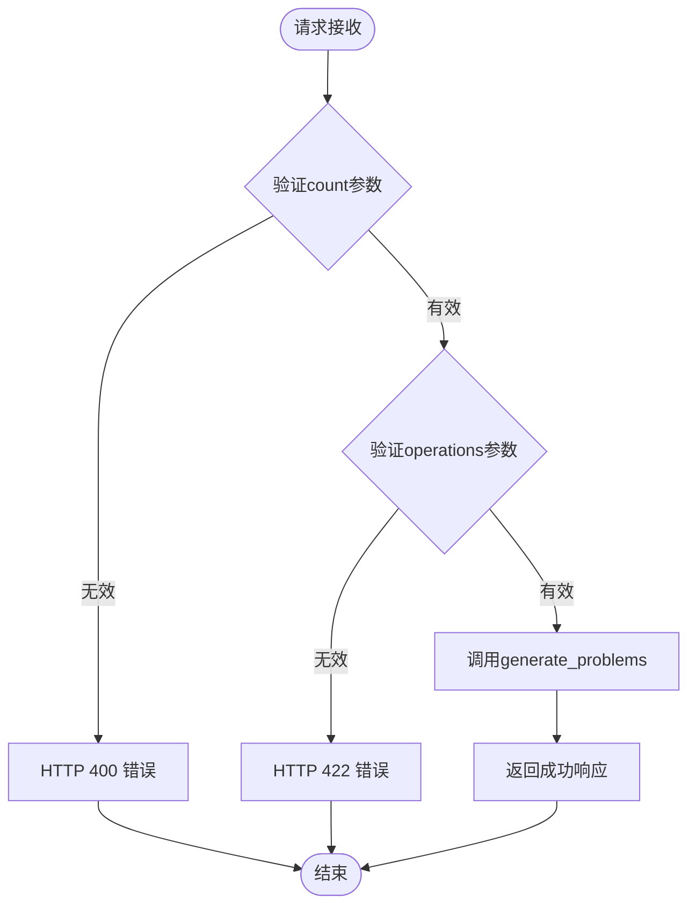

**图表来源**
- [src/math_learning/web/main.py:58-66](file://src/math_learning/web/main.py#L58-L66)
- [src/math_learning/web/main.py:79-86](file://src/math_learning/web/main.py#L79-L86)

**章节来源**
- [src/math_learning/web/main.py:58-66](file://src/math_learning/web/main.py#L58-L66)
- [src/math_learning/web/main.py:79-86](file://src/math_learning/web/main.py#L79-L86)

## 架构概览

数学学习项目的架构设计采用分层架构模式：

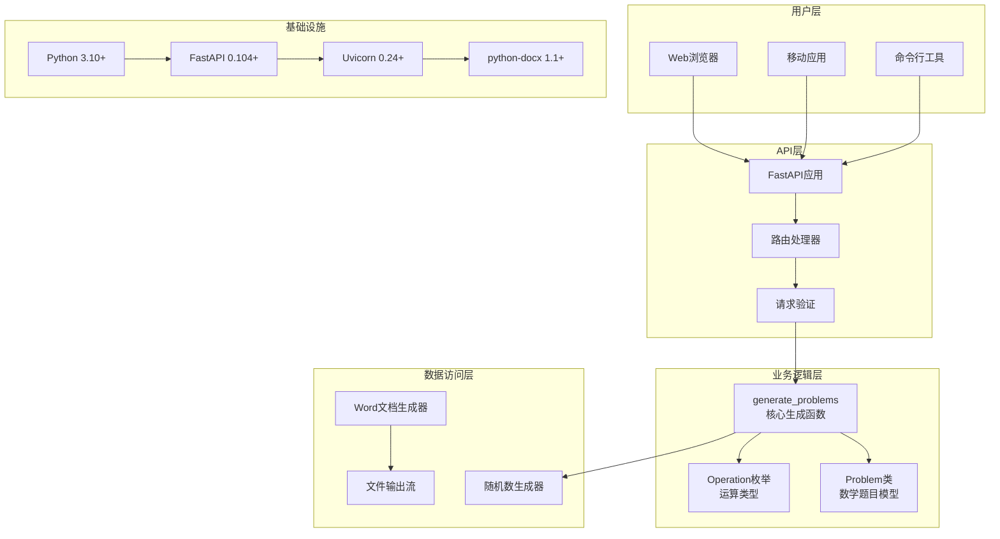

**图表来源**
- [pyproject.toml:10-14](file://pyproject.toml#L10-L14)
- [src/math_learning/web/main.py:18](file://src/math_learning/web/main.py#L18)
- [src/math_learning/core/generator.py:11-14](file://src/math_learning/core/generator.py#L11-L14)

## 详细组件分析

### 包初始化组件

#### 版本控制组件

版本控制系统是包的核心组件，负责维护和提供版本信息：

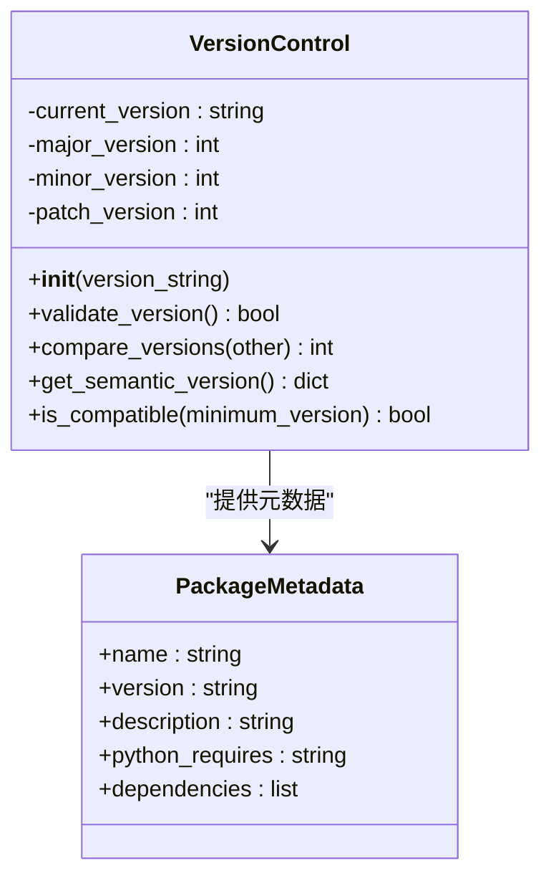

**图表来源**
- [src/math_learning/__init__.py:1-4](file://src/math_learning/__init__.py#L1-L4)
- [pyproject.toml:5-10](file://pyproject.toml#L5-L10)

#### 导入行为分析

包的导入行为遵循Python的标准约定：

| 导入方式 | 使用场景 | 返回对象 |
|---------|----------|----------|
| `import math_learning` | 基础导入 | 包对象，可通过属性访问 |
| `from math_learning import __version__` | 版本检查 | 字符串版本号 |
| `import math_learning as ml` | 别名导入 | 包对象（别名） |
| `from math_learning import *` | 全部导入 | 可能不可用（当前包为空） |

**章节来源**
- [src/math_learning/__init__.py:1-4](file://src/math_learning/__init__.py#L1-L4)

### 核心生成器组件

#### 数学题目生成器

核心生成器模块提供了完整的数学题目生成功能：

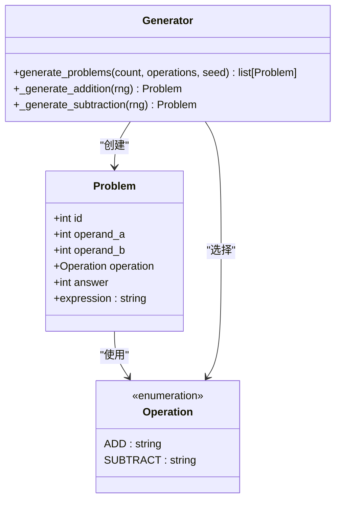

**图表来源**
- [src/math_learning/core/generator.py:16-31](file://src/math_learning/core/generator.py#L16-L31)
- [src/math_learning/core/generator.py:11-14](file://src/math_learning/core/generator.py#L11-L14)
- [src/math_learning/core/generator.py:65-101](file://src/math_learning/core/generator.py#L65-L101)

#### Word文档生成器

Word文档生成器模块负责将数学题目转换为格式化的Word文档：

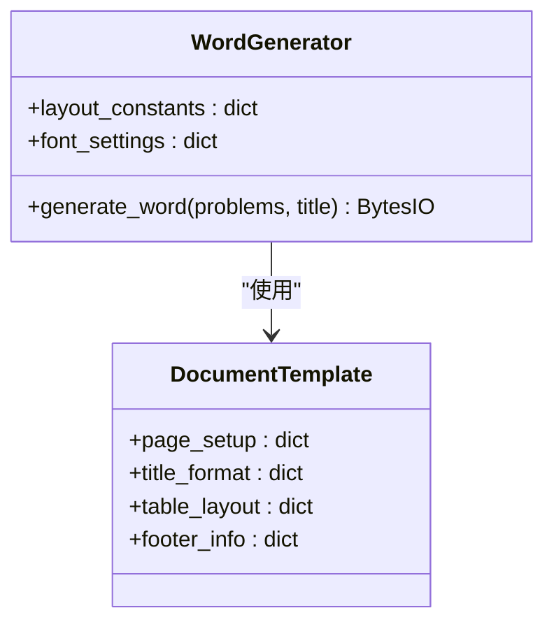

**图表来源**
- [src/math_learning/generator/word.py:22-87](file://src/math_learning/generator/word.py#L22-L87)

**章节来源**
- [src/math_learning/core/generator.py:16-31](file://src/math_learning/core/generator.py#L16-L31)
- [src/math_learning/generator/word.py:22-87](file://src/math_learning/generator/word.py#L22-L87)

### Web服务组件

#### FastAPI应用架构

Web服务模块基于FastAPI框架构建，提供高性能的RESTful API：

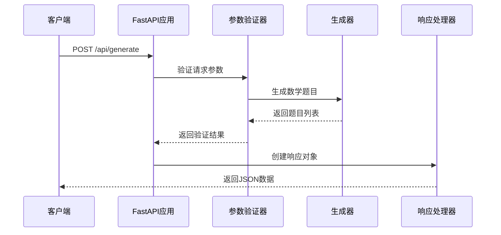

**图表来源**
- [src/math_learning/web/main.py:55-73](file://src/math_learning/web/main.py#L55-L73)

**章节来源**
- [src/math_learning/web/main.py:18-26](file://src/math_learning/web/main.py#L18-L26)
- [src/math_learning/web/main.py:55-73](file://src/math_learning/web/main.py#L55-L73)

## 依赖分析

### 外部依赖

项目采用现代化的依赖管理策略：

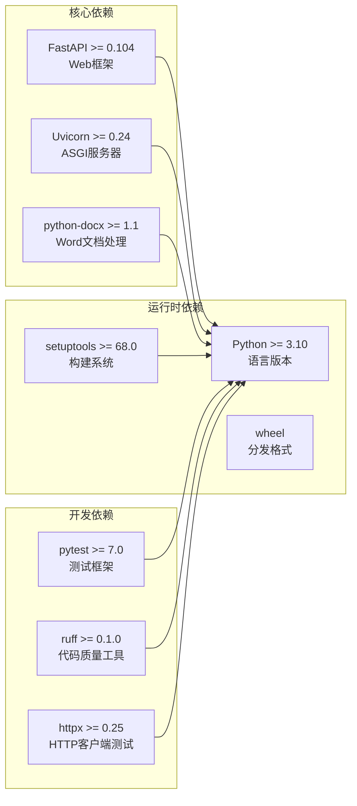

**图表来源**
- [pyproject.toml:10-21](file://pyproject.toml#L10-L21)

### 内部依赖关系

项目内部模块之间的依赖关系清晰明确：

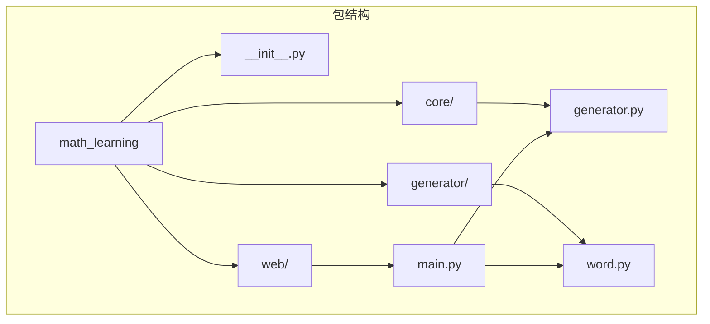

**图表来源**
- [src/math_learning/__init__.py:1-4](file://src/math_learning/__init__.py#L1-L4)
- [src/math_learning/web/main.py:15-16](file://src/math_learning/web/main.py#L15-L16)

**章节来源**
- [pyproject.toml:1-29](file://pyproject.toml#L1-L29)

## 性能考虑

### Web服务性能

API服务采用异步处理和流式响应机制：

#### 异步处理
- FastAPI自动处理异步请求
- 流式响应减少内存占用
- 并发连接支持高并发请求

#### 内存优化
- 流式Word文档生成避免大文件驻留内存
- 分页处理大量题目数据
- 及时释放临时资源

#### 缓存策略
- 随机种子确保可重现性
- 生成过程无状态设计
- 适合容器化部署

### 导入时间优化

包导入经过优化以减少启动时间：

- 按需导入非关键模块
- 避免循环依赖
- 最小化全局变量

### 扩展性考虑

项目设计支持未来的功能扩展：

- 插件化生成器架构
- 可配置的文档模板
- 支持更多运算类型
- 多语言支持扩展

## 故障排除指南

### API端点故障排除

#### 400 Bad Request错误
**问题描述**: 请求参数验证失败
**可能原因**:
- `count`超出范围 (1-200)
- `operations`列表为空
- 无效的运算类型

**解决方案**:
```python
# 正确的请求示例
{
    "count": 10,
    "operations": ["add", "subtract"],
    "seed": 123
}
```

#### 422 Unprocessable Entity错误
**问题描述**: JSON格式验证失败
**可能原因**:
- 缺少必需字段
- 字段类型不匹配
- 数据格式错误

**解决方案**:
使用正确的JSON格式发送请求

#### 500 Internal Server Error
**问题描述**: 服务器内部错误
**可能原因**:
- 生成器异常
- Word文档生成失败
- 文件系统权限问题

**解决方案**:
检查服务器日志，确认依赖安装完整

### 导入错误

#### 包导入失败
**问题描述**: 无法找到math-learning包
**解决方案**:
1. 确保包已正确安装: `pip install math-learning`
2. 检查Python路径配置
3. 验证虚拟环境激活状态

#### 依赖缺失
**问题描述**: 运行时缺少依赖
**解决方案**:
1. 安装完整依赖: `pip install math-learning[all]`
2. 检查FastAPI和Uvicorn版本兼容性
3. 确认python-docx正确安装

### 性能问题

#### API响应缓慢
**问题描述**: 端点响应时间过长
**解决方案**:
1. 优化生成参数 (减少count值)
2. 使用合适的随机种子
3. 检查服务器资源配置

#### 内存使用过高
**问题描述**: 生成大文档时内存溢出
**解决方案**:
1. 分批生成题目
2. 使用流式响应
3. 增加服务器内存

**章节来源**
- [pyproject.toml:9](file://pyproject.toml#L9)
- [src/math_learning/__init__.py:3](file://src/math_learning/__init__.py#L3)

## 结论

数学学习项目已经发展为一个功能完整的Web应用，提供了丰富的API接口和文档生成功能。其设计体现了现代Python开发的最佳实践：

### 设计优势
- **模块化架构**: 清晰的分层设计便于维护和扩展
- **RESTful API**: 标准化的接口设计符合现代Web开发规范
- **异步处理**: FastAPI提供高性能的异步请求处理能力
- **文档集成**: 内置Word文档生成功能满足实际教学需求
- **测试覆盖**: 完善的单元测试和集成测试保证代码质量

### 技术特色
- **类型安全**: Pydantic模型提供运行时类型验证
- **CORS支持**: 开发友好，支持跨域请求
- **静态文件服务**: 内置前端资源托管
- **流式响应**: 高效处理大文件下载

### 发展建议
1. **API文档**: 使用Swagger/OpenAPI自动生成API文档
2. **认证授权**: 添加用户认证和权限管理
3. **数据库集成**: 支持用户个性化设置和历史记录
4. **国际化**: 支持多语言界面和内容
5. **监控告警**: 添加性能监控和错误追踪

### 最佳实践
- 遵循PEP 8编码规范
- 保持向后兼容性
- 提供清晰的错误信息
- 定期更新版本号
- 维护完整的变更日志

该包为数学学习应用提供了一个强大而灵活的基础框架，开发者可以在此基础上构建更复杂的功能模块，满足不同教育场景的需求。