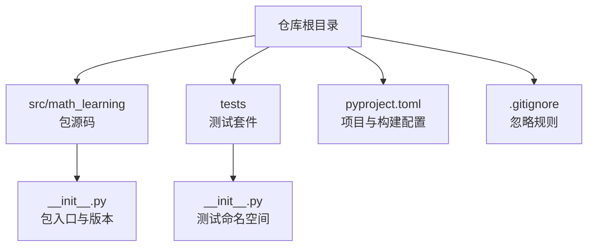
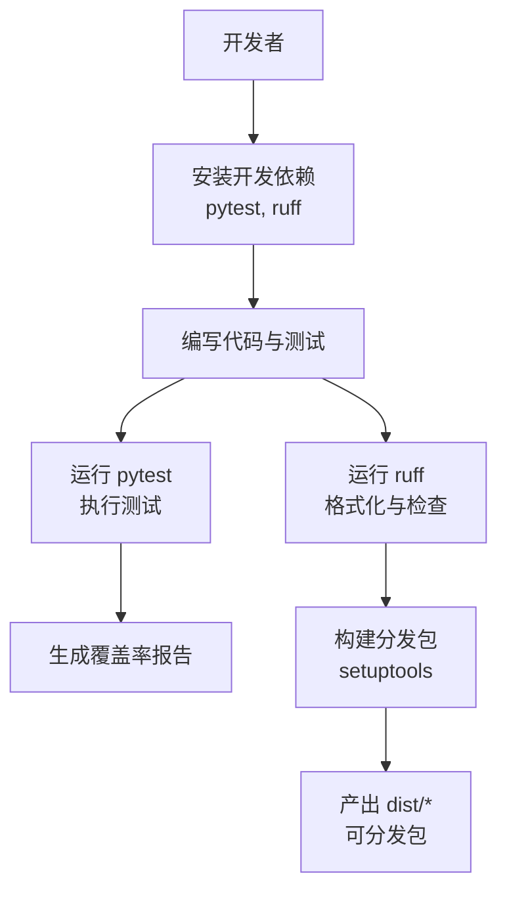
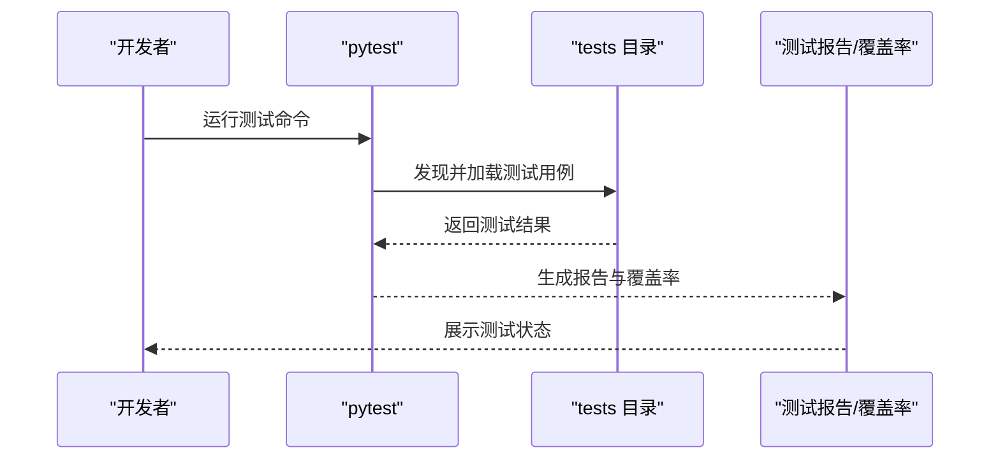
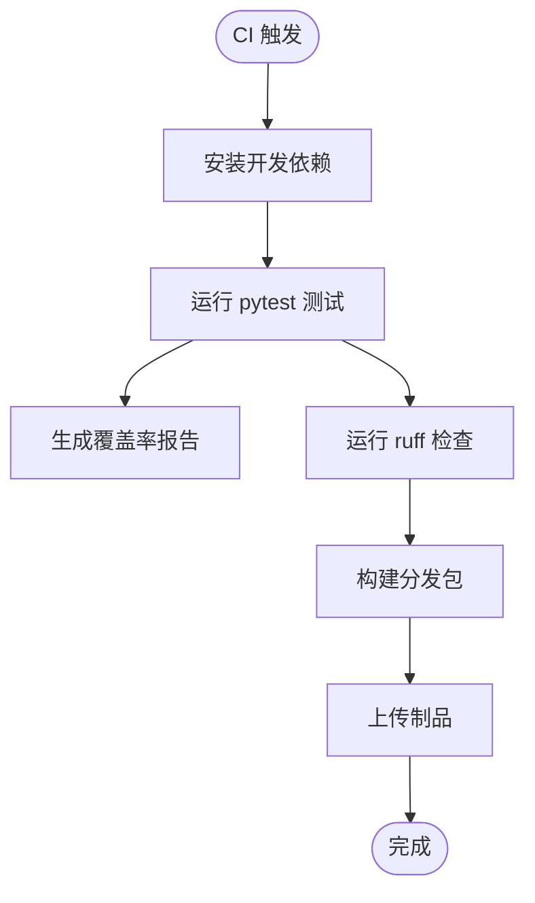
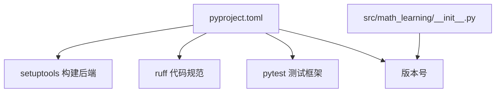

# 开发指南

<cite>
**本文引用的文件**
- [pyproject.toml](file://pyproject.toml)
- [src/math_learning/__init__.py](file://src/math_learning/__init__.py)
- [.gitignore](file://.gitignore)
- [tests/__init__.py](file://tests/__init__.py)
</cite>

## 目录
1. [简介](#简介)
2. [项目结构](#项目结构)
3. [核心组件](#核心组件)
4. [架构总览](#架构总览)
5. [详细组件分析](#详细组件分析)
6. [依赖分析](#依赖分析)
7. [性能考虑](#性能考虑)
8. [故障排查指南](#故障排查指南)
9. [结论](#结论)
10. [附录](#附录)

## 简介
本指南面向数学学习项目的开发者，提供从包开发到发布的全流程实践，覆盖包开发流程、测试编写方法、代码规范与版本管理策略。当前仓库已具备基础的项目配置（pyproject.toml）、包入口（src/math_learning/__init__.py）以及测试目录（tests），并配置了 pytest 和 ruff 的开发依赖与基本规则。本文将基于现有配置，给出可操作的开发步骤、最佳实践与扩展建议。

## 项目结构
项目采用标准的 Python 包布局，源码位于 src/math_learning，测试位于 tests，构建与发布通过 setuptools 后端在 pyproject.toml 中定义。.gitignore 已屏蔽常见构建产物、虚拟环境与 IDE 缓存，便于保持仓库整洁。

图表来源
- [pyproject.toml:1-24](file://pyproject.toml#L1-L24)
- [src/math_learning/__init__.py:1-4](file://src/math_learning/__init__.py#L1-L4)
- [tests/__init__.py:1-2](file://tests/__init__.py#L1-L2)
- [.gitignore:1-34](file://.gitignore#L1-L34)

章节来源
- [pyproject.toml:1-24](file://pyproject.toml#L1-L24)
- [src/math_learning/__init__.py:1-4](file://src/math_learning/__init__.py#L1-L4)
- [tests/__init__.py:1-2](file://tests/__init__.py#L1-L2)
- [.gitignore:1-34](file://.gitignore#L1-L34)

## 核心组件
- 包入口与版本
  - 包入口文件包含包级文档字符串与版本号，用于标识包版本。
  - 版本号与项目元数据一致，便于发布与依赖解析。
- 构建与打包配置
  - 使用 setuptools 构建后端，指定源码目录为 src，并声明 Python 版本要求。
  - 可选开发依赖包含 pytest 与 ruff，分别用于测试与代码格式化。
- 测试框架
  - tests 目录作为测试命名空间，pytest 将自动发现该目录下的测试用例。
- 忽略规则
  - .gitignore 屏蔽构建产物、虚拟环境与缓存，避免污染版本库。

章节来源
- [src/math_learning/__init__.py:1-4](file://src/math_learning/__init__.py#L1-L4)
- [pyproject.toml:1-24](file://pyproject.toml#L1-L24)
- [tests/__init__.py:1-2](file://tests/__init__.py#L1-L2)
- [.gitignore:1-34](file://.gitignore#L1-L34)

## 架构总览
下图展示从开发到发布的整体流程：开发者在本地安装开发依赖，编写代码与测试；通过 pytest 运行测试并生成覆盖率报告；使用 ruff 格式化与检查代码风格；最终通过 setuptools 构建分发包。

图表来源
- [pyproject.toml:12-16](file://pyproject.toml#L12-L16)
- [pyproject.toml:18-23](file://pyproject.toml#L18-L23)

## 详细组件分析

### 包开发流程
- 初始化与依赖安装
  - 在虚拟环境中安装开发依赖，确保工具链与项目版本兼容。
  - 参考路径：[pyproject.toml:12-16](file://pyproject.toml#L12-L16)
- 源码组织
  - 将新增功能模块放入 src/math_learning 下，遵循 Python 包规范。
  - 更新包入口以导出新模块或更新版本号。
  - 参考路径：[src/math_learning/__init__.py:1-4](file://src/math_learning/__init__.py#L1-L4)
- 构建与验证
  - 使用 setuptools 构建命令生成分发包，验证包内容与元数据。
  - 参考路径：[pyproject.toml:1-3](file://pyproject.toml#L1-L3), [pyproject.toml:18-19](file://pyproject.toml#L18-L19)

章节来源
- [pyproject.toml:1-3](file://pyproject.toml#L1-L3)
- [pyproject.toml:12-16](file://pyproject.toml#L12-L16)
- [pyproject.toml:18-19](file://pyproject.toml#L18-L19)
- [src/math_learning/__init__.py:1-4](file://src/math_learning/__init__.py#L1-L4)

### 测试编写方法
- 测试发现与命名空间
  - tests 目录作为测试命名空间，pytest 将自动发现该目录下的测试用例。
  - 参考路径：[tests/__init__.py:1-2](file://tests/__init__.py#L1-L2)
- 基本测试流程
  - 在 tests 目录下新增测试文件，编写测试函数与断言。
  - 使用 pytest 运行测试，查看结果与覆盖率。
  - 参考路径：[pyproject.toml:12-16](file://pyproject.toml#L12-L16)
- 覆盖率与缓存
  - .gitignore 已屏蔽 .pytest_cache 与覆盖率相关目录，避免提交缓存。
  - 参考路径：[.gitignore:27-30](file://.gitignore#L27-L30)

图表来源
- [pyproject.toml:12-16](file://pyproject.toml#L12-L16)
- [tests/__init__.py:1-2](file://tests/__init__.py#L1-L2)
- [.gitignore:27-30](file://.gitignore#L27-L30)

章节来源
- [tests/__init__.py:1-2](file://tests/__init__.py#L1-L2)
- [pyproject.toml:12-16](file://pyproject.toml#L12-L16)
- [.gitignore:27-30](file://.gitignore#L27-L30)

### 代码规范与格式化
- ruff 配置
  - 行长度与目标 Python 版本在 pyproject.toml 中定义，确保团队统一风格。
  - 参考路径：[pyproject.toml:21-23](file://pyproject.toml#L21-L23)
- 忽略缓存
  - .gitignore 屏蔽 .ruff_cache，避免缓存进入版本控制。
  - 参考路径：[.gitignore:32-33](file://.gitignore#L32-L33)
- 建议实践
  - 在 CI 中启用 ruff 检查，保证提交质量。
  - 结合 pytest 的失败即停止选项，提升反馈效率。

章节来源
- [pyproject.toml:21-23](file://pyproject.toml#L21-L23)
- [.gitignore:32-33](file://.gitignore#L32-L33)

### 版本管理策略
- 版本同步
  - 包入口与项目元数据中的版本需保持一致，避免发布不一致。
  - 参考路径：[src/math_learning/__init__.py:3](file://src/math_learning/__init__.py#L3), [pyproject.toml:6-7](file://pyproject.toml#L6-L7)
- 发布前检查
  - 确认测试全部通过、覆盖率达标、ruff 无严重问题。
  - 参考路径：[pyproject.toml:12-16](file://pyproject.toml#L12-L16), [pyproject.toml:21-23](file://pyproject.toml#L21-L23)

章节来源
- [src/math_learning/__init__.py:3](file://src/math_learning/__init__.py#L3)
- [pyproject.toml:6-7](file://pyproject.toml#L6-L7)
- [pyproject.toml:12-16](file://pyproject.toml#L12-L16)
- [pyproject.toml:21-23](file://pyproject.toml#L21-L23)

### 扩展包功能示例
- 新增模块
  - 在 src/math_learning 下创建新模块文件，按需在包入口导出。
  - 更新版本号与变更记录，确保发布信息完整。
  - 参考路径：[src/math_learning/__init__.py:1-4](file://src/math_learning/__init__.py#L1-L4)
- 编写测试
  - 在 tests 目录下新增对应测试文件，覆盖新增功能。
  - 使用 pytest 运行并检查覆盖率。
  - 参考路径：[tests/__init__.py:1-2](file://tests/__init__.py#L1-L2), [pyproject.toml:12-16](file://pyproject.toml#L12-L16)
- 规范与检查
  - 使用 ruff 格式化与检查，修复警告后再次运行测试。
  - 参考路径：[pyproject.toml:21-23](file://pyproject.toml#L21-L23), [.gitignore:32-33](file://.gitignore#L32-L33)

章节来源
- [src/math_learning/__init__.py:1-4](file://src/math_learning/__init__.py#L1-L4)
- [tests/__init__.py:1-2](file://tests/__init__.py#L1-L2)
- [pyproject.toml:12-16](file://pyproject.toml#L12-L16)
- [pyproject.toml:21-23](file://pyproject.toml#L21-L23)
- [.gitignore:32-33](file://.gitignore#L32-L33)

### 代码审查流程
- 提交前自检
  - 运行 pytest 全量测试，确保所有用例通过。
  - 运行 ruff 检查，修正风格问题。
  - 参考路径：[pyproject.toml:12-16](file://pyproject.toml#L12-L16), [pyproject.toml:21-23](file://pyproject.toml#L21-L23)
- 审查要点
  - 功能正确性、边界条件、异常处理。
  - 代码可读性、注释与文档字符串完整性。
  - 性能与资源使用是否合理。
- 审查后合并
  - 修复审查意见后重新检查，确保问题闭环。

章节来源
- [pyproject.toml:12-16](file://pyproject.toml#L12-L16)
- [pyproject.toml:21-23](file://pyproject.toml#L21-L23)

### 持续集成配置
- 建议流水线步骤
  - 安装依赖：使用 pip 安装开发依赖。
  - 运行测试：执行 pytest 并生成覆盖率报告。
  - 代码检查：运行 ruff 格式化与静态检查。
  - 构建分发：使用 setuptools 构建 wheel/sdist。
  - 上传制品：将 dist/* 上传至发布平台或制品库。
- 关键配置参考
  - 开发依赖与工具配置：[pyproject.toml:12-16](file://pyproject.toml#L12-L16), [pyproject.toml:21-23](file://pyproject.toml#L21-L23)
  - 源码目录与构建后端：[pyproject.toml:1-3](file://pyproject.toml#L1-L3), [pyproject.toml:18-19](file://pyproject.toml#L18-L19)

图表来源
- [pyproject.toml:12-16](file://pyproject.toml#L12-L16)
- [pyproject.toml:18-19](file://pyproject.toml#L18-L19)
- [pyproject.toml:21-23](file://pyproject.toml#L21-L23)

章节来源
- [pyproject.toml:12-16](file://pyproject.toml#L12-L16)
- [pyproject.toml:18-19](file://pyproject.toml#L18-L19)
- [pyproject.toml:21-23](file://pyproject.toml#L21-L23)

### 发布准备工作
- 内容核对
  - 确认版本号、变更日志与文档齐备。
  - 确保测试与检查均通过，覆盖率达标。
- 分发准备
  - 清理构建产物与缓存，仅保留 dist/*。
  - 参考路径：[pyproject.toml:1-3](file://pyproject.toml#L1-L3), [.gitignore:6-10](file://.gitignore#L6-L10)
- 发布渠道
  - 选择合适的发布渠道（如私有/公共索引），上传构建产物并更新索引。

章节来源
- [pyproject.toml:1-3](file://pyproject.toml#L1-L3)
- [pyproject.toml:6-7](file://pyproject.toml#L6-L7)
- [.gitignore:6-10](file://.gitignore#L6-L10)

## 依赖分析
- 组件耦合
  - 包入口与项目元数据耦合，版本需保持一致。
  - 测试与构建工具通过 pyproject.toml 解耦，便于统一管理。
- 外部依赖
  - setuptools 作为构建后端，ruff 与 pytest 作为开发工具。
- 潜在风险
  - 版本不一致导致发布错误。
  - 忽略缓存与构建产物可能影响 CI 一致性。

图表来源
- [pyproject.toml:1-3](file://pyproject.toml#L1-L3)
- [pyproject.toml:12-16](file://pyproject.toml#L12-L16)
- [pyproject.toml:21-23](file://pyproject.toml#L21-L23)
- [src/math_learning/__init__.py:3](file://src/math_learning/__init__.py#L3)

章节来源
- [pyproject.toml:1-3](file://pyproject.toml#L1-L3)
- [pyproject.toml:12-16](file://pyproject.toml#L12-L16)
- [pyproject.toml:21-23](file://pyproject.toml#L21-L23)
- [src/math_learning/__init__.py:3](file://src/math_learning/__init__.py#L3)

## 性能考虑
- 测试性能
  - 使用 pytest 的并行与分片能力（如适用）加速测试执行。
  - 通过覆盖率报告定位热点模块，优化关键路径。
- 代码质量
  - ruff 检查应尽早发现潜在性能问题（如冗余导入、复杂表达式）。
- 构建效率
  - 清理缓存与构建产物，避免重复计算与缓存污染。

## 故障排查指南
- 测试未发现用例
  - 确认测试文件命名与位置符合 pytest 约定，tests 目录为命名空间。
  - 参考路径：[tests/__init__.py:1-2](file://tests/__init__.py#L1-L2)
- 覆盖率缺失
  - 检查 .gitignore 是否屏蔽了覆盖率相关目录，必要时调整忽略规则。
  - 参考路径：[.gitignore:27-30](file://.gitignore#L27-L30)
- 代码风格告警
  - 使用 ruff 修复告警，确认行长度与目标版本设置正确。
  - 参考路径：[pyproject.toml:21-23](file://pyproject.toml#L21-L23), [.gitignore:32-33](file://.gitignore#L32-L33)
- 构建失败
  - 检查 setuptools 后端与源码目录配置，确保 src 正确识别。
  - 参考路径：[pyproject.toml:1-3](file://pyproject.toml#L1-L3), [pyproject.toml:18-19](file://pyproject.toml#L18-L19)

章节来源
- [tests/__init__.py:1-2](file://tests/__init__.py#L1-L2)
- [.gitignore:27-30](file://.gitignore#L27-L30)
- [pyproject.toml:21-23](file://pyproject.toml#L21-L23)
- [.gitignore:32-33](file://.gitignore#L32-L33)
- [pyproject.toml:1-3](file://pyproject.toml#L1-L3)
- [pyproject.toml:18-19](file://pyproject.toml#L18-L19)

## 结论
本指南基于现有仓库配置，给出了从开发、测试、规范到发布的完整实践路径。建议在现有基础上逐步完善 CI、文档与变更记录，形成稳定的迭代节奏。通过统一的工具链与严格的审查流程，保障代码质量与交付效率。

## 附录
- 快速清单
  - 安装开发依赖：[pyproject.toml:12-16](file://pyproject.toml#L12-L16)
  - 运行测试：pytest 命令（由开发依赖提供）
  - 格式化与检查：ruff 命令（由开发依赖提供）
  - 构建分发：setuptools 命令（由构建系统提供）
  - 源码目录：src（由构建配置指定）

章节来源
- [pyproject.toml:12-16](file://pyproject.toml#L12-L16)
- [pyproject.toml:18-19](file://pyproject.toml#L18-L19)