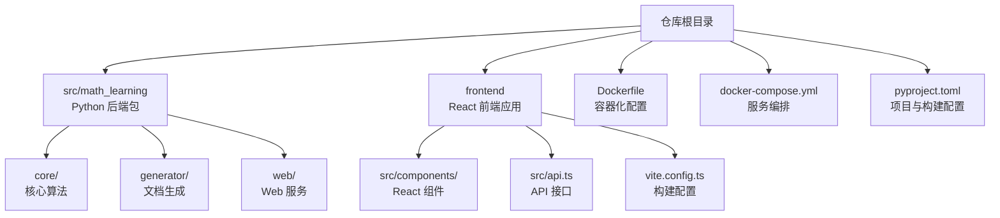
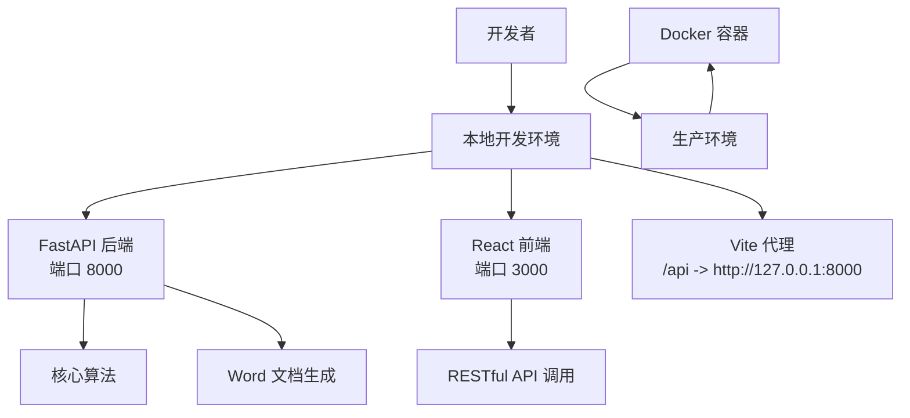

# 开发指南

<cite>
**本文引用的文件**
- [pyproject.toml](file://pyproject.toml)
- [Dockerfile](file://Dockerfile)
- [docker-compose.yml](file://docker-compose.yml)
- [src/math_learning/__init__.py](file://src/math_learning/__init__.py)
- [src/math_learning/core/generator.py](file://src/math_learning/core/generator.py)
- [src/math_learning/generator/word.py](file://src/math_learning/generator/word.py)
- [src/math_learning/web/main.py](file://src/math_learning/web/main.py)
- [tests/test_generator.py](file://tests/test_generator.py)
- [.gitignore](file://.gitignore)
- [frontend/package.json](file://frontend/package.json)
- [frontend/vite.config.ts](file://frontend/vite.config.ts)
- [frontend/src/App.tsx](file://frontend/src/App.tsx)
- [frontend/src/api.ts](file://frontend/src/api.ts)
- [frontend/src/components/ConfigPanel.tsx](file://frontend/src/components/ConfigPanel.tsx)
- [frontend/src/components/ProblemPreview.tsx](file://frontend/src/components/ProblemPreview.tsx)
</cite>

## 目录
1. [简介](#简介)
2. [项目结构](#项目结构)
3. [核心组件](#核心组件)
4. [架构总览](#架构总览)
5. [详细组件分析](#详细组件分析)
6. [依赖分析](#依赖分析)
7. [性能考虑](#性能考虑)
8. [故障排查指南](#故障排查指南)
9. [结论](#结论)
10. [附录](#附录)

## 简介
本指南面向数学学习项目的开发者，提供从包开发到发布的全流程实践，覆盖包开发流程、测试编写方法、代码规范与版本管理策略。当前仓库已具备完整的前后端架构，包括 FastAPI 后端服务、React 前端界面、Docker 容器化部署和自动化构建流程。本文将基于现有配置，给出可操作的开发步骤、最佳实践与扩展建议。

## 项目结构
项目采用现代化的全栈架构，包含 Python 后端服务、TypeScript 前端应用和容器化部署配置。后端使用 FastAPI 提供 RESTful API，前端使用 React + Vite 构建用户界面，Docker 支持一键部署。

**图表来源**
- [pyproject.toml:1-29](file://pyproject.toml#L1-L29)
- [Dockerfile:1-28](file://Dockerfile#L1-L28)
- [docker-compose.yml:1-9](file://docker-compose.yml#L1-L9)
- [frontend/package.json:1-23](file://frontend/package.json#L1-L23)
- [frontend/vite.config.ts:1-19](file://frontend/vite.config.ts#L1-L19)

**章节来源**
- [pyproject.toml:1-29](file://pyproject.toml#L1-L29)
- [Dockerfile:1-28](file://Dockerfile#L1-L28)
- [docker-compose.yml:1-9](file://docker-compose.yml#L1-L9)
- [frontend/package.json:1-23](file://frontend/package.json#L1-L23)
- [frontend/vite.config.ts:1-19](file://frontend/vite.config.ts#L1-L19)

## 核心组件
- **后端服务 (FastAPI)**
  - 提供数学题目生成和 Word 文档下载的 RESTful API
  - 支持 CORS 跨域访问，便于前端开发调试
  - 实现流式响应处理大文件下载
- **核心算法 (Generator)**
  - 支持加法和减法运算的随机题目生成
  - 提供可重现的随机种子机制
  - 实现题目表达式格式化和验证
- **文档生成 (Word)**
  - 基于 python-docx 库生成格式化的 Word 文档
  - 支持 A4 页面布局和网格排版
  - 自动添加页眉页脚和格式设置
- **前端界面 (React)**
  - 提供直观的配置面板和实时预览
  - 支持范围选择和复选框配置
  - 实现文件下载和错误处理
- **容器化部署**
  - 多阶段构建优化镜像大小
  - 前端静态资源与后端服务集成
  - 支持环境变量配置和时区设置

**章节来源**
- [src/math_learning/web/main.py:1-102](file://src/math_learning/web/main.py#L1-L102)
- [src/math_learning/core/generator.py:1-102](file://src/math_learning/core/generator.py#L1-L102)
- [src/math_learning/generator/word.py:1-88](file://src/math_learning/generator/word.py#L1-L88)
- [frontend/src/App.tsx:1-63](file://frontend/src/App.tsx#L1-L63)
- [Dockerfile:1-28](file://Dockerfile#L1-L28)

## 架构总览
下图展示从开发到生产的完整流程：开发者在本地运行前后端服务，通过 Docker 进行容器化部署，支持热重载和代理转发。

**图表来源**
- [frontend/vite.config.ts:6-14](file://frontend/vite.config.ts#L6-L14)
- [src/math_learning/web/main.py:20-26](file://src/math_learning/web/main.py#L20-L26)
- [Dockerfile:26-27](file://Dockerfile#L26-L27)

**章节来源**
- [frontend/vite.config.ts:6-14](file://frontend/vite.config.ts#L6-L14)
- [src/math_learning/web/main.py:20-26](file://src/math_learning/web/main.py#L20-L26)
- [Dockerfile:26-27](file://Dockerfile#L26-L27)

## 详细组件分析

### 包开发流程
- **初始化与依赖安装**
  - 使用 Python 3.10+ 和虚拟环境隔离依赖
  - 安装开发依赖：pytest、ruff、httpx
  - 参考路径：[pyproject.toml:16-21](file://pyproject.toml#L16-L21)
- **源码组织**
  - 后端模块：core（算法）、generator（文档）、web（服务）
  - 前端组件：按功能模块化组织
  - 更新包版本：src/math_learning/__init__.py
  - 参考路径：[src/math_learning/__init__.py:3](file://src/math_learning/__init__.py#L3)
- **构建与验证**
  - 使用 setuptools 构建 Python 包
  - Docker 多阶段构建优化镜像
  - 参考路径：[pyproject.toml:1-3](file://pyproject.toml#L1-L3), [Dockerfile:1-28](file://Dockerfile#L1-L28)

**章节来源**
- [pyproject.toml:16-21](file://pyproject.toml#L16-L21)
- [src/math_learning/__init__.py:3](file://src/math_learning/__init__.py#L3)
- [pyproject.toml:1-3](file://pyproject.toml#L1-L3)
- [Dockerfile:1-28](file://Dockerfile#L1-L28)

### 测试编写方法
- **测试发现与命名空间**
  - tests 目录作为测试命名空间，pytest 自动发现
  - 包含核心算法测试、Word 文档测试和 API 测试
  - 参考路径：[tests/test_generator.py:1-141](file://tests/test_generator.py#L1-L141)
- **测试分类**
  - 单元测试：核心算法逻辑验证
  - 集成测试：API 端点测试
  - 文档测试：Word 输出验证
- **测试运行**
  - 使用 pytest 运行完整测试套件
  - 支持参数化测试和异常场景测试
  - 参考路径：[pyproject.toml:17-19](file://pyproject.toml#L17-L19)

**章节来源**
- [tests/test_generator.py:1-141](file://tests/test_generator.py#L1-L141)
- [pyproject.toml:17-19](file://pyproject.toml#L17-L19)

### 代码规范与格式化
- **ruff 配置**
  - 行长度 88 字符，目标 Python 3.10
  - 统一代码风格和导入排序
  - 参考路径：[pyproject.toml:26-28](file://pyproject.toml#L26-L28)
- **前端 TypeScript**
  - 使用 TypeScript 类型安全
  - Vite 构建配置优化开发体验
  - 参考路径：[frontend/package.json:15-21](file://frontend/package.json#L15-L21), [frontend/vite.config.ts:1-19](file://frontend/vite.config.ts#L1-L19)
- **忽略规则**
  - .gitignore 屏蔽构建产物、缓存和 node_modules
  - 参考路径：[.gitignore:33-38](file://.gitignore#L33-L38)

**章节来源**
- [pyproject.toml:26-28](file://pyproject.toml#L26-L28)
- [frontend/package.json:15-21](file://frontend/package.json#L15-L21)
- [frontend/vite.config.ts:1-19](file://frontend/vite.config.ts#L1-L19)
- [.gitignore:33-38](file://.gitignore#L33-L38)

### 版本管理策略
- **版本同步**
  - 包版本与项目版本保持一致
  - API 版本独立管理，便于接口演进
  - 参考路径：[src/math_learning/__init__.py:3](file://src/math_learning/__init__.py#L3), [src/math_learning/web/main.py:18](file://src/math_learning/web/main.py#L18)
- **发布前检查**
  - 所有测试通过，覆盖率达标
  - 代码风格检查通过，无严重警告
  - Docker 构建成功，容器可正常启动
  - 参考路径：[tests/test_generator.py:105-141](file://tests/test_generator.py#L105-L141)

**章节来源**
- [src/math_learning/__init__.py:3](file://src/math_learning/__init__.py#L3)
- [src/math_learning/web/main.py:18](file://src/math_learning/web/main.py#L18)
- [tests/test_generator.py:105-141](file://tests/test_generator.py#L105-L141)

### 扩展包功能示例
- **新增后端功能**
  - 在 src/math_learning/core/ 添加新模块
  - 更新 __init__.py 导出新功能
  - 编写对应的测试用例
  - 参考路径：[src/math_learning/core/generator.py:1-102](file://src/math_learning/core/generator.py#L1-L102)
- **前端组件扩展**
  - 在 frontend/src/components/ 创建新组件
  - 更新路由和状态管理
  - 编写组件测试和样式
  - 参考路径：[frontend/src/components/ConfigPanel.tsx:1-88](file://frontend/src/components/ConfigPanel.tsx#L1-L88)
- **API 接口扩展**
  - 在 web/main.py 添加新端点
  - 实现请求验证和响应模型
  - 编写集成测试
  - 参考路径：[src/math_learning/web/main.py:55-95](file://src/math_learning/web/main.py#L55-L95)

**章节来源**
- [src/math_learning/core/generator.py:1-102](file://src/math_learning/core/generator.py#L1-L102)
- [frontend/src/components/ConfigPanel.tsx:1-88](file://frontend/src/components/ConfigPanel.tsx#L1-L88)
- [src/math_learning/web/main.py:55-95](file://src/math_learning/web/main.py#L55-L95)

### 代码审查流程
- **提交前自检**
  - 运行完整测试套件，确保所有用例通过
  - 使用 ruff 检查代码风格，修复警告
  - 验证 Docker 构建，确保容器可正常运行
  - 参考路径：[tests/test_generator.py:1-141](file://tests/test_generator.py#L1-L141), [pyproject.toml:26-28](file://pyproject.toml#L26-L28)
- **审查要点**
  - 功能正确性和边界条件处理
  - 代码可读性和注释完整性
  - 性能优化和内存使用
  - 安全性和输入验证
- **审查后合并**
  - 修复审查意见后重新检查
  - 确保 CI 流水线通过

**章节来源**
- [tests/test_generator.py:1-141](file://tests/test_generator.py#L1-L141)
- [pyproject.toml:26-28](file://pyproject.toml#L26-L28)

### 持续集成配置
- **建议流水线步骤**
  - 安装 Python 和 Node.js 环境
  - 安装依赖：pip install -e .[dev] 和 npm install
  - 运行测试：pytest 和 npm test
  - 代码检查：ruff 检查和 TypeScript 类型检查
  - 构建 Docker 镜像：docker build
  - 上传制品：Docker Hub 或制品库
- **关键配置参考**
  - 开发依赖配置：[pyproject.toml:16-21](file://pyproject.toml#L16-L21)
  - 前端构建配置：[frontend/package.json:6-10](file://frontend/package.json#L6-L10)
  - 容器化配置：[Dockerfile:1-28](file://Dockerfile#L1-L28)

**章节来源**
- [pyproject.toml:16-21](file://pyproject.toml#L16-L21)
- [frontend/package.json:6-10](file://frontend/package.json#L6-L10)
- [Dockerfile:1-28](file://Dockerfile#L1-L28)

### 发布准备工作
- **内容核对**
  - 确认版本号、变更日志和文档完整
  - 验证所有测试通过，覆盖率达标
  - 检查 Docker 构建和容器运行状态
- **分发准备**
  - 清理构建产物和缓存
  - 生成最终的 Docker 镜像
  - 准备部署配置文件
- **发布渠道**
  - Docker Hub 或私有镜像仓库
  - Kubernetes 集群部署
  - 云平台容器服务

**章节来源**
- [pyproject.toml:6-7](file://pyproject.toml#L6-L7)
- [Dockerfile:1-28](file://Dockerfile#L1-L28)
- [docker-compose.yml:1-9](file://docker-compose.yml#L1-L9)

### 开发工具配置
- **本地开发环境**
  - Python 开发环境：Python 3.10+
  - 前端开发环境：Node.js 20+
  - IDE 推荐：VS Code + 相关插件
  - 参考路径：[pyproject.toml:9](file://pyproject.toml#L9), [frontend/package.json:1-23](file://frontend/package.json#L1-L23)
- **调试方法**
  - 后端调试：uvicorn --reload
  - 前端调试：npm run dev
  - API 调试：curl 或 Postman
  - 容器调试：docker-compose up
  - 参考路径：[Dockerfile:26-27](file://Dockerfile#L26-L27), [frontend/vite.config.ts:6-14](file://frontend/vite.config.ts#L6-L14)
- **构建流程**
  - 前端构建：npm run build
  - 后端构建：python -m build
  - 容器构建：docker build
  - 参考路径：[frontend/package.json:8](file://frontend/package.json#L8), [pyproject.toml:1-3](file://pyproject.toml#L1-L3)

**章节来源**
- [pyproject.toml:9](file://pyproject.toml#L9)
- [frontend/package.json:1-23](file://frontend/package.json#L1-L23)
- [Dockerfile:26-27](file://Dockerfile#L26-L27)
- [frontend/vite.config.ts:6-14](file://frontend/vite.config.ts#L6-L14)
- [frontend/package.json:8](file://frontend/package.json#L8)
- [pyproject.toml:1-3](file://pyproject.toml#L1-L3)

## 依赖分析
- **组件耦合**
  - 后端服务与核心算法模块强耦合
  - 前端组件与 API 接口松耦合
  - Docker 容器与前后端服务解耦
- **外部依赖**
  - 后端：FastAPI、Uvicorn、python-docx
  - 前端：React、TypeScript、Vite
  - 构建：setuptools、ruff、Docker
- **潜在风险**
  - 版本不兼容导致构建失败
  - 前端依赖更新破坏 UI 交互
  - Docker 镜像体积过大影响部署

**章节来源**
- [pyproject.toml:10-14](file://pyproject.toml#L10-L14)
- [frontend/package.json:11-21](file://frontend/package.json#L11-L21)

## 性能考虑
- **后端性能**
  - 使用流式响应处理大文件下载
  - 优化随机数生成和数据结构
  - 实现适当的缓存策略
- **前端性能**
  - React 组件懒加载和 memo 优化
  - TypeScript 类型检查减少运行时错误
  - Vite 热重载提升开发效率
- **容器性能**
  - 多阶段构建减少镜像大小
  - Alpine Linux 基础镜像优化
  - 环境变量配置优化运行时性能

**章节来源**
- [src/math_learning/web/main.py:76-95](file://src/math_learning/web/main.py#L76-L95)
- [Dockerfile:10](file://Dockerfile#L10)
- [frontend/vite.config.ts:1-19](file://frontend/vite.config.ts#L1-L19)

## 故障排查指南
- **后端服务问题**
  - 检查端口占用和依赖安装
  - 验证 CORS 配置和 API 端点
  - 查看 uvicorn 日志输出
  - 参考路径：[src/math_learning/web/main.py:18](file://src/math_learning/web/main.py#L18), [Dockerfile:24-27](file://Dockerfile#L24-L27)
- **前端开发问题**
  - 检查 Vite 代理配置和端口冲突
  - 验证 API 基础地址和跨域设置
  - 查看浏览器控制台错误信息
  - 参考路径：[frontend/vite.config.ts:8-13](file://frontend/vite.config.ts#L8-L13), [frontend/src/api.ts:1](file://frontend/src/api.ts#L1)
- **Docker 容器问题**
  - 检查镜像构建日志和依赖安装
  - 验证端口映射和环境变量
  - 查看容器日志和进程状态
  - 参考路径：[Dockerfile:14-15](file://Dockerfile#L14-L15), [docker-compose.yml:4-5](file://docker-compose.yml#L4-L5)
- **测试失败问题**
  - 检查测试依赖和环境变量
  - 验证随机种子和预期结果
  - 查看测试覆盖率和错误堆栈
  - 参考路径：[tests/test_generator.py:63-66](file://tests/test_generator.py#L63-L66)

**章节来源**
- [src/math_learning/web/main.py:18](file://src/math_learning/web/main.py#L18)
- [Dockerfile:24-27](file://Dockerfile#L24-L27)
- [frontend/vite.config.ts:8-13](file://frontend/vite.config.ts#L8-L13)
- [frontend/src/api.ts:1](file://frontend/src/api.ts#L1)
- [Dockerfile:14-15](file://Dockerfile#L14-L15)
- [docker-compose.yml:4-5](file://docker-compose.yml#L4-L5)
- [tests/test_generator.py:63-66](file://tests/test_generator.py#L63-L66)

## 结论
本指南基于完整的数学学习项目配置，提供了从前端开发到后端服务、从本地调试到容器部署的全流程实践。项目采用现代化的技术栈和最佳实践，包括多阶段 Docker 构建、前后端分离架构、完善的测试体系和持续集成流程。建议在现有基础上继续完善文档、监控和运维体系，形成更加成熟的开发和发布流程。

## 附录
- **快速清单**
  - 后端开发：uvicorn --reload
  - 前端开发：npm run dev
  - 测试运行：pytest
  - 容器构建：docker build
  - 容器启动：docker-compose up
  - 代码检查：ruff check
  - 前端构建：npm run build

**章节来源**
- [Dockerfile:26-27](file://Dockerfile#L26-L27)
- [frontend/vite.config.ts:6-14](file://frontend/vite.config.ts#L6-L14)
- [pyproject.toml:17-19](file://pyproject.toml#L17-L19)
- [docker-compose.yml:2-6](file://docker-compose.yml#L2-L6)
- [pyproject.toml:26-28](file://pyproject.toml#L26-L28)
- [frontend/package.json:8](file://frontend/package.json#L8)