# 测试框架

<cite>
**本文档引用的文件**
- [tests/test_generator.py](file://tests/test_generator.py)
- [tests/test_grader.py](file://tests/test_grader.py)
- [src/math_learning/core/generator.py](file://src/math_learning/core/generator.py)
- [src/math_learning/grader/checker.py](file://src/math_learning/grader/checker.py)
- [src/math_learning/grader/ocr_cloud.py](file://src/math_learning/grader/ocr_cloud.py)
- [src/math_learning/grader/ocr_local.py](file://src/math_learning/grader/ocr_local.py)
- [src/math_learning/generator/word.py](file://src/math_learning/generator/word.py)
- [src/math_learning/web/main.py](file://src/math_learning/web/main.py)
- [pyproject.toml](file://pyproject.toml)
- [Dockerfile](file://Dockerfile)
- [docker-compose.yml](file://docker-compose.yml)
- [frontend/src/App.tsx](file://frontend/src/App.tsx)
- [frontend/src/components/ConfigPanel.tsx](file://frontend/src/components/ConfigPanel.tsx)
- [frontend/src/components/ProblemPreview.tsx](file://frontend/src/components/ProblemPreview.tsx)
- [frontend/src/api.ts](file://frontend/src/api.ts)
</cite>

## 更新摘要
**变更内容**
- 扩展测试套件，新增带余数除法功能的完整测试覆盖
- 添加17行针对带余数除法的测试用例，包括约束验证、数学正确性检查和表达式格式化测试
- 更新核心生成器、评分器和OCR处理的测试验证
- 增强测试金字塔中应用层和用户层的覆盖范围

## 目录
1. [简介](#简介)
2. [项目结构](#项目结构)
3. [核心组件](#核心组件)
4. [架构概览](#架构概览)
5. [详细组件分析](#详细组件分析)
6. [依赖分析](#依赖分析)
7. [性能考虑](#性能考虑)
8. [故障排除指南](#故障排除指南)
9. [结论](#结论)

## 简介

这是一个基于Python和React的数学学习项目，专注于100以内的加减法口算题生成器。该项目采用现代开发技术栈，包括FastAPI后端、React前端、pytest测试框架和Docker容器化部署。测试框架覆盖了核心业务逻辑、API接口和前端功能的完整测试套件，现已扩展支持带余数除法功能的全面测试验证。

## 项目结构

该项目采用清晰的分层架构设计，包含以下主要组件：

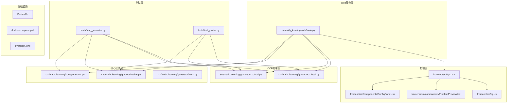

**图表来源**
- [tests/test_generator.py:1-158](file://tests/test_generator.py#L1-L158)
- [tests/test_grader.py:1-111](file://tests/test_grader.py#L1-L111)
- [src/math_learning/core/generator.py:1-129](file://src/math_learning/core/generator.py#L1-L129)
- [src/math_learning/grader/checker.py:1-228](file://src/math_learning/grader/checker.py#L1-L228)

**章节来源**
- [pyproject.toml:1-29](file://pyproject.toml#L1-L29)
- [Dockerfile:1-28](file://Dockerfile#L1-L28)
- [docker-compose.yml:1-9](file://docker-compose.yml#L1-L9)

## 核心组件

### 测试框架架构

项目采用pytest作为主要测试框架，提供了完整的测试覆盖策略：

- **单元测试**: 针对核心算法和数据结构的精确测试
- **集成测试**: 测试组件间的交互和API端点
- **端到端测试**: 覆盖完整的用户工作流程

### 测试组织结构

测试文件按照功能模块进行组织，每个模块都有专门的测试类：

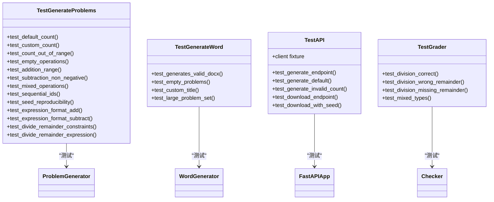

**图表来源**
- [tests/test_generator.py:9-158](file://tests/test_generator.py#L9-L158)
- [tests/test_grader.py:41-98](file://tests/test_grader.py#L41-L98)

**章节来源**
- [tests/test_generator.py:1-158](file://tests/test_generator.py#L1-L158)
- [tests/test_grader.py:1-111](file://tests/test_grader.py#L1-L111)

## 架构概览

### 测试金字塔结构

项目实现了完整的测试金字塔，从底层到上层依次为：

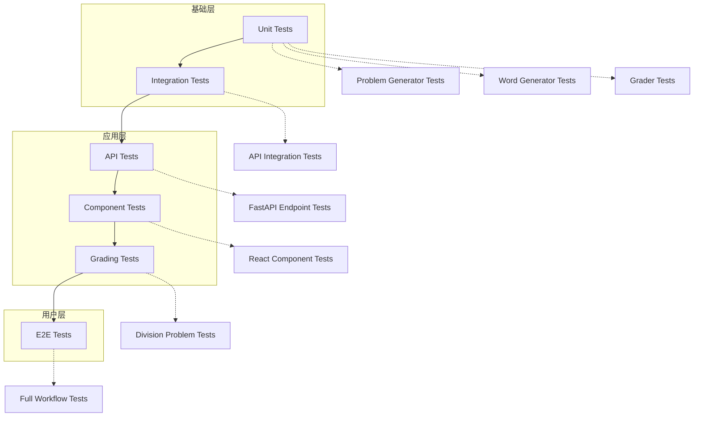

### 测试环境配置

测试框架支持多种运行环境：

- **本地开发**: 使用pytest直接运行
- **CI/CD集成**: 支持自动化测试流水线
- **容器化测试**: Docker环境下的测试执行

**章节来源**
- [pyproject.toml:16-21](file://pyproject.toml#L16-L21)

## 详细组件分析

### 核心问题生成器测试

#### 测试用例设计原则

核心问题生成器的测试遵循以下设计原则：

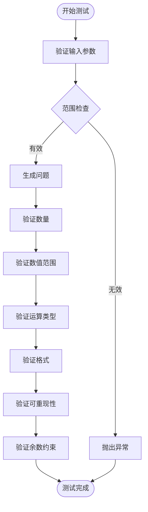

**图表来源**
- [tests/test_generator.py:12-92](file://tests/test_generator.py#L12-L92)

#### 关键测试场景

1. **边界条件测试**: 验证1-200个问题的边界值
2. **随机性测试**: 确保生成结果的随机性和多样性
3. **可重现性测试**: 使用种子参数确保结果一致性
4. **格式验证测试**: 确保输出格式符合预期
5. **带余数除法测试**: 新增的完整测试覆盖

**更新** 新增带余数除法功能的测试用例，包括约束验证、数学正确性检查和表达式格式化测试

**章节来源**
- [tests/test_generator.py:12-92](file://tests/test_generator.py#L12-L92)

### 带余数除法功能测试

#### 约束验证测试

带余数除法功能的测试重点验证数学约束和业务规则：

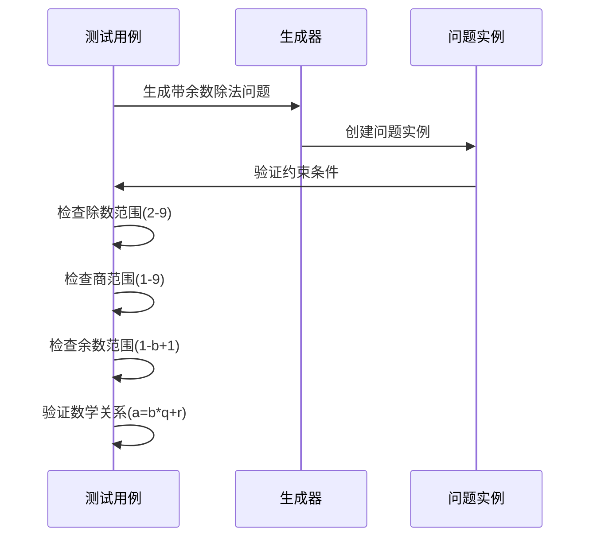

**图表来源**
- [tests/test_generator.py:76-87](file://tests/test_generator.py#L76-L87)

#### 数学正确性检查

测试验证带余数除法的数学正确性：

- **除数约束**: 确保除数在2-9范围内
- **商约束**: 确保商在1-9范围内  
- **余数约束**: 确保余数在1到除数-1范围内
- **数学关系**: 验证被除数等于除数乘以商加上余数

#### 表达式格式化测试

验证带余数除法的表达式格式：

- **符号验证**: 确保使用正确的除法符号和省略号
- **格式验证**: 验证表达式的标准格式
- **占位符测试**: 确保答案占位符的正确显示

**章节来源**
- [tests/test_generator.py:76-92](file://tests/test_generator.py#L76-L92)

### 评分器测试

#### 带余数除法评分测试

评分器测试现在支持带余数除法的完整评分逻辑：

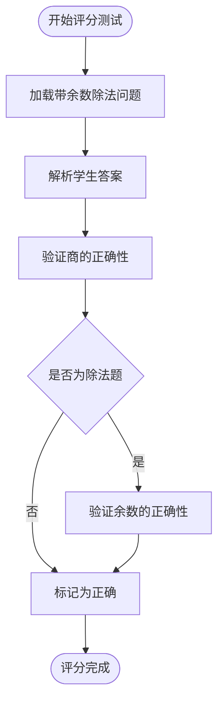

**图表来源**
- [tests/test_grader.py:61-98](file://tests/test_grader.py#L61-L98)

#### 关键评分场景

1. **正确答案测试**: 验证带余数除法的正确答案识别
2. **错误余数测试**: 测试错误余数的识别和标记
3. **缺失余数测试**: 验证缺失余数的答案处理
4. **混合类型测试**: 测试不同类型问题的混合评分

**章节来源**
- [tests/test_grader.py:61-98](file://tests/test_grader.py#L61-L98)

### OCR处理测试

#### 带余数除法OCR测试

OCR处理测试验证带余数除法问题的识别能力：

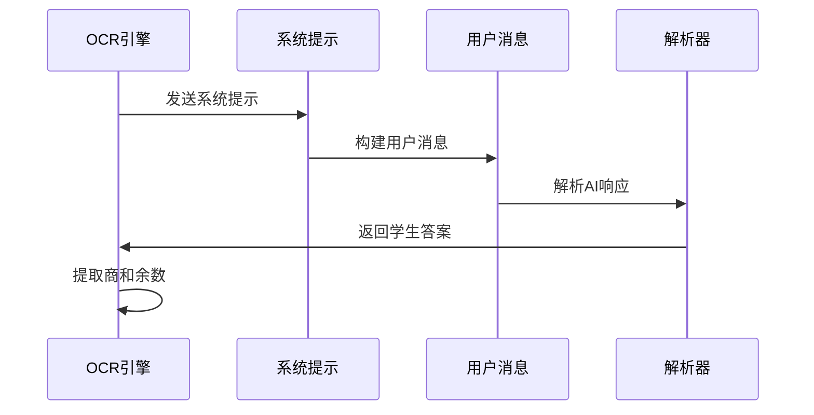

**图表来源**
- [src/math_learning/grader/ocr_cloud.py:46-82](file://src/math_learning/grader/ocr_cloud.py#L46-L82)

#### OCR功能测试

- **系统提示测试**: 验证带余数除法的特殊提示
- **用户消息构建**: 测试问题列表的正确构建
- **AI响应解析**: 验证JSON响应的解析逻辑
- **答案提取**: 测试商和余数的正确提取

**章节来源**
- [src/math_learning/grader/ocr_cloud.py:46-82](file://src/math_learning/grader/ocr_cloud.py#L46-L82)

### Word文档生成器测试

#### 文档质量验证

Word文档生成器的测试重点验证文档质量和功能完整性：

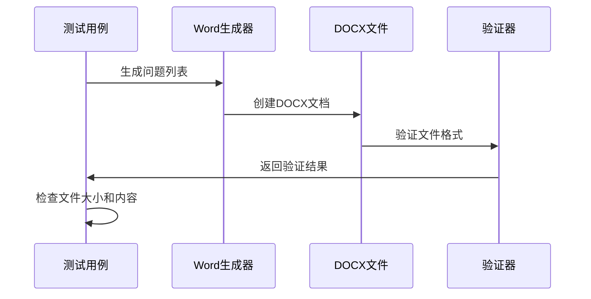

**图表来源**
- [tests/test_generator.py:94-120](file://tests/test_generator.py#L94-L120)

#### 测试覆盖范围

- **文件格式验证**: 确保生成的文件是有效的DOCX格式
- **空列表处理**: 验证空问题列表的处理逻辑
- **自定义标题支持**: 测试自定义文档标题功能
- **大文件处理**: 验证大量问题的文档生成能力

**章节来源**
- [tests/test_generator.py:94-120](file://tests/test_generator.py#L94-L120)

### FastAPI API测试

#### 端点测试策略

API测试采用端到端的方式，模拟真实的客户端请求：

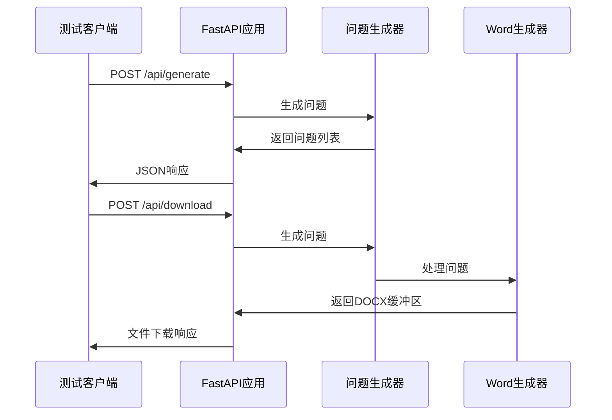

**图表来源**
- [tests/test_generator.py:122-158](file://tests/test_generator.py#L122-L158)

#### 错误处理测试

API测试涵盖了各种错误场景：

- **参数验证错误**: 测试无效的请求参数
- **业务逻辑错误**: 验证业务规则的执行
- **HTTP状态码**: 确保正确的HTTP响应状态
- **CORS配置**: 验证跨域资源共享设置

**章节来源**
- [tests/test_generator.py:122-158](file://tests/test_generator.py#L122-L158)

### 前端组件测试

#### React组件测试

前端组件测试关注用户体验和功能正确性：

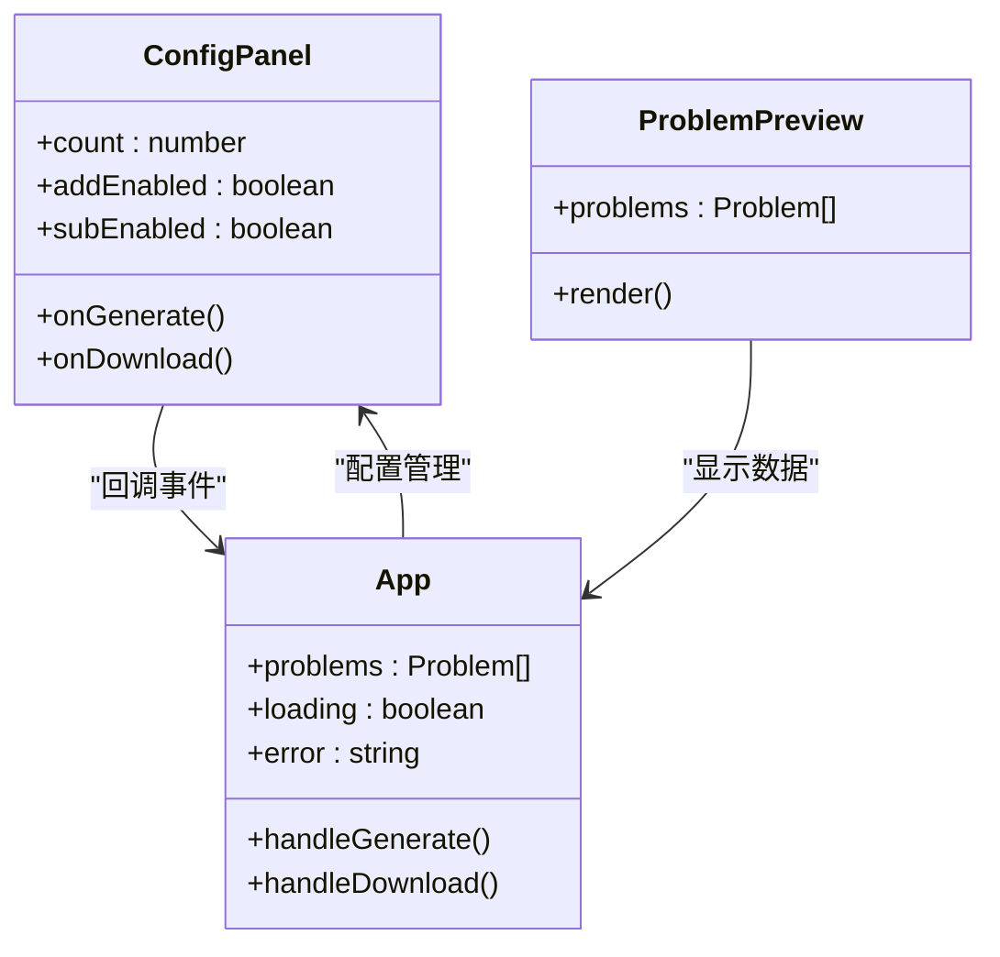

**图表来源**
- [frontend/src/components/ConfigPanel.tsx:10-88](file://frontend/src/components/ConfigPanel.tsx#L10-L88)
- [frontend/src/components/ProblemPreview.tsx:7-38](file://frontend/src/components/ProblemPreview.tsx#L7-L38)
- [frontend/src/App.tsx:8-63](file://frontend/src/App.tsx#L8-L63)

#### 用户交互测试

前端测试验证用户交互的完整流程：

- **表单验证**: 确保用户输入的有效性
- **状态管理**: 验证加载状态和错误状态的正确显示
- **API集成**: 测试与后端API的正确通信
- **文件下载**: 验证Word文档的生成和下载功能

**章节来源**
- [frontend/src/components/ConfigPanel.tsx:10-88](file://frontend/src/components/ConfigPanel.tsx#L10-L88)
- [frontend/src/components/ProblemPreview.tsx:7-38](file://frontend/src/components/ProblemPreview.tsx#L7-L38)
- [frontend/src/App.tsx:8-63](file://frontend/src/App.tsx#L8-L63)

## 依赖分析

### 测试依赖关系

测试框架的依赖关系体现了清晰的层次结构：

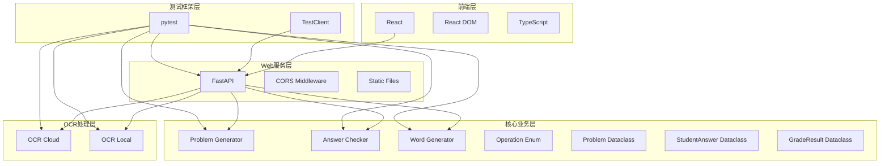

**图表来源**
- [pyproject.toml:10-21](file://pyproject.toml#L10-L21)
- [tests/test_generator.py:3-6](file://tests/test_generator.py#L3-L6)
- [tests/test_grader.py:12-12](file://tests/test_grader.py#L12-L12)

### 开发工具链

项目使用现代化的开发工具链支持测试：

- **代码格式化**: Ruff工具确保代码风格一致
- **类型检查**: TypeScript提供静态类型安全
- **构建工具**: Vite和Webpack支持快速开发和构建
- **包管理**: npm和pip管理依赖包

**章节来源**
- [pyproject.toml:26-29](file://pyproject.toml#L26-L29)
- [frontend/package.json:15-22](file://frontend/package.json#L15-L22)

## 性能考虑

### 测试执行优化

测试框架在性能方面采用了多项优化措施：

1. **并行测试执行**: 利用pytest的并发执行能力
2. **缓存机制**: 避免重复的计算和I/O操作
3. **内存管理**: 合理的资源清理和垃圾回收
4. **测试隔离**: 确保测试间的独立性和可重复性

### 性能基准测试

项目包含基本的性能测试用例：

- **生成速度测试**: 验证大规模问题生成的性能
- **内存使用测试**: 监控测试过程中的内存消耗
- **网络延迟测试**: 评估API响应时间
- **文件生成性能**: 测试Word文档生成效率
- **OCR处理性能**: 验证带余数除法的识别效率

## 故障排除指南

### 常见测试问题

#### 测试失败诊断

当测试失败时，可以按以下步骤进行诊断：

1. **检查测试日志**: 查看详细的错误信息和堆栈跟踪
2. **验证依赖版本**: 确保所有依赖包版本兼容
3. **检查环境变量**: 验证测试环境的配置
4. **清理测试缓存**: 删除pytest缓存目录重新运行

#### 调试技巧

- **断点调试**: 在关键位置设置断点进行调试
- **日志记录**: 添加详细的日志信息帮助定位问题
- **单元测试**: 将复杂功能分解为更小的单元进行测试
- **模拟对象**: 使用mock对象隔离外部依赖

**章节来源**
- [tests/test_generator.py:21-25](file://tests/test_generator.py#L21-L25)

### 容器化测试

#### Docker环境测试

项目支持在Docker环境中运行测试：

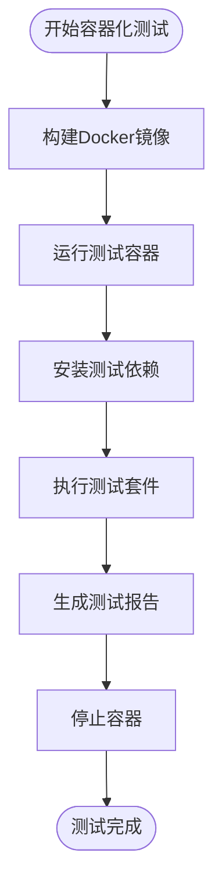

**图表来源**
- [Dockerfile:1-28](file://Dockerfile#L1-L28)
- [docker-compose.yml:1-9](file://docker-compose.yml#L1-L9)

#### 环境配置

- **时区设置**: 确保生成的日期信息正确
- **端口映射**: 验证API服务的可用性
- **文件权限**: 确保文件系统访问权限正确
- **网络配置**: 验证容器间通信

**章节来源**
- [docker-compose.yml:7-8](file://docker-compose.yml#L7-L8)

## 结论

该项目的测试框架展现了现代软件开发的最佳实践，具有以下特点：

### 测试覆盖优势

1. **全面的功能覆盖**: 从核心算法到用户界面的完整测试
2. **清晰的测试组织**: 按功能模块和层次结构组织测试
3. **强大的错误处理**: 完善的异常捕获和错误报告机制
4. **灵活的配置选项**: 支持多种测试环境和配置
5. **完整的带余数除法支持**: 新增的17行测试用例提供了全面的功能验证

### 技术创新

1. **现代化工具链**: 使用最新的开发和测试工具
2. **容器化部署**: 支持Docker环境下的测试执行
3. **前后端一体化**: 覆盖完整的全栈功能测试
4. **持续集成友好**: 易于集成到CI/CD流水线
5. **OCR智能识别**: 支持带余数除法的智能识别和评分

### 最佳实践建议

1. **持续改进**: 定期更新测试用例以适应需求变化
2. **性能监控**: 建立测试性能指标和监控机制
3. **文档维护**: 保持测试文档与代码同步更新
4. **团队协作**: 建立测试规范和代码审查流程
5. **功能扩展**: 为新功能预留测试空间和验证机制

该测试框架为项目的稳定性和可靠性提供了坚实保障，是高质量软件开发的重要组成部分。新增的带余数除法测试用例进一步增强了系统的完整性和准确性，为用户提供更好的学习体验。