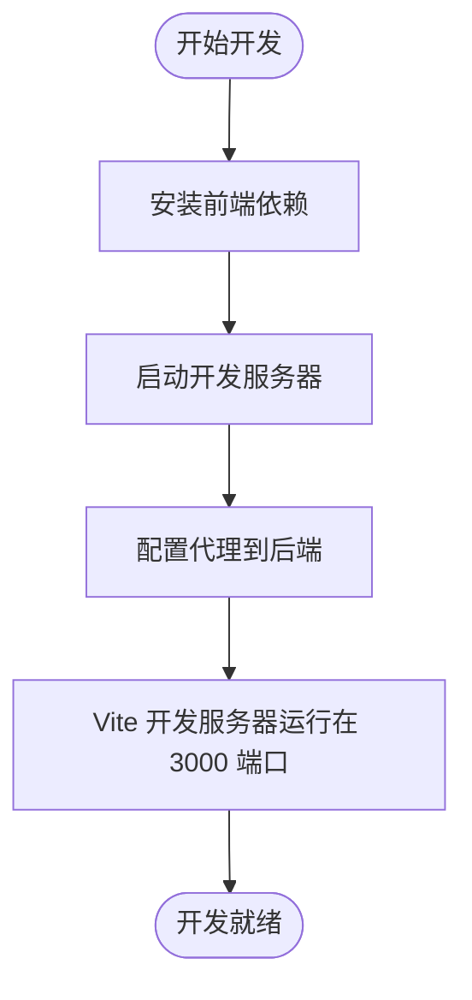
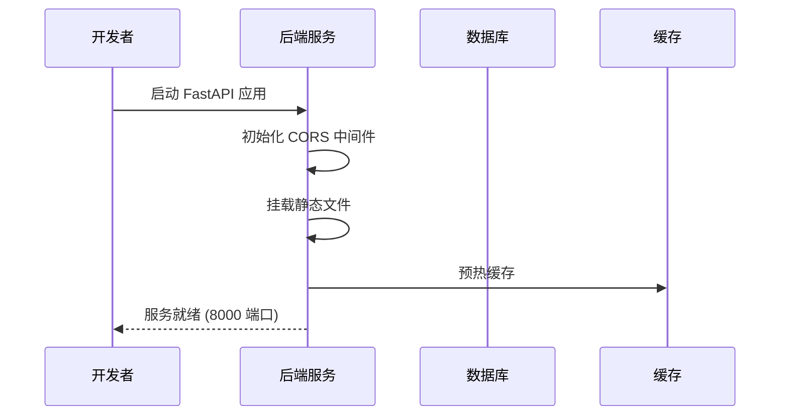
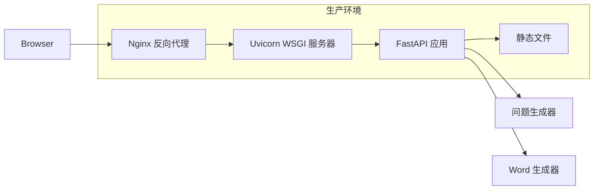
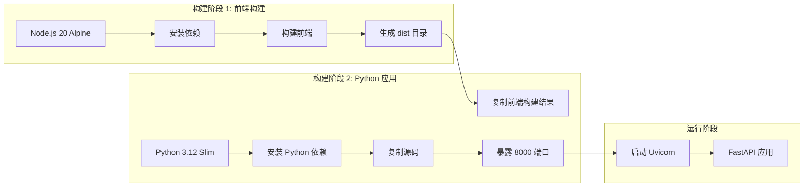
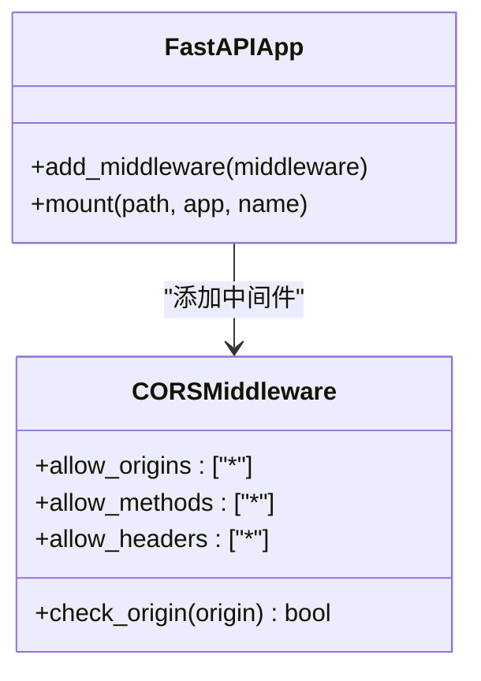
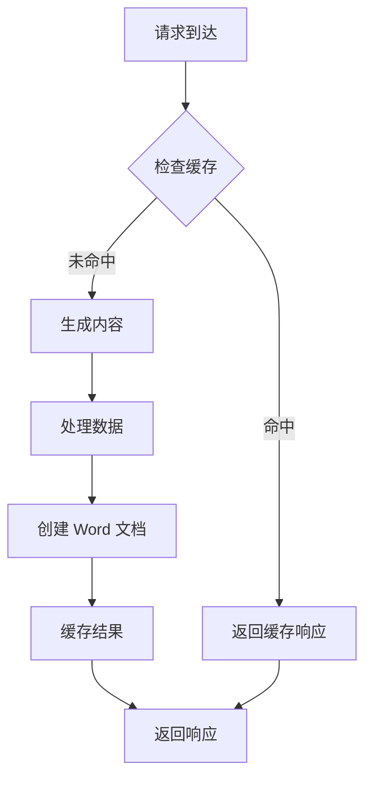
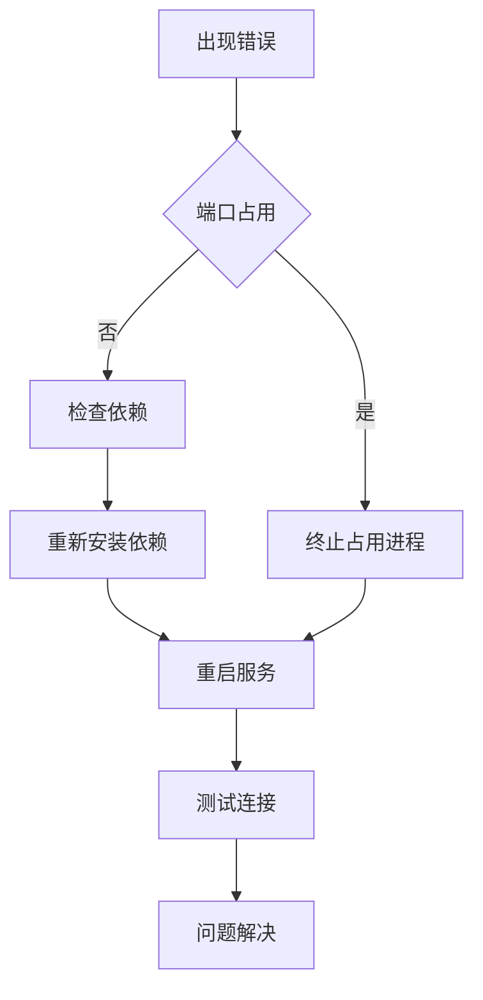
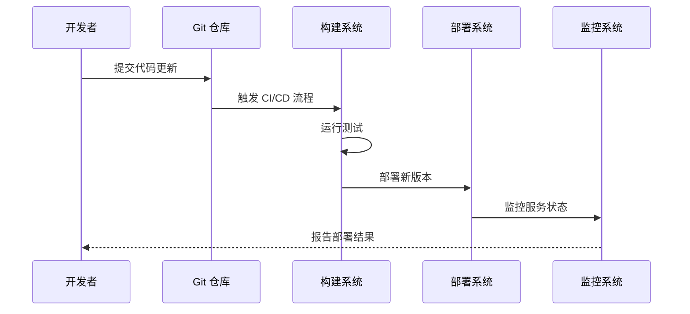

# 部署指南

<cite>
**本文档引用的文件**
- [Dockerfile](file://Dockerfile)
- [docker-compose.yml](file://docker-compose.yml)
- [pyproject.toml](file://pyproject.toml)
- [frontend/package.json](file://frontend/package.json)
- [frontend/vite.config.ts](file://frontend/vite.config.ts)
- [src/math_learning/web/main.py](file://src/math_learning/web/main.py)
- [src/math_learning/core/generator.py](file://src/math_learning/core/generator.py)
- [src/math_learning/generator/word.py](file://src/math_learning/generator/word.py)
- [.gitignore](file://.gitignore)
- [.dockerignore](file://.dockerignore)
</cite>

## 目录
1. [简介](#简介)
2. [系统架构](#系统架构)
3. [环境要求](#环境要求)
4. [本地开发部署](#本地开发部署)
5. [生产环境部署](#生产环境部署)
6. [Docker 容器化部署](#docker-容器化部署)
7. [配置说明](#配置说明)
8. [性能优化](#性能优化)
9. [故障排除](#故障排除)
10. [维护指南](#维护指南)

## 简介

数学学习项目是一个基于 FastAPI 和 React 的现代化 Web 应用，专门用于生成 100 以内的加减法口算练习题。该应用支持在线预览和 Word 文档下载功能，采用前后端分离架构，通过 Docker 进行容器化部署。

## 系统架构

```mermaid
graph TB
subgraph "客户端层"
Browser[Web 浏览器]
React[React 前端应用]
end
subgraph "API 层"
FastAPI[FastAPI 应用]
API_Generate[/api/generate 接口]
API_Download[/api/download 接口]
end
subgraph "业务逻辑层"
Generator[问题生成器]
WordGenerator[Word 文档生成器]
end
subgraph "数据存储层"
Memory[内存缓存]
end
Browser --> React
React --> API_Generate
React --> API_Download
API_Generate --> Generator
API_Download --> Generator
API_Download --> WordGenerator
Generator --> Memory
WordGenerator --> Memory
```

**图表来源**
- [src/math_learning/web/main.py:1-102](file://src/math_learning/web/main.py#L1-L102)
- [src/math_learning/core/generator.py:1-102](file://src/math_learning/core/generator.py#L1-L102)
- [src/math_learning/generator/word.py:1-88](file://src/math_learning/generator/word.py#L1-L88)

## 环境要求

### 硬件要求
- CPU: 至少 2 核心
- 内存: 至少 2GB RAM
- 存储: 至少 500MB 可用空间

### 软件要求
- Python: 3.10+
- Node.js: 16+
- Docker: 20+ (可选)
- pip: 最新版本

### 依赖包
- **后端依赖**: FastAPI, Uvicorn, python-docx
- **前端依赖**: React, TypeScript, Vite
- **开发工具**: pytest, ruff

**章节来源**
- [pyproject.toml:10-14](file://pyproject.toml#L10-L14)
- [frontend/package.json:11-21](file://frontend/package.json#L11-L21)

## 本地开发部署

### 前端开发环境设置



**图表来源**
- [frontend/vite.config.ts:6-14](file://frontend/vite.config.ts#L6-L14)

### 后端开发环境设置



**图表来源**
- [src/math_learning/web/main.py:18-26](file://src/math_learning/web/main.py#L18-L26)
- [src/math_learning/web/main.py:98-102](file://src/math_learning/web/main.py#L98-L102)

### 开发环境启动步骤

1. **克隆项目**
```bash
git clone <repository-url>
cd math-learning
```

2. **安装后端依赖**
```bash
pip install -e .
```

3. **启动后端服务**
```bash
uvicorn math_learning.web.main:app --reload --host 0.0.0.0 --port 8000
```

4. **安装前端依赖**
```bash
cd frontend
npm install
```

5. **启动前端开发服务器**
```bash
npm run dev
```

**章节来源**
- [pyproject.toml:1-29](file://pyproject.toml#L1-L29)
- [frontend/package.json:6-10](file://frontend/package.json#L6-L10)

## 生产环境部署

### 部署架构



**图表来源**
- [Dockerfile:23-27](file://Dockerfile#L23-L27)
- [src/math_learning/web/main.py:98-102](file://src/math_learning/web/main.py#L98-L102)

### 生产环境配置

1. **构建生产镜像**
```bash
docker build -t math-learning:latest .
```

2. **运行生产容器**
```bash
docker run -d \
  --name math-learning \
  --restart unless-stopped \
  -p 8000:8000 \
  -e TZ=Asia/Shanghai \
  math-learning:latest
```

3. **使用 Docker Compose**
```bash
docker-compose up -d
```

**章节来源**
- [docker-compose.yml:1-9](file://docker-compose.yml#L1-L9)
- [Dockerfile:1-28](file://Dockerfile#L1-L28)

## Docker 容器化部署

### 多阶段构建流程



**图表来源**
- [Dockerfile:1-28](file://Dockerfile#L1-L28)

### Docker 配置详解

| 配置项 | 值 | 说明 |
|--------|-----|------|
| 基础镜像 | node:20-alpine | 前端构建环境 |
| 工作目录 | /app/frontend | 前端工作目录 |
| 构建命令 | npm ci --registry https://registry.npmmirror.com | 使用国内镜像加速 |
| 前端构建 | npm run build | 生成生产版本 |
| Python 基础镜像 | python:3.12-slim | 运行时环境 |
| 依赖安装 | pip install --no-cache-dir | 清理缓存减少镜像大小 |
| 端口暴露 | 8000 | 应用监听端口 |
| 健康检查 | 无 | 使用默认健康检查 |

**章节来源**
- [Dockerfile:1-28](file://Dockerfile#L1-L28)
- [.dockerignore:1-9](file://.dockerignore#L1-L9)

## 配置说明

### 环境变量

| 变量名 | 默认值 | 说明 |
|--------|--------|------|
| TZ | Asia/Shanghai | 时区设置 |
| PORT | 8000 | 应用端口号 |
| DEBUG | false | 调试模式 |

### CORS 配置



**图表来源**
- [src/math_learning/web/main.py:21-26](file://src/math_learning/web/main.py#L21-L26)

### 静态文件配置

| 文件类型 | 路径 | 用途 |
|----------|------|------|
| HTML | frontend/dist/index.html | 主页面入口 |
| CSS | frontend/dist/*.css | 样式文件 |
| JS | frontend/dist/*.js | 脚本文件 |
| Assets | frontend/dist/assets/* | 静态资源 |

**章节来源**
- [src/math_learning/web/main.py:98-102](file://src/math_learning/web/main.py#L98-L102)

## 性能优化

### 缓存策略



**图表来源**
- [src/math_learning/generator/word.py:22-88](file://src/math_learning/generator/word.py#L22-L88)

### 性能优化建议

1. **前端优化**
   - 启用代码分割和懒加载
   - 使用 CDN 加速静态资源
   - 实现请求缓存机制

2. **后端优化**
   - 使用连接池管理数据库连接
   - 实现异步处理大文件生成
   - 添加请求限流和熔断机制

3. **容器优化**
   - 使用多阶段构建减少镜像大小
   - 实现健康检查和自动重启
   - 配置资源限制和监控

## 故障排除

### 常见问题及解决方案



### 错误诊断流程

1. **服务启动失败**
   - 检查端口是否被占用
   - 验证 Python 版本兼容性
   - 确认依赖包安装完整

2. **API 请求失败**
   - 检查 CORS 配置
   - 验证请求格式正确性
   - 查看服务器日志

3. **前端无法访问**
   - 确认代理配置正确
   - 检查防火墙设置
   - 验证网络连接

**章节来源**
- [tests/test_generator.py:105-141](file://tests/test_generator.py#L105-L141)

### 日志监控

| 日志级别 | 用途 | 示例 |
|----------|------|------|
| INFO | 正常操作记录 | 服务启动、请求处理 |
| WARNING | 警告信息 | 配置警告、性能警告 |
| ERROR | 错误信息 | 异常处理、错误响应 |
| DEBUG | 调试信息 | 详细调试输出 |

## 维护指南

### 更新流程



### 版本管理

1. **语义化版本控制**
   - 主版本号：不兼容的 API 变更
   - 次版本号：向后兼容的功能新增
   - 修订号：向后兼容的问题修正

2. **分支策略**
   - main 分支：稳定版本
   - develop 分支：开发版本
   - feature/* 分支：功能开发
   - hotfix/* 分支：紧急修复

### 备份策略

1. **数据备份**
   - 定期备份配置文件
   - 备份用户生成的内容
   - 测试备份恢复流程

2. **系统备份**
   - 备份 Docker 镜像
   - 备份环境配置
   - 文档化部署步骤

### 安全考虑

1. **网络安全**
   - 使用 HTTPS 协议
   - 配置防火墙规则
   - 实施访问控制

2. **应用安全**
   - 输入验证和过滤
   - SQL 注入防护
   - XSS 攻击防护

**章节来源**
- [.gitignore:1-39](file://.gitignore#L1-L39)
- [.dockerignore:1-9](file://.dockerignore#L1-L9)