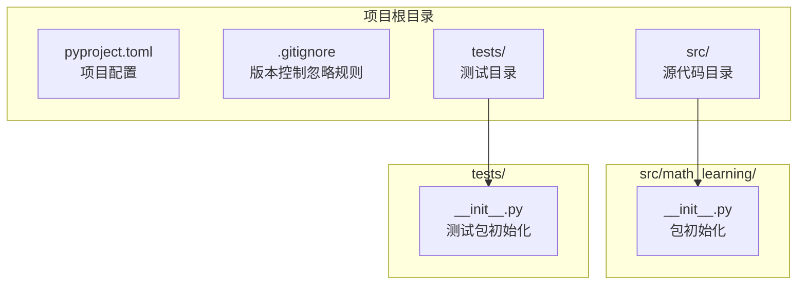
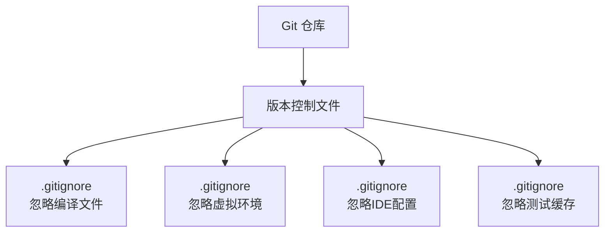
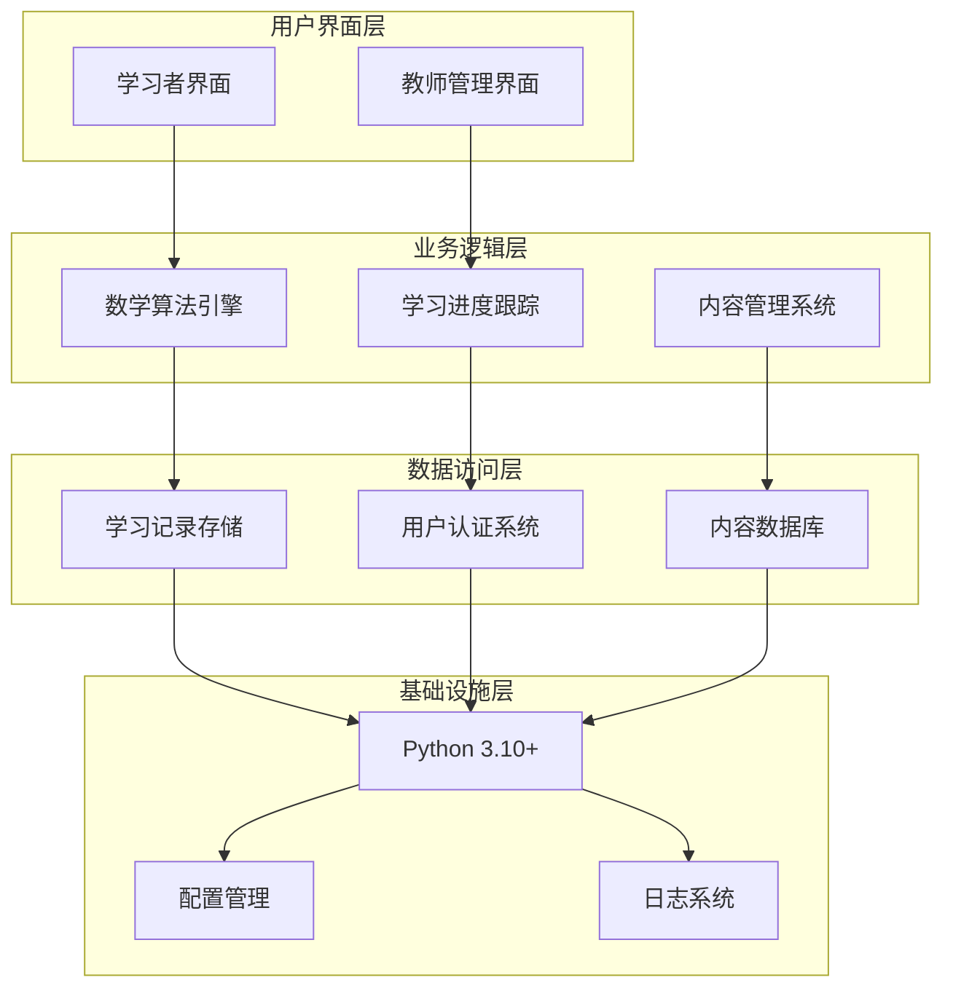
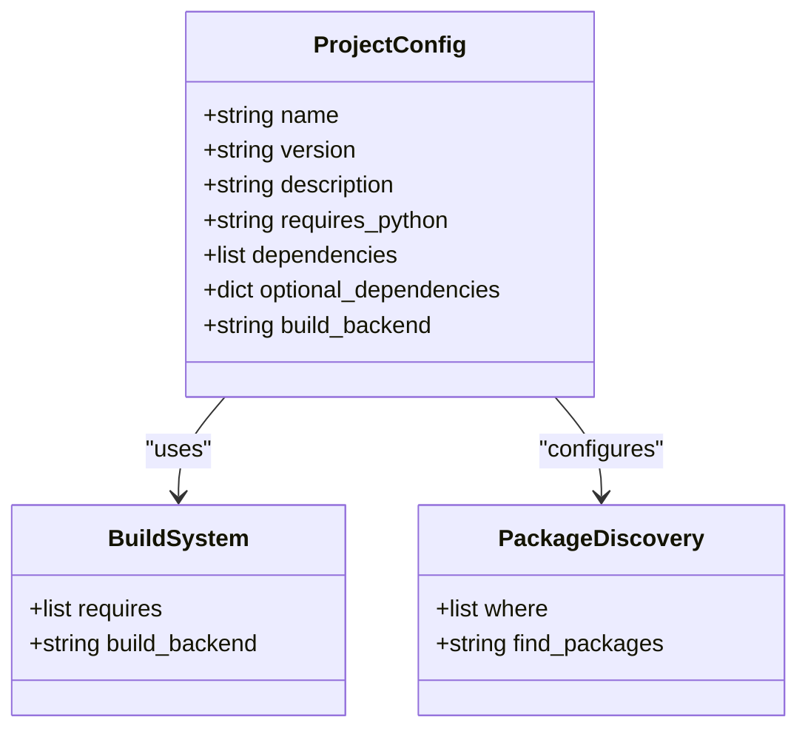
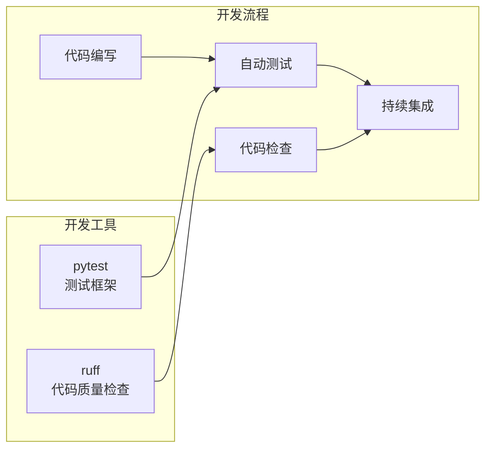
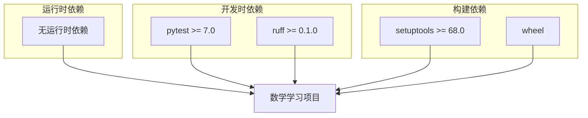
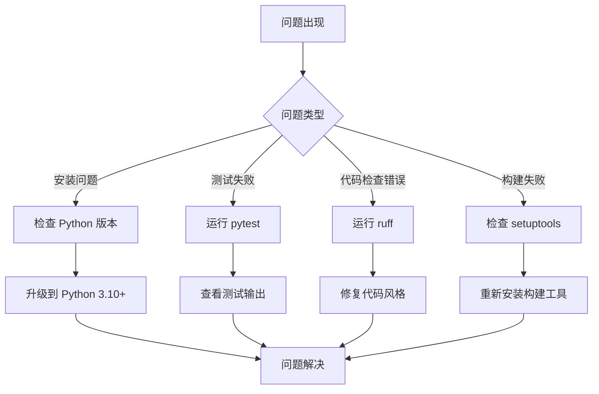

# 项目概述

<cite>
**本文档引用的文件**
- [pyproject.toml](file://pyproject.toml)
- [src/math_learning/__init__.py](file://src/math_learning/__init__.py)
- [.gitignore](file://.gitignore)
- [tests/__init__.py](file://tests/__init__.py)
</cite>

## 目录
1. [项目简介](#项目简介)
2. [项目结构](#项目结构)
3. [核心组件](#核心组件)
4. [架构概览](#架构概览)
5. [详细组件分析](#详细组件分析)
6. [依赖关系分析](#依赖关系分析)
7. [性能考虑](#性能考虑)
8. [故障排除指南](#故障排除指南)
9. [结论](#结论)

## 项目简介

数学学习项目（Math Learning）是一个专为数学教育而设计的基础框架项目。该项目旨在为数学学习平台提供一个灵活、可扩展的技术基础，支持从基础算术到高级数学概念的教学应用。

### 项目目标

- **教育技术定位**：为数学教育领域提供现代化的技术解决方案
- **学习体验优化**：通过技术手段提升数学学习的互动性和有效性
- **可扩展架构**：构建支持未来功能扩展的模块化系统
- **开发者友好**：提供清晰的代码结构和完善的开发工具链

### 核心价值主张

1. **技术先进性**：采用 Python 3.10+ 的最新特性，确保代码质量和性能
2. **教育专业性**：专注于数学教育场景，提供专业的技术解决方案
3. **可扩展性**：模块化的架构设计支持功能的渐进式扩展
4. **开发效率**：完善的开发工具链和测试框架

## 项目结构

当前项目采用标准的 Python 包结构，遵循现代 Python 开发最佳实践：

**图表来源**
- [pyproject.toml:1-24](file://pyproject.toml#L1-L24)
- [src/math_learning/__init__.py:1-4](file://src/math_learning/__init__.py#L1-L4)
- [.gitignore:1-34](file://.gitignore#L1-L34)

### 目录组织原则

- **src/**: 源代码的主目录，采用 `src/` 结构以支持标准的 Python 包安装
- **tests/**: 测试代码的独立目录，便于测试发现和管理
- **配置文件**: 集中管理项目配置和开发工具设置

**章节来源**
- [pyproject.toml:18-20](file://pyproject.toml#L18-L20)
- [src/math_learning/__init__.py:1-4](file://src/math_learning/__init__.py#L1-L4)

## 核心组件

### 版本控制系统

项目采用 Git 进行版本管理，配置了完善的忽略规则：

**图表来源**
- [.gitignore:1-34](file://.gitignore#L1-L34)

### 包初始化组件

包初始化文件提供了基本的元数据信息：

- **版本管理**: 当前版本为 0.1.0
- **文档字符串**: 提供包的功能描述
- **标准化**: 符合 Python 包的标准约定

**章节来源**
- [src/math_learning/__init__.py:1-4](file://src/math_learning/__init__.py#L1-L4)

## 架构概览

数学学习项目采用分层架构设计，为未来的功能扩展预留了充分的空间：

### 技术架构特点

1. **模块化设计**: 各层之间职责明确，便于维护和扩展
2. **可插拔组件**: 支持添加新的数学功能模块
3. **标准化接口**: 为不同组件间的通信提供统一规范
4. **可测试性**: 每个模块都具备独立的测试能力

## 详细组件分析

### 项目配置管理

项目配置采用现代 Python 包管理标准：

**图表来源**
- [pyproject.toml:1-24](file://pyproject.toml#L1-L24)

#### 配置特性分析

- **构建系统**: 使用 setuptools 作为构建后端
- **Python 版本**: 要求 Python 3.10 或更高版本
- **依赖管理**: 当前无运行时依赖，专注于开发工具
- **包发现**: 自动发现 src 目录下的包结构

**章节来源**
- [pyproject.toml:1-24](file://pyproject.toml#L1-L24)

### 开发工具链

项目集成了现代化的开发工具链：

**图表来源**
- [pyproject.toml:12-16](file://pyproject.toml#L12-L16)

#### 工具特性

- **pytest**: 提供强大的测试发现和执行能力
- **ruff**: 快速的 Python 代码检查工具
- **自动化**: 支持 CI/CD 流程集成

**章节来源**
- [pyproject.toml:12-16](file://pyproject.toml#L12-L16)

## 依赖关系分析

### 当前依赖状态

**图表来源**
- [pyproject.toml:9-16](file://pyproject.toml#L9-L16)

### 依赖关系特点

1. **零运行时依赖**: 项目本身不包含任何运行时依赖，保持轻量级
2. **开发工具导向**: 所有依赖都集中在开发和测试阶段
3. **构建工具**: 使用标准的 Python 构建工具链

**章节来源**
- [pyproject.toml:9-16](file://pyproject.toml#L9-L16)

## 性能考虑

### 代码质量标准

项目采用了严格的质量控制标准：

- **代码长度**: 单行最大 88 个字符，确保代码可读性
- **Python 版本**: 针对 Python 3.10 进行优化
- **缓存策略**: 配置了适当的 Python 缓存忽略规则

### 性能优化建议

1. **模块化加载**: 利用 Python 的延迟导入机制
2. **内存管理**: 注意大型数据结构的内存使用
3. **算法优化**: 数学计算中的性能瓶颈识别

## 故障排除指南

### 常见问题解决

### 开发环境配置

- **Python 版本**: 确保使用 Python 3.10 或更高版本
- **虚拟环境**: 建议使用独立的虚拟环境进行开发
- **依赖安装**: 使用 `pip install -e .[dev]` 安装开发依赖

**章节来源**
- [.gitignore:12-16](file://.gitignore#L12-L16)

## 结论

数学学习项目作为一个基础框架，展现了清晰的设计理念和技术架构。虽然当前版本相对简单，但其模块化设计和完善的开发工具链为未来的功能扩展奠定了坚实基础。

### 项目优势

1. **技术先进性**: 采用最新的 Python 3.10+ 技术栈
2. **开发效率**: 完善的开发工具链和测试框架
3. **可扩展性**: 清晰的架构设计支持功能渐进式扩展
4. **教育专业性**: 专注于数学教育领域的技术解决方案

### 发展方向

- **数学算法模块**: 实现具体的数学计算功能
- **学习管理系统**: 添加学习进度跟踪和评估功能
- **交互式界面**: 开发用户友好的教学界面
- **数据分析**: 集成学习行为分析和个性化推荐

这个项目为数学教育技术的发展提供了一个良好的起点，通过合理的架构设计和工具配置，能够支持从基础到高级的数学学习应用开发。