# 项目概述

<cite>
**本文档引用的文件**
- [pyproject.toml](file://pyproject.toml)
- [Dockerfile](file://Dockerfile)
- [docker-compose.yml](file://docker-compose.yml)
- [src/math_learning/web/main.py](file://src/math_learning/web/main.py)
- [src/math_learning/core/generator.py](file://src/math_learning/core/generator.py)
- [src/math_learning/generator/word.py](file://src/math_learning/generator/word.py)
- [frontend/package.json](file://frontend/package.json)
- [frontend/vite.config.ts](file://frontend/vite.config.ts)
- [frontend/src/App.tsx](file://frontend/src/App.tsx)
- [frontend/src/api.ts](file://frontend/src/api.ts)
- [frontend/src/components/ConfigPanel.tsx](file://frontend/src/components/ConfigPanel.tsx)
- [frontend/src/components/ProblemPreview.tsx](file://frontend/src/components/ProblemPreview.tsx)
</cite>

## 更新摘要
**所做更改**
- 更新了项目架构概述，反映全新的前后端分离设计
- 新增了微服务架构和现代化技术栈的详细说明
- 更新了技术栈选择和组件分析
- 新增了容器化部署和开发工具链章节
- 更新了项目结构图和架构图

## 目录
1. [项目简介](#项目简介)
2. [项目架构](#项目架构)
3. [技术栈概览](#技术栈概览)
4. [前后端分离设计](#前后端分离设计)
5. [核心组件分析](#核心组件分析)
6. [容器化部署](#容器化部署)
7. [开发工具链](#开发工具链)
8. [性能考虑](#性能考虑)
9. [故障排除指南](#故障排除指南)
10. [结论](#结论)

## 项目简介

数学学习项目（Math Learning）是一个专为数学教育而设计的现代化工作表生成器系统。该项目采用前后端分离的微服务架构，为数学学习平台提供一个灵活、可扩展的技术基础，支持从基础算术到高级数学概念的教学应用。

### 项目目标

- **现代化教育技术**：采用最新的前后端分离架构，提供现代化的数学学习体验
- **微服务设计理念**：通过模块化的微服务架构支持功能的独立扩展
- **容器化部署**：利用 Docker 和容器编排技术实现高效的部署和运维
- **开发者友好**：提供完整的开发工具链和现代化的技术栈

### 核心价值主张

1. **技术先进性**：采用 FastAPI + React 的现代化技术栈，确保高性能和开发效率
2. **架构灵活性**：微服务架构支持功能的独立开发和部署
3. **开发效率**：完整的开发工具链和自动化部署流程
4. **可扩展性**：模块化的架构设计支持未来功能的渐进式扩展

## 项目架构

数学学习项目采用全新的前后端分离微服务架构，实现了清晰的职责分离和模块化设计：

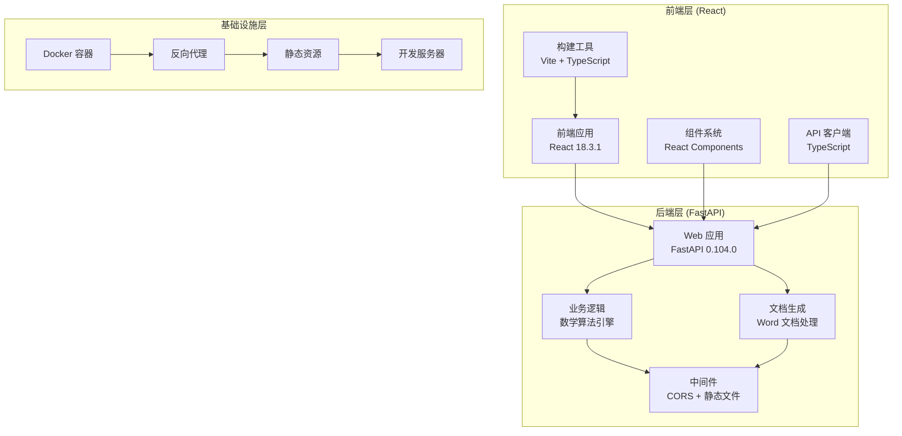

**图表来源**
- [src/math_learning/web/main.py:18-26](file://src/math_learning/web/main.py#L18-L26)
- [frontend/vite.config.ts:4-18](file://frontend/vite.config.ts#L4-L18)
- [Dockerfile:1-28](file://Dockerfile#L1-L28)

### 微服务架构特点

1. **前后端分离**：前端使用 React 进行用户界面开发，后端使用 FastAPI 提供 RESTful API
2. **职责清晰**：前端负责用户交互和展示，后端专注于业务逻辑和数据处理
3. **独立部署**：前后端可以独立开发、测试和部署
4. **技术栈现代化**：采用最新的 JavaScript 和 Python 技术栈

## 技术栈概览

### 后端技术栈

项目采用现代化的 Python 技术栈，专注于高性能和易用性：

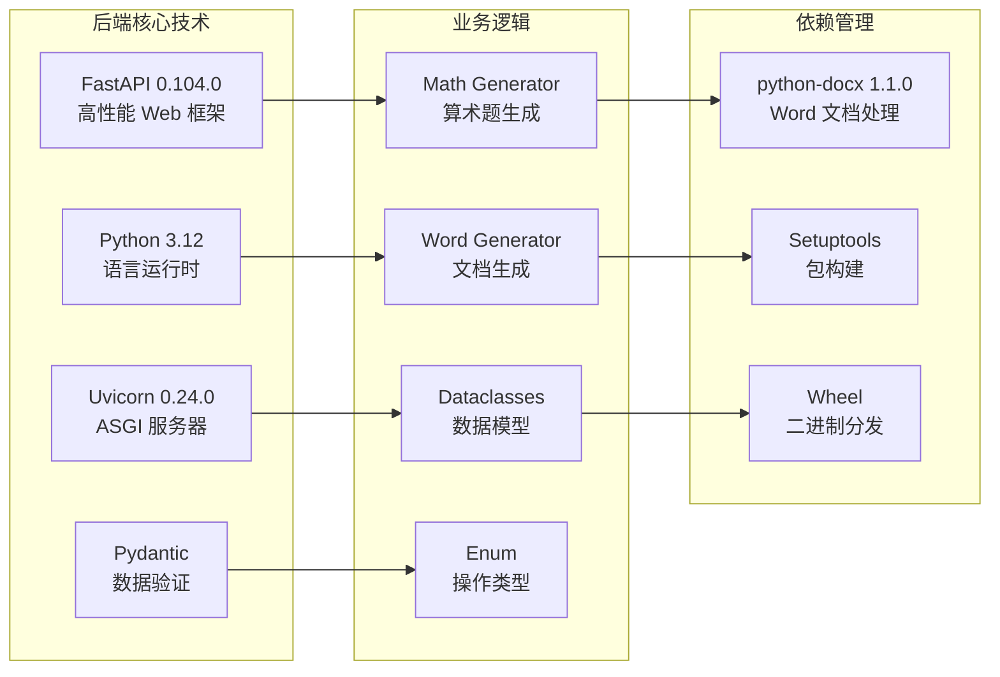

**图表来源**
- [pyproject.toml:10-14](file://pyproject.toml#L10-L14)
- [src/math_learning/core/generator.py:11-14](file://src/math_learning/core/generator.py#L11-L14)
- [src/math_learning/generator/word.py:8](file://src/math_learning/generator/word.py#L8)

### 前端技术栈

前端采用现代化的 React 技术栈，提供优秀的用户体验：

```mermaid
graph LR
subgraph "前端核心技术"
A[React 18.3.1<br/>用户界面库]
B[TypeScript 5.6.2<br/>类型安全]
C[Vite 6.0.0<br/>构建工具]
D[React DOM 18.3.1<br/>DOM 操作]
end
subgraph "开发工具"
E[@vitejs/plugin-react<br/>React 插件]
F[React DevTools<br/>调试工具]
G[ESLint + Prettier<br/>代码质量]
H[Proxy 代理<br/>开发服务器]
end
subgraph "组件系统"
I[ConfigPanel<br/>配置面板]
J[ProblemPreview<br/>题目预览]
K[API 客户端<br/>HTTP 请求]
L[样式系统<br/>CSS 模块]
end
A --> I
B --> J
C --> K
D --> L
E --> F
F --> G
G --> H
I --> J
J --> K
K --> L
```

**图表来源**
- [frontend/package.json:11-21](file://frontend/package.json#L11-L21)
- [frontend/src/components/ConfigPanel.tsx:10-87](file://frontend/src/components/ConfigPanel.tsx#L10-L87)
- [frontend/src/components/ProblemPreview.tsx:7-37](file://frontend/src/components/ProblemPreview.tsx#L7-L37)

**章节来源**
- [pyproject.toml:10-21](file://pyproject.toml#L10-L21)
- [frontend/package.json:11-21](file://frontend/package.json#L11-L21)

## 前后端分离设计

### 前端架构设计

前端采用组件化的 React 架构，实现了清晰的职责分离：

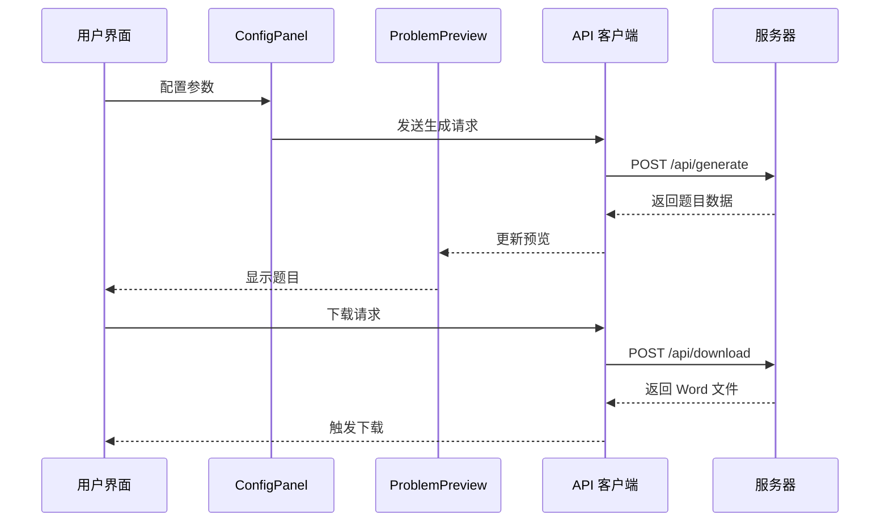

**图表来源**
- [frontend/src/App.tsx:14-37](file://frontend/src/App.tsx#L14-L37)
- [frontend/src/api.ts:20-50](file://frontend/src/api.ts#L20-L50)
- [src/math_learning/web/main.py:55-95](file://src/math_learning/web/main.py#L55-L95)

### 后端 API 设计

后端提供 RESTful API 接口，支持数学题目生成和 Word 文档下载：

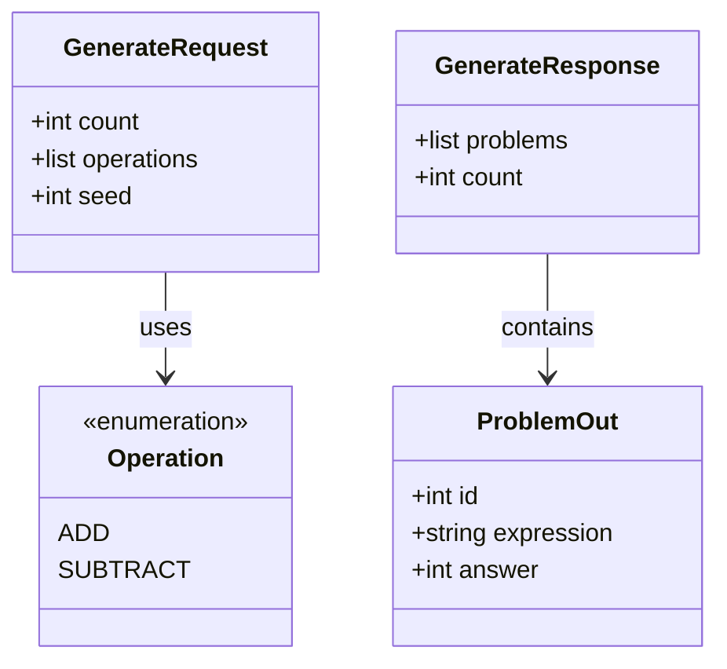

**图表来源**
- [src/math_learning/web/main.py:29-53](file://src/math_learning/web/main.py#L29-L53)
- [src/math_learning/core/generator.py:11-31](file://src/math_learning/core/generator.py#L11-L31)

**章节来源**
- [frontend/src/App.tsx:8-62](file://frontend/src/App.tsx#L8-L62)
- [src/math_learning/web/main.py:55-95](file://src/math_learning/web/main.py#L55-L95)

## 核心组件分析

### 数学算法引擎

核心的数学题目生成器实现了加法和减法的随机生成：

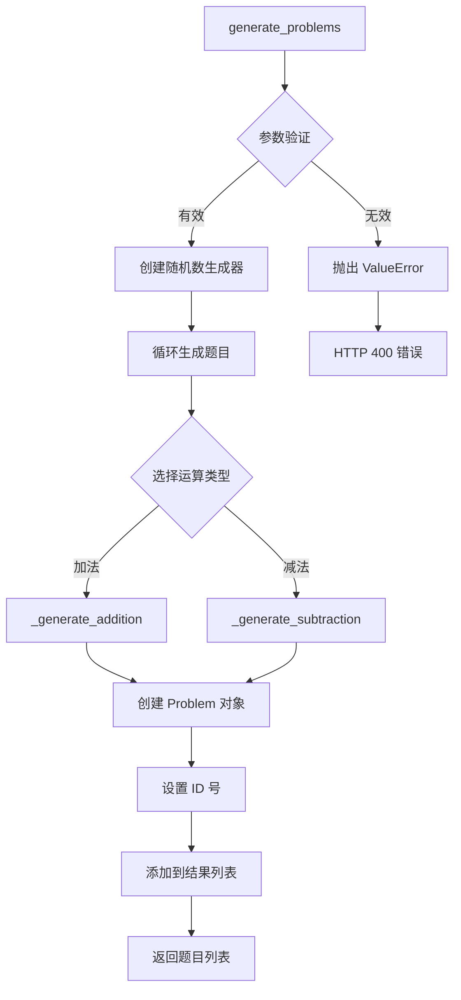

**图表来源**
- [src/math_learning/core/generator.py:65-101](file://src/math_learning/core/generator.py#L65-L101)

#### 功能特性

- **范围控制**：确保加法结果不超过 100，减法结果非负
- **随机性保证**：支持种子参数实现可重现的结果
- **类型安全**：使用 Pydantic 数据类确保数据完整性
- **性能优化**：批量生成减少函数调用开销

**章节来源**
- [src/math_learning/core/generator.py:33-56](file://src/math_learning/core/generator.py#L33-L56)

### Word 文档生成器

Word 文档生成器提供了专业的格式化功能：

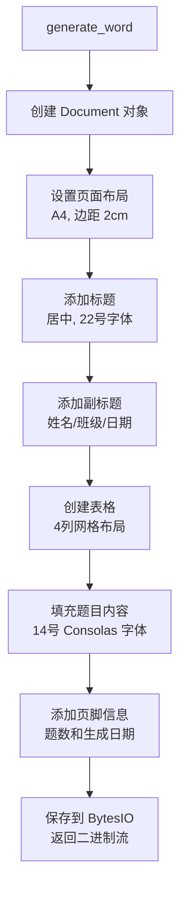

**图表来源**
- [src/math_learning/generator/word.py:22-87](file://src/math_learning/generator/word.py#L22-L87)

#### 格式化特性

- **专业布局**：A4 页面，2cm 边距，4列网格
- **字体设置**：等宽字体 Consolas，确保对齐效果
- **自动换行**：根据题目数量动态计算行数
- **元数据**：包含生成信息和统计数据

**章节来源**
- [src/math_learning/generator/word.py:15-20](file://src/math_learning/generator/word.py#L15-L20)

## 容器化部署

### Docker 架构设计

项目采用多阶段 Docker 构建，实现了高效的镜像管理和快速部署：

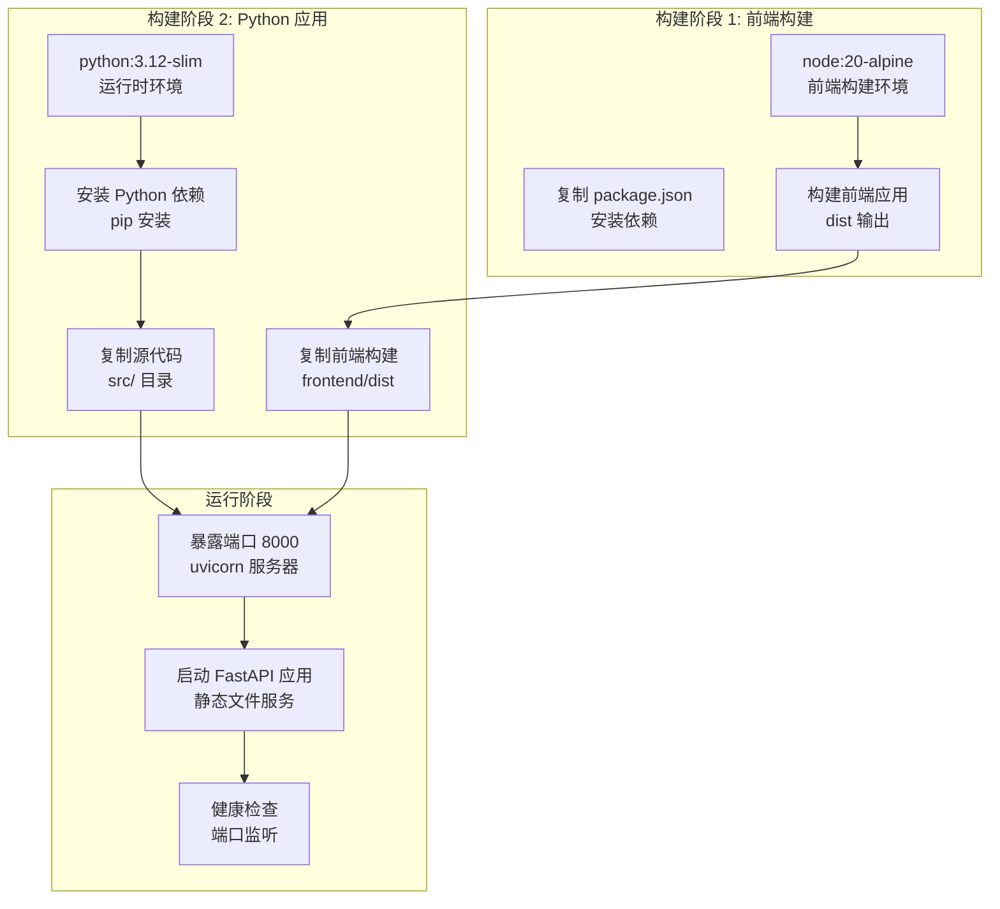

**图表来源**
- [Dockerfile:1-28](file://Dockerfile#L1-L28)

### 部署配置

Docker Compose 提供了简化的本地部署方案：

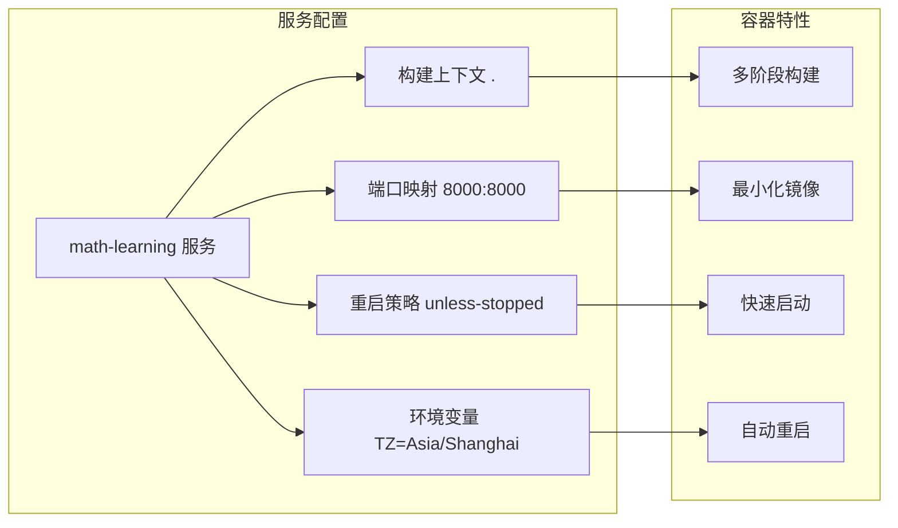

**图表来源**
- [docker-compose.yml:1-9](file://docker-compose.yml#L1-L9)

**章节来源**
- [Dockerfile:1-28](file://Dockerfile#L1-L28)
- [docker-compose.yml:1-9](file://docker-compose.yml#L1-L9)

## 开发工具链

### 前端开发工具

前端开发工具链提供了现代化的开发体验：

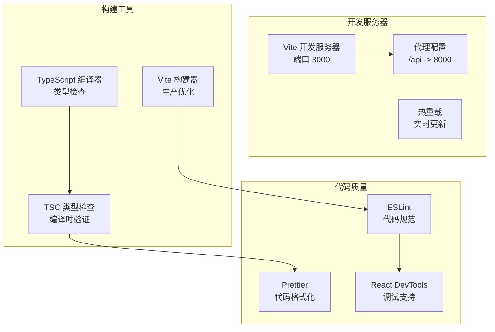

**图表来源**
- [frontend/vite.config.ts:6-18](file://frontend/vite.config.ts#L6-L18)
- [frontend/package.json:15-21](file://frontend/package.json#L15-L21)

### 后端开发工具

后端开发工具链确保代码质量和开发效率：

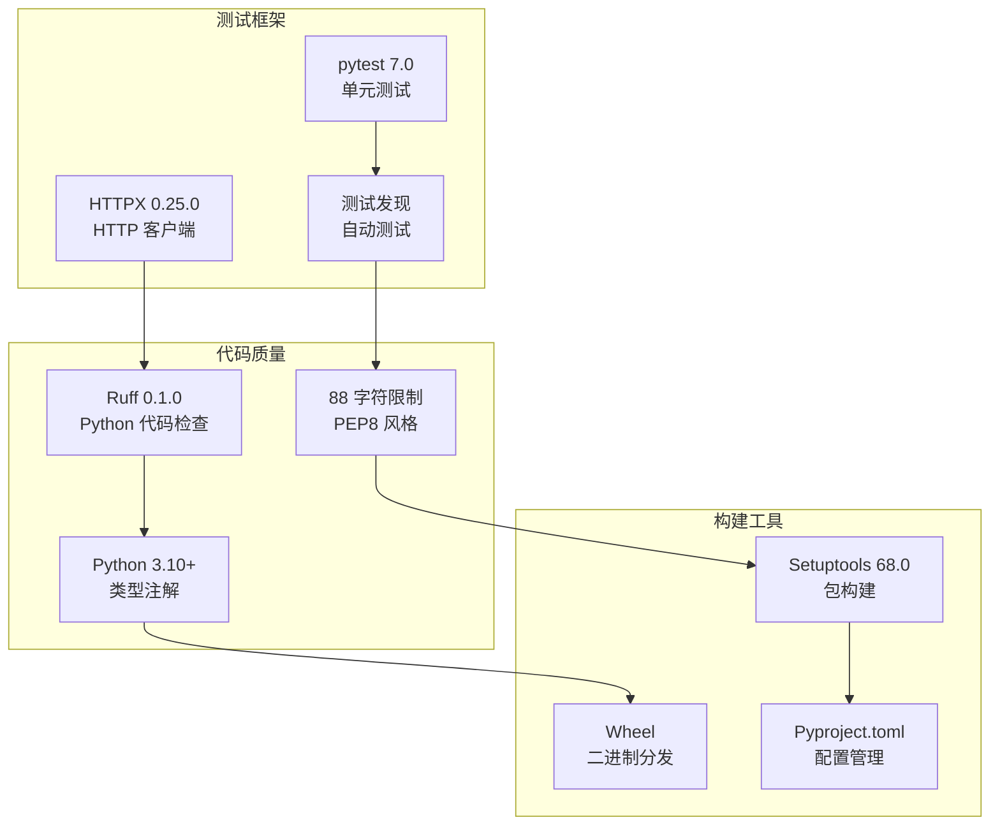

**图表来源**
- [pyproject.toml:17-21](file://pyproject.toml#L17-L21)
- [pyproject.toml:26-29](file://pyproject.toml#L26-L29)

**章节来源**
- [frontend/vite.config.ts:6-18](file://frontend/vite.config.ts#L6-L18)
- [pyproject.toml:17-29](file://pyproject.toml#L17-L29)

## 性能考虑

### 前端性能优化

前端应用采用了多项性能优化策略：

- **组件懒加载**：React 组件按需加载，减少初始包大小
- **虚拟滚动**：大量题目时使用虚拟滚动避免 DOM 节点过多
- **状态管理**：使用 React hooks 进行高效的状态更新
- **构建优化**：Vite 的快速冷启动和热重载机制

### 后端性能优化

后端服务针对高并发进行了专门优化：

- **异步处理**：FastAPI 的异步请求处理能力
- **流式响应**：Word 文档生成使用 BytesIO 流式传输
- **静态文件服务**：生产环境直接提供前端静态文件
- **CORS 优化**：开发环境的跨域配置简化了调试

### 容器化性能

Docker 多阶段构建提供了最佳的性能平衡：

- **镜像大小**：Python slim 基础镜像减少容器体积
- **构建缓存**：分层构建充分利用 Docker 缓存
- **启动时间**：单进程 Uvicorn 服务器快速启动
- **资源占用**：最小化依赖减少内存占用

## 故障排除指南

### 常见开发问题

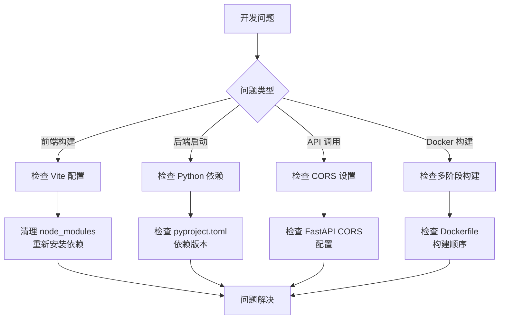

### 生产环境部署

- **端口冲突**：确保 8000 端口未被占用
- **网络连接**：检查容器间网络通信
- **时区配置**：Asia/Shanghai 时区确保正确的时间显示
- **静态文件**：确认 frontend/dist 目录存在且可访问

**章节来源**
- [frontend/vite.config.ts:8-12](file://frontend/vite.config.ts#L8-L12)
- [docker-compose.yml:4-5](file://docker-compose.yml#L4-L5)

## 结论

数学学习项目代表了现代教育技术的发展方向，通过采用前后端分离的微服务架构和现代化技术栈，为数学教育应用提供了一个强大而灵活的基础平台。

### 项目优势

1. **架构先进性**：采用最新的前后端分离架构，符合现代软件开发趋势
2. **技术栈现代化**：FastAPI + React 的组合提供了高性能和开发效率
3. **部署便捷性**：Docker 容器化部署简化了环境配置和运维
4. **可扩展性强**：微服务架构支持功能的独立开发和扩展

### 技术特色

- **前后端分离**：清晰的职责分离和独立开发流程
- **微服务架构**：模块化的服务设计支持功能独立演进
- **容器化部署**：Docker 多阶段构建确保部署效率
- **现代化工具链**：Vite + TypeScript + Ruff 提供优秀的开发体验

### 发展前景

项目为数学教育技术的发展提供了坚实的技术基础，通过合理的架构设计和工具配置，能够支持从基础算术练习到复杂数学学习应用的开发需求。未来可以在此基础上扩展更多数学功能模块，集成学习分析系统，以及支持多语言和多地区的需求。