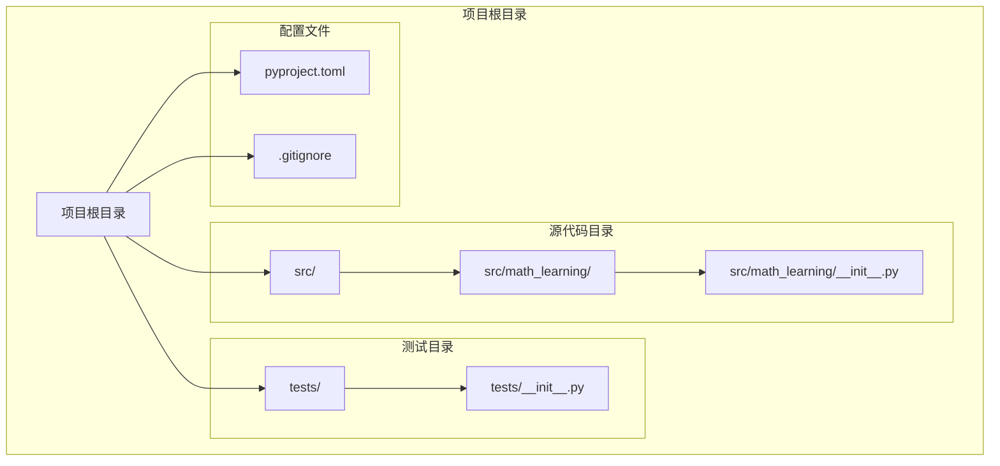
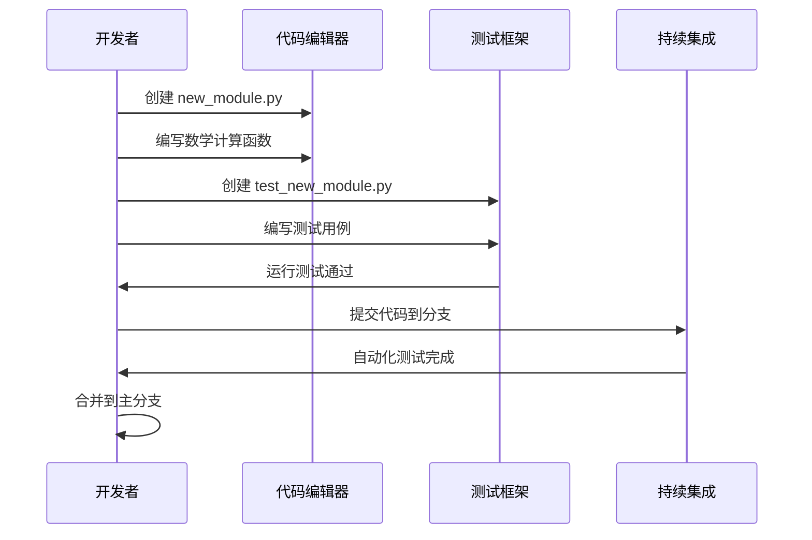

# 项目结构

<cite>
**本文档引用的文件**
- [pyproject.toml](file://pyproject.toml)
- [.gitignore](file://.gitignore)
- [src/math_learning/__init__.py](file://src/math_learning/__init__.py)
- [tests/__init__.py](file://tests/__init__.py)
</cite>

## 目录结构概览

数学学习项目采用标准的Python包结构设计，遵循现代Python开发最佳实践。项目结构简洁明了，便于扩展和维护。

**图表来源**
- [pyproject.toml:1-24](file://pyproject.toml#L1-L24)
- [.gitignore:1-34](file://.gitignore#L1-L34)
- [src/math_learning/__init__.py:1-4](file://src/math_learning/__init__.py#L1-L4)
- [tests/__init__.py:1-2](file://tests/__init__.py#L1-L2)

## 核心组件分析

### 源代码包结构

项目采用标准的Python包结构，所有源代码都位于`src/`目录下，这是现代Python项目的推荐做法。

#### 主包结构
- **src/math_learning/**: 主要的数学学习包
- **src/math_learning/__init__.py**: 包初始化文件，定义包版本信息

#### 包初始化文件功能
- 定义`__version__`变量，用于包版本管理
- 提供包级别的文档字符串
- 作为包的入口点，支持从外部导入

**章节来源**
- [src/math_learning/__init__.py:1-4](file://src/math_learning/__init__.py#L1-L4)

### 测试框架准备

测试目录结构简单而完整，遵循Python测试最佳实践。

#### 测试包结构
- **tests/**: 测试代码根目录
- **tests/__init__.py**: 测试包初始化文件

#### 测试包功能
- 提供测试包的文档字符串
- 支持pytest测试框架的自动发现机制
- 作为测试模块的命名空间

**章节来源**
- [tests/__init__.py:1-2](file://tests/__init__.py#L1-L2)

## 配置文件详解

### pyproject.toml 配置文件

该项目使用现代Python打包配置文件，替代传统的setup.py和setup.cfg。

#### 构建系统配置
- **build-backend**: 使用setuptools构建后端
- **requires**: 指定构建依赖（setuptools>=68.0, wheel）

#### 项目元数据配置
- **name**: "math-learning" - 项目名称
- **version**: "0.1.0" - 初始版本号
- **description**: "A math learning project" - 项目描述
- **requires-python**: ">=3.10" - Python版本要求

#### 依赖管理
- **dependencies**: 空列表 - 运行时依赖（当前无依赖）
- **optional-dependencies.dev**: 开发依赖组
  - pytest>=7.0: 测试框架
  - ruff>=0.1.0: 代码格式化和质量检查工具

#### 包发现配置
- **tool.setuptools.packages.find.where**: ["src"] - 指定包查找路径
- **tool.ruff**: 代码风格配置
  - line-length: 88 - 行长度限制
  - target-version: py310 - 目标Python版本

**章节来源**
- [pyproject.toml:1-24](file://pyproject.toml#L1-L24)

### .gitignore 版本控制配置

版本控制忽略文件确保不会提交不必要的文件到Git仓库。

#### Python相关忽略
- `__pycache__/`: 编译后的Python字节码缓存
- `*.py[cod]`: 编译后的Python文件
- `*.egg-info/`: 打包信息目录

#### 分发和构建产物
- `dist/`: 分发包输出目录
- `build/`: 构建输出目录
- `*.egg`: 打包产物

#### 虚拟环境
- `.venv/`, `venv/`, `env/`: 常见虚拟环境目录

#### IDE和操作系统
- `.idea/`, `.vscode/`: IDE配置
- `.DS_Store`, `Thumbs.db`: 操作系统文件

#### 测试和代码质量
- `.pytest_cache/`: pytest缓存
- `.coverage`, `htmlcov/`: 覆盖率报告
- `.ruff_cache/`: Ruff代码检查缓存

**章节来源**
- [.gitignore:1-34](file://.gitignore#L1-L34)

## 标准Python包结构最佳实践

### 目录组织原则

1. **src/目录结构**: 将所有源代码放在src/目录下，避免与包名冲突
2. **独立的测试目录**: tests/目录与源代码分离，便于测试发现
3. **明确的包边界**: 每个包都有清晰的职责划分
4. **版本控制隔离**: .gitignore排除构建产物和缓存文件

### 包设计模式

#### 包初始化策略
- 在`__init__.py`中定义包级别的常量和版本信息
- 提供包的公共接口
- 支持从包外导入

#### 模块化设计
- 将相关功能组织在同一个包内
- 使用清晰的模块命名
- 保持模块间的低耦合高内聚

## 版本控制策略

### Git工作流程

1. **分支管理**: 建议使用功能分支开发，主分支保持稳定
2. **提交规范**: 使用清晰的提交消息，描述变更内容
3. **标签管理**: 发布版本时创建Git标签
4. **持续集成**: 集成CI/CD流程进行自动化测试

### 文件管理策略

#### 忽略规则分类
- **编译产物**: 自动排除Python字节码和打包文件
- **开发环境**: 排除IDE和编辑器特定文件
- **临时文件**: 忽略缓存和日志文件
- **虚拟环境**: 不提交虚拟环境文件

## 开发工作流程

### 本地开发环境设置

1. **创建虚拟环境**: 使用Python 3.10+创建隔离环境
2. **安装开发依赖**: `pip install -e ".[dev]"` 安装开发包
3. **代码检查**: 使用Ruff进行代码质量检查
4. **单元测试**: 使用pytest运行测试套件

### 代码质量保证

#### 代码格式化
- 使用Ruff统一代码风格
- 遵循PEP 8编码规范
- 维持适当的行长度限制

#### 测试驱动开发
- 编写测试用例验证功能
- 使用pytest框架进行测试
- 维持高覆盖率的测试套件

## 实际扩展指南

### 添加新模块的步骤

#### 步骤1：创建模块文件
在`src/math_learning/`目录下创建新的Python模块文件：
- 命名遵循Python命名约定（小写字母和下划线）
- 文件扩展名为`.py`
- 包含适当的文档字符串

#### 步骤2：更新包初始化
在`src/math_learning/__init__.py`中：
- 导入新模块或类
- 更新包的公共接口
- 维护版本信息

#### 步骤3：编写测试文件
在`tests/`目录下创建对应的测试文件：
- 文件命名以`test_`前缀开头
- 使用pytest装饰器标记测试函数
- 编写完整的测试用例

#### 步骤4：更新配置文件
根据需要更新`pyproject.toml`：
- 添加运行时依赖
- 配置新的开发工具
- 更新包元数据

### 示例：添加数学计算模块

**图表来源**
- [pyproject.toml:12-16](file://pyproject.toml#L12-L16)
- [tests/__init__.py:1-2](file://tests/__init__.py#L1-L2)

### 添加测试文件的标准流程

#### 测试文件命名规范
- 使用`test_`前缀命名测试文件
- 与被测试模块同名或相关联
- 避免使用特殊字符和空格

#### 测试用例组织
- 使用pytest装饰器标记测试函数
- 编写清晰的测试描述
- 覆盖正常和异常情况
- 使用参数化测试提高效率

#### 测试数据管理
- 使用fixtures管理测试数据
- 保持测试数据的独立性
- 清理测试产生的临时数据

## 性能考虑

### 代码组织优化

#### 模块加载性能
- 避免循环导入
- 使用延迟导入减少启动时间
- 优化包导入顺序

#### 内存使用优化
- 及时释放不需要的对象
- 使用生成器处理大数据集
- 避免全局状态污染

### 构建和分发优化

#### 包大小控制
- 移除未使用的依赖
- 优化资源文件大小
- 使用压缩技术减少包体积

#### 安装性能
- 减少安装时的计算开销
- 优化依赖解析过程
- 提供预编译的二进制文件

## 故障排除指南

### 常见问题解决

#### 包导入问题
- 确保`src/`目录在Python路径中
- 检查包初始化文件的正确性
- 验证模块路径的相对性

#### 测试运行失败
- 检查pytest配置是否正确
- 验证测试文件命名规范
- 确认测试依赖已正确安装

#### 构建错误
- 检查Python版本兼容性
- 验证构建依赖的版本
- 确认打包配置正确

### 调试技巧

#### 日志记录
- 使用标准logging模块记录调试信息
- 设置适当的日志级别
- 输出关键执行路径的信息

#### 错误处理
- 实现优雅的错误处理机制
- 提供有意义的错误消息
- 记录错误堆栈跟踪

## 结论

数学学习项目采用了现代化的Python项目结构，遵循最佳实践和标准配置。这种结构为项目的长期发展提供了良好的基础，便于团队协作和持续集成。

### 项目优势

1. **清晰的结构**: 标准化的目录组织便于理解和维护
2. **现代化配置**: 使用pyproject.toml替代传统配置文件
3. **完善的测试**: 准备了pytest测试框架的基础结构
4. **版本控制友好**: 全面的.gitignore配置避免了不必要的文件提交

### 扩展建议

1. **功能模块化**: 按数学领域划分功能模块
2. **文档完善**: 添加详细的API文档和用户指南
3. **持续集成**: 配置自动化测试和部署流程
4. **代码质量**: 引入更多的静态分析工具

这个项目结构为数学学习应用的开发奠定了坚实的基础，支持未来的功能扩展和技术演进。