# Web API接口文档

<cite>
**本文档引用的文件**
- [src/math_learning/web/main.py](file://src/math_learning/web/main.py)
- [src/math_learning/core/generator.py](file://src/math_learning/core/generator.py)
- [src/math_learning/generator/word.py](file://src/math_learning/generator/word.py)
- [src/math_learning/grader/checker.py](file://src/math_learning/grader/checker.py)
- [src/math_learning/grader/ocr_cloud.py](file://src/math_learning/grader/ocr_cloud.py)
- [src/math_learning/grader/ocr_local.py](file://src/math_learning/grader/ocr_local.py)
- [frontend/src/api.ts](file://frontend/src/api.ts)
- [frontend/src/App.tsx](file://frontend/src/App.tsx)
- [frontend/src/components/ConfigPanel.tsx](file://frontend/src/components/ConfigPanel.tsx)
- [frontend/src/components/GradePanel.tsx](file://frontend/src/components/GradePanel.tsx)
- [frontend/src/components/GradeResult.tsx](file://frontend/src/components/GradeResult.tsx)
- [frontend/src/components/ProblemPreview.tsx](file://frontend/src/components/ProblemPreview.tsx)
- [pyproject.toml](file://pyproject.toml)
- [Dockerfile](file://Dockerfile)
- [docker-compose.yml](file://docker-compose.yml)
- [tests/test_generator.py](file://tests/test_generator.py)
- [tests/test_grader.py](file://tests/test_grader.py)
</cite>

## 更新摘要
**变更内容**
- 新增OCR自动批改API接口：/api/grade和/api/grade/recheck端点
- 支持图像上传、OCR识别和智能评分功能
- 新增云端和本地OCR识别模式
- 增强前端GradePanel和GradeResult组件以支持OCR批改
- 添加OCR配置管理接口：/api/config/ocr

## 目录
1. [简介](#简介)
2. [项目结构](#项目结构)
3. [核心组件](#核心组件)
4. [架构概览](#架构概览)
5. [详细组件分析](#详细组件分析)
6. [API接口规范](#api接口规范)
7. [数据模型](#数据模型)
8. [错误处理](#错误处理)
9. [部署与运行](#部署与运行)
10. [性能考虑](#性能考虑)
11. [故障排除指南](#故障排除指南)
12. [总结](#总结)

## 简介

这是一个基于Python FastAPI构建的数学练习题生成Web应用。该系统提供100以内的加减法口算题生成服务，现已扩展支持除法带余数运算和OCR自动批改功能。应用采用前后端分离架构，后端提供RESTful API接口，前端使用React + TypeScript开发用户界面。系统支持在线预览、Word文档下载、OCR自动批改以及云端AI视觉识别功能。

## 项目结构

项目采用模块化设计，主要分为以下层次：

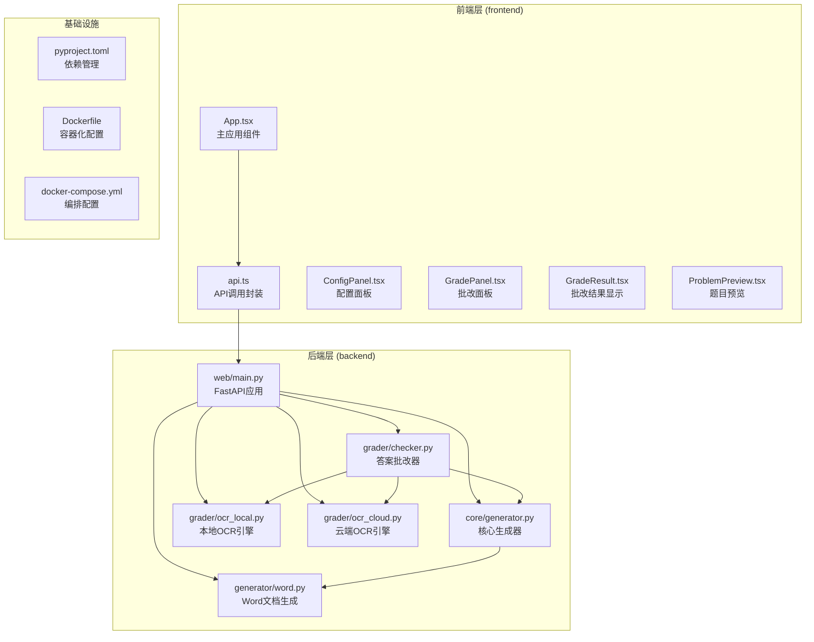

**图表来源**
- [src/math_learning/web/main.py:1-297](file://src/math_learning/web/main.py#L1-L297)
- [src/math_learning/core/generator.py:1-99](file://src/math_learning/core/generator.py#L1-L99)
- [src/math_learning/generator/word.py:1-88](file://src/math_learning/generator/word.py#L1-L88)
- [src/math_learning/grader/checker.py:1-228](file://src/math_learning/grader/checker.py#L1-L228)
- [src/math_learning/grader/ocr_local.py:1-172](file://src/math_learning/grader/ocr_local.py#L1-L172)
- [src/math_learning/grader/ocr_cloud.py:1-167](file://src/math_learning/grader/ocr_cloud.py#L1-L167)

**章节来源**
- [pyproject.toml:1-29](file://pyproject.toml#L1-L29)
- [Dockerfile:1-28](file://Dockerfile#L1-L28)
- [docker-compose.yml:1-9](file://docker-compose.yml#L1-L9)

## 核心组件

### 后端核心组件

#### FastAPI应用服务器
- 提供RESTful API接口
- 支持CORS跨域访问
- 集成静态文件服务（生产环境）
- 错误处理和异常管理
- **新增**：OCR配置管理接口

#### 数学问题生成器
- 支持加法、减法和除法带余数运算
- 随机种子控制可重现性
- 范围限制在100以内
- 数据类封装问题结构

#### Word文档生成器
- 使用python-docx库
- A4页面布局优化
- 四列网格排版
- 自定义字体和间距

#### 答案批改器
- OCR识别结果处理
- 多种运算类型的答案比较
- 图像标注和评分计算
- 余数验证支持

#### OCR引擎
- **本地OCR**：基于EasyOCR的手写识别
- **云端OCR**：支持OpenAI兼容API的AI视觉模型
- **智能配置**：动态API密钥管理和模型选择

**章节来源**
- [src/math_learning/web/main.py:18-26](file://src/math_learning/web/main.py#L18-L26)
- [src/math_learning/core/generator.py:11-31](file://src/math_learning/core/generator.py#L11-L31)
- [src/math_learning/generator/word.py:22-87](file://src/math_learning/generator/word.py#L22-L87)
- [src/math_learning/grader/checker.py:15-35](file://src/math_learning/grader/checker.py#L15-L35)
- [src/math_learning/grader/ocr_local.py:1-172](file://src/math_learning/grader/ocr_local.py#L1-L172)
- [src/math_learning/grader/ocr_cloud.py:1-167](file://src/math_learning/grader/ocr_cloud.py#L1-L167)

### 前端核心组件

#### API调用封装
- 统一的HTTP请求处理
- 错误状态码检查
- Blob下载处理
- 类型安全的接口定义
- **新增**：OCR批改API调用

#### 用户界面组件
- 配置面板（题目数量、运算类型）
- 题目预览网格
- **新增**：批改面板（图像上传、OCR模式选择）
- **新增**：批改结果显示（含余数输入）
- 实时状态反馈
- 响应式设计

**章节来源**
- [frontend/src/api.ts:1-126](file://frontend/src/api.ts#L1-L126)
- [frontend/src/components/ConfigPanel.tsx:1-88](file://frontend/src/components/ConfigPanel.tsx#L1-L88)
- [frontend/src/components/GradePanel.tsx:1-173](file://frontend/src/components/GradePanel.tsx#L1-L173)
- [frontend/src/components/GradeResult.tsx:1-108](file://frontend/src/components/GradeResult.tsx#L1-L108)
- [frontend/src/components/ProblemPreview.tsx:1-38](file://frontend/src/components/ProblemPreview.tsx#L1-L38)

## 架构概览

系统采用经典的三层架构模式，现已扩展支持OCR自动批改：

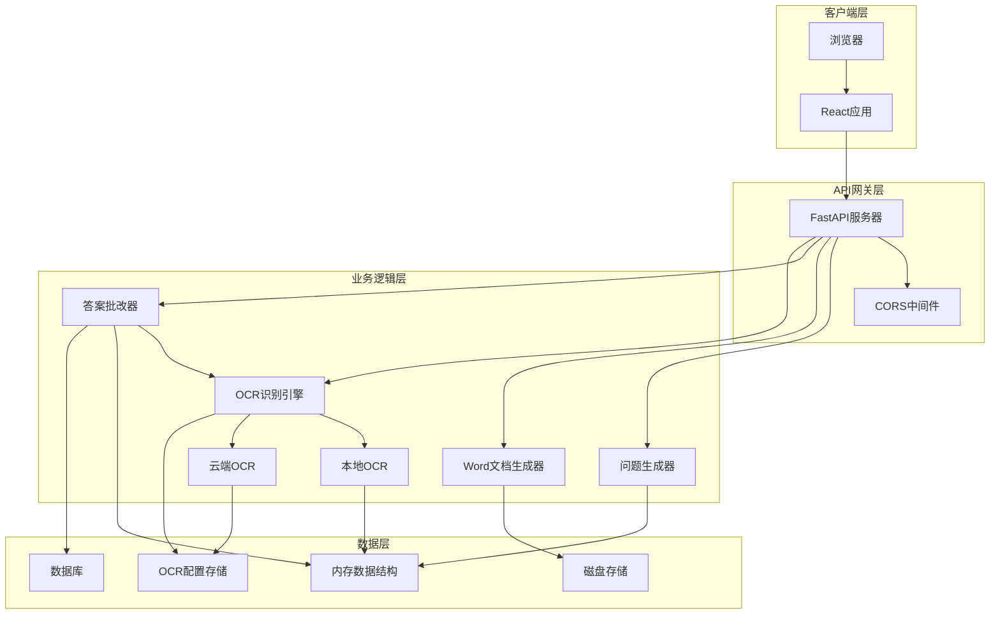

**图表来源**
- [src/math_learning/web/main.py:55-95](file://src/math_learning/web/main.py#L55-L95)
- [src/math_learning/core/generator.py:65-99](file://src/math_learning/core/generator.py#L65-L99)
- [src/math_learning/generator/word.py:22-87](file://src/math_learning/generator/word.py#L22-L87)
- [src/math_learning/grader/checker.py:61-107](file://src/math_learning/grader/checker.py#L61-L107)
- [src/math_learning/grader/ocr_local.py:150-172](file://src/math_learning/grader/ocr_local.py#L150-L172)
- [src/math_learning/grader/ocr_cloud.py:85-167](file://src/math_learning/grader/ocr_cloud.py#L85-L167)

## 详细组件分析

### API接口实现

#### 生成题目接口
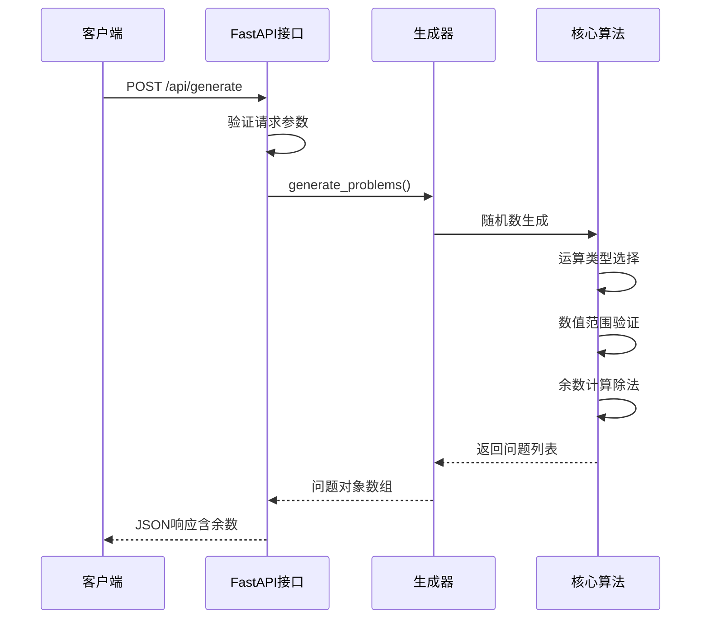

**图表来源**
- [src/math_learning/web/main.py:66-84](file://src/math_learning/web/main.py#L66-L84)
- [src/math_learning/core/generator.py:65-99](file://src/math_learning/core/generator.py#L65-L99)

#### 下载Word文档接口
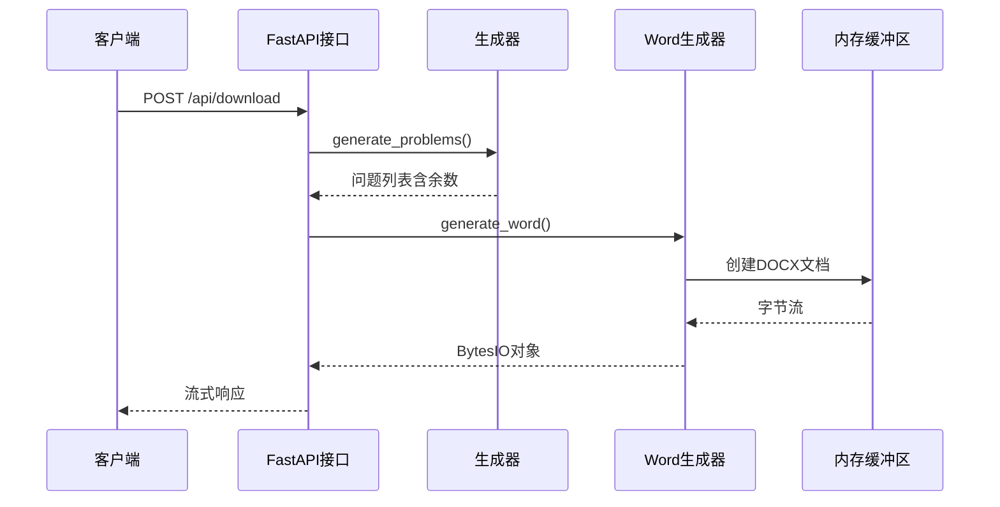

**图表来源**
- [src/math_learning/web/main.py:87-106](file://src/math_learning/web/main.py#L87-L106)
- [src/math_learning/generator/word.py:22-87](file://src/math_learning/generator/word.py#L22-L87)

#### OCR自动批改接口
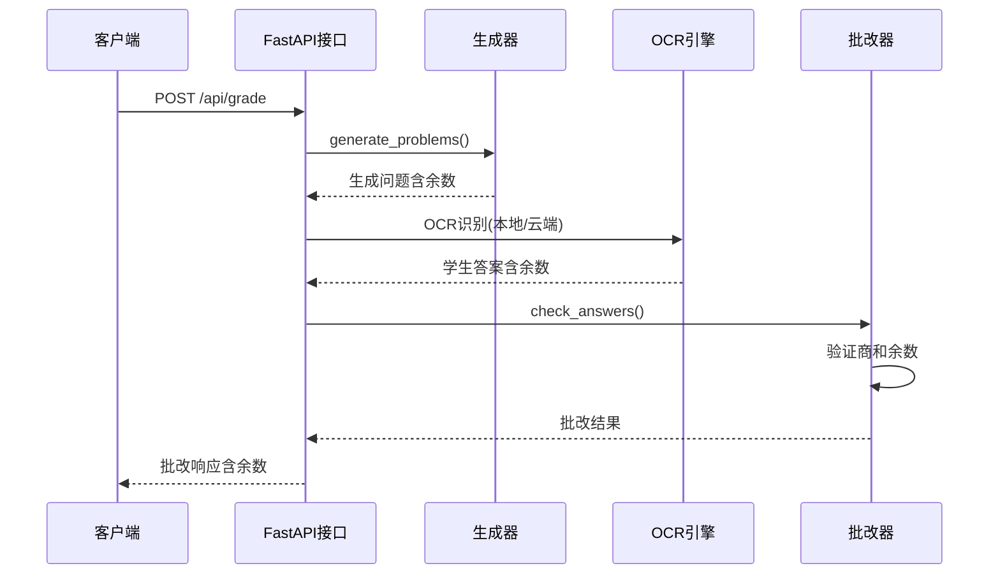

**图表来源**
- [src/math_learning/web/main.py:158-236](file://src/math_learning/web/main.py#L158-L236)
- [src/math_learning/grader/checker.py:61-107](file://src/math_learning/grader/checker.py#L61-L107)
- [src/math_learning/grader/ocr_local.py:150-172](file://src/math_learning/grader/ocr_local.py#L150-L172)
- [src/math_learning/grader/ocr_cloud.py:85-167](file://src/math_learning/grader/ocr_cloud.py#L85-L167)

#### 重新批改接口
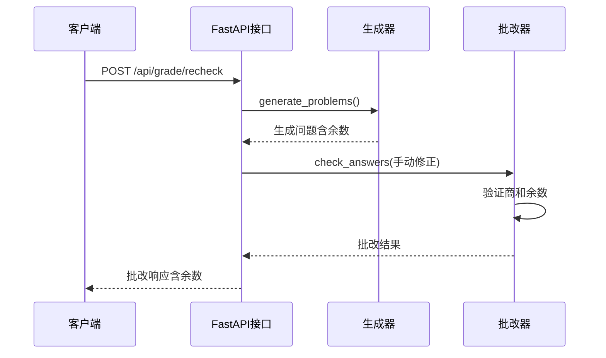

**图表来源**
- [src/math_learning/web/main.py:239-278](file://src/math_learning/web/main.py#L239-L278)
- [src/math_learning/grader/checker.py:61-107](file://src/math_learning/grader/checker.py#L61-L107)

#### OCR配置管理接口
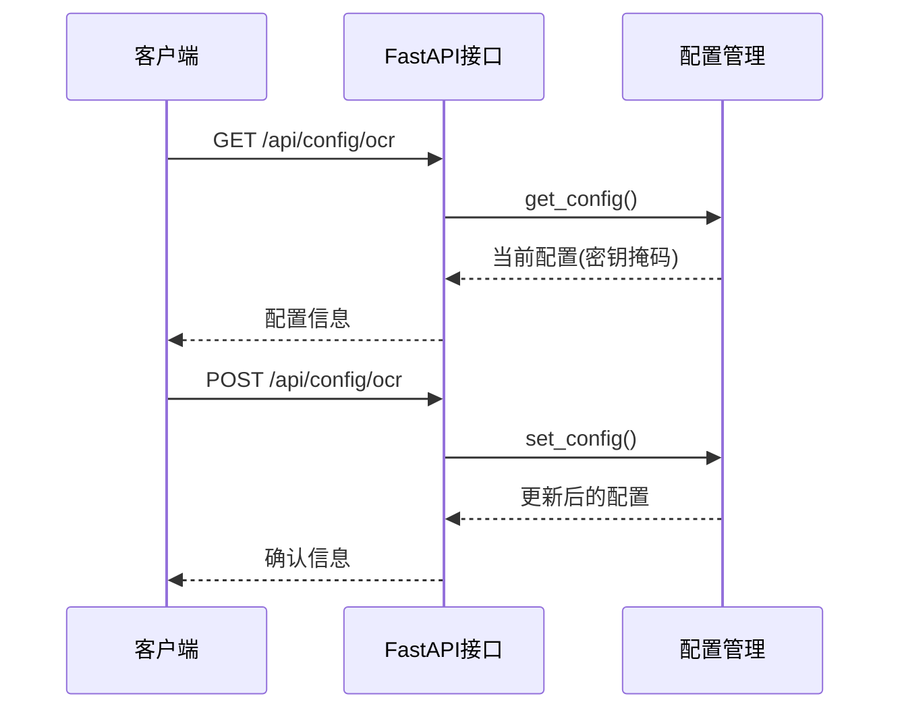

**图表来源**
- [src/math_learning/web/main.py:281-290](file://src/math_learning/web/main.py#L281-L290)
- [src/math_learning/grader/ocr_cloud.py:26-44](file://src/math_learning/grader/ocr_cloud.py#L26-L44)

**章节来源**
- [src/math_learning/web/main.py:66-290](file://src/math_learning/web/main.py#L66-L290)

### 数据结构设计

#### 问题数据模型
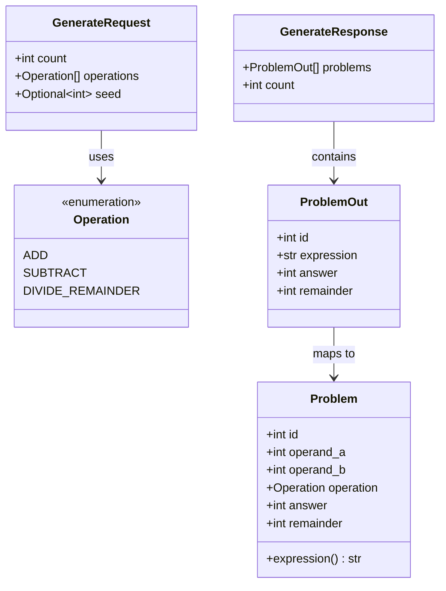

**图表来源**
- [src/math_learning/core/generator.py:11-31](file://src/math_learning/core/generator.py#L11-L31)
- [src/math_learning/web/main.py:50-64](file://src/math_learning/web/main.py#L50-L64)

#### OCR批改数据模型
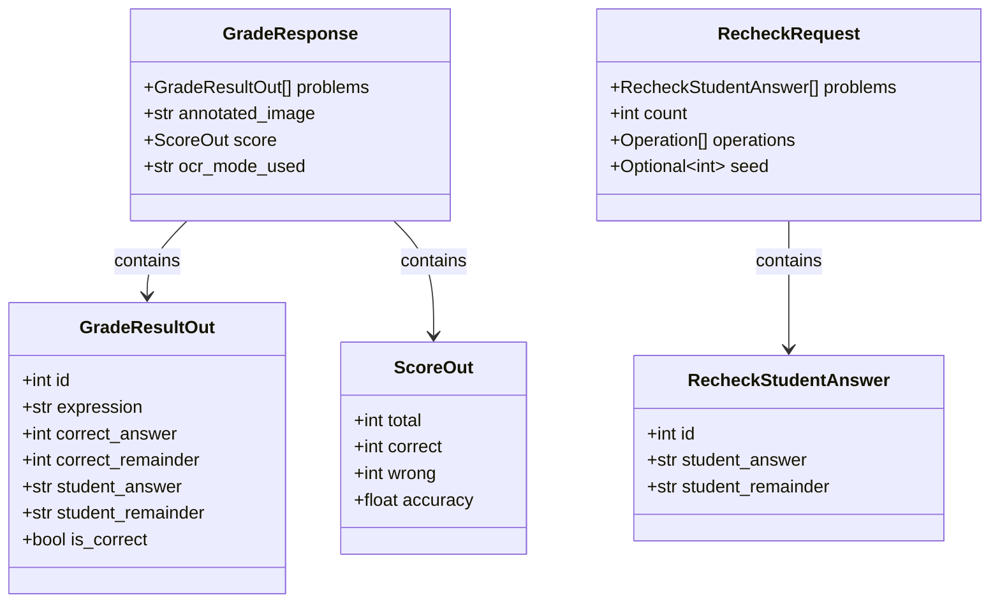

**图表来源**
- [src/math_learning/web/main.py:112-147](file://src/math_learning/web/main.py#L112-L147)
- [src/math_learning/web/main.py:158-278](file://src/math_learning/web/main.py#L158-L278)

**章节来源**
- [src/math_learning/core/generator.py:16-31](file://src/math_learning/core/generator.py#L16-L31)
- [src/math_learning/web/main.py:50-64](file://src/math_learning/web/main.py#L50-L64)
- [src/math_learning/web/main.py:112-147](file://src/math_learning/web/main.py#L112-L147)

### 前端交互流程

#### 配置面板组件
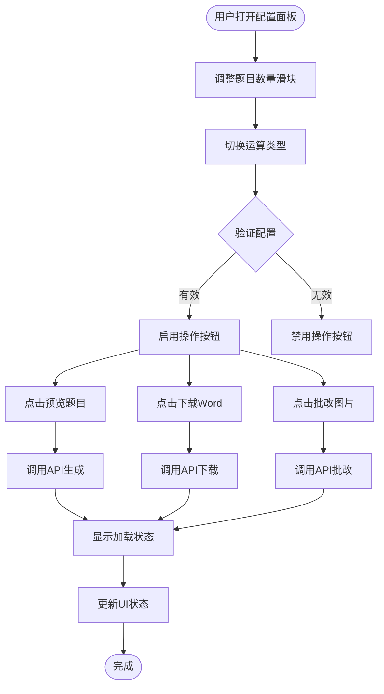

**图表来源**
- [frontend/src/components/ConfigPanel.tsx:10-87](file://frontend/src/components/ConfigPanel.tsx#L10-L87)
- [frontend/src/App.tsx:14-37](file://frontend/src/App.tsx#L14-L37)

#### 批改面板组件
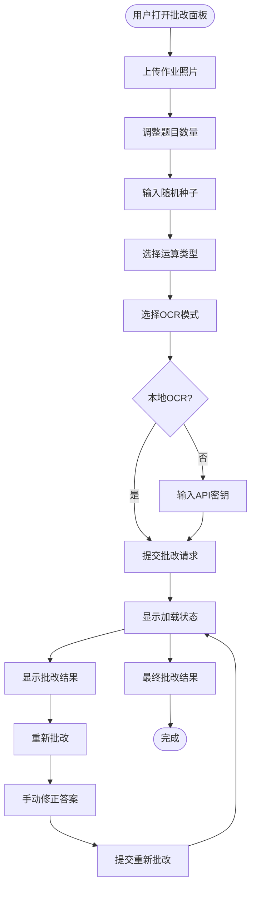

**图表来源**
- [frontend/src/components/GradePanel.tsx:15-173](file://frontend/src/components/GradePanel.tsx#L15-L173)
- [frontend/src/components/GradeResult.tsx:12-108](file://frontend/src/components/GradeResult.tsx#L12-L108)

#### 批改结果显示组件
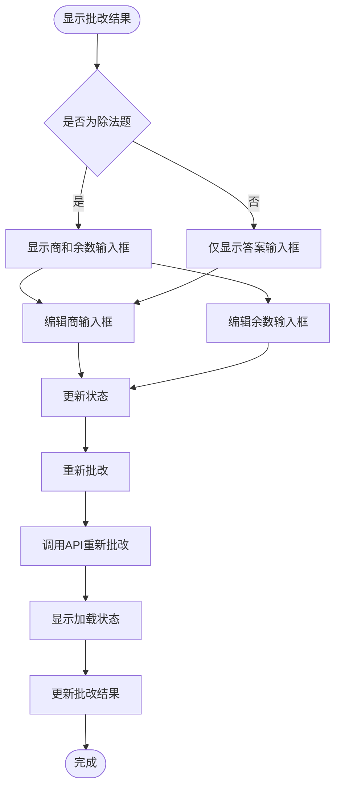

**图表来源**
- [frontend/src/components/GradeResult.tsx:12-33](file://frontend/src/components/GradeResult.tsx#L12-L33)
- [frontend/src/api.ts:55-77](file://frontend/src/api.ts#L55-L77)

**章节来源**
- [frontend/src/components/ConfigPanel.tsx:1-88](file://frontend/src/components/ConfigPanel.tsx#L1-L88)
- [frontend/src/components/GradePanel.tsx:1-173](file://frontend/src/components/GradePanel.tsx#L1-L173)
- [frontend/src/components/GradeResult.tsx:1-108](file://frontend/src/components/GradeResult.tsx#L1-L108)
- [frontend/src/App.tsx:1-63](file://frontend/src/App.tsx#L1-L63)

## API接口规范

### 接口概览

| 方法 | 路径 | 功能描述 | 请求体 | 响应体 |
|------|------|----------|--------|--------|
| POST | `/api/generate` | 生成数学题目并返回JSON | [GenerateRequest](#请求体规范) | [GenerateResponse](#响应体规范) |
| POST | `/api/download` | 生成Word文档并下载 | [GenerateRequest](#请求体规范) | Stream |
| POST | `/api/grade` | 批改学生作业照片 | [GradeRequest](#批改请求体规范) | [GradeResponse](#批改响应体规范) |
| POST | `/api/grade/recheck` | 重新批改手动修正的答案 | [RecheckRequest](#重新批改请求体规范) | [GradeResponse](#批改响应体规范) |
| GET | `/api/config/ocr` | 获取OCR配置信息 | 无 | [OCRConfig](#ocr配置规范) |
| POST | `/api/config/ocr` | 更新OCR配置信息 | [OcrConfigUpdate](#ocr配置更新请求体规范) | [OCRConfig](#ocr配置规范) |

### 请求体规范

#### GenerateRequest
- `count`: number (1-200，默认20)
- `operations`: string[] (默认['add','subtract']，现支持['add','subtract','divide_remainder'])
- `seed`: number (可选，用于可重现性)

#### GradeRequest
- `image`: File (作业照片)
- `count`: number (题目数量)
- `operations`: string[] (运算类型数组)
- `seed`: number (可选，用于重现相同题目)
- `ocr_mode`: string (本地或云端OCR)
- `api_key`: string (云端OCR密钥)
- `base_url`: string (云端OCR地址)
- `model`: string (OCR模型)

#### RecheckRequest
- `problems`: [RecheckStudentAnswer[]](#重新批改学生答案)
- `count`: number
- `operations`: string[]
- `seed`: number

#### RecheckStudentAnswer
- `id`: number
- `student_answer`: string (商)
- `student_remainder`: string (余数)

#### OcrConfigUpdate
- `api_key`: string (默认空字符串)
- `base_url`: string (默认空字符串)
- `model`: string (默认空字符串)

### 响应体规范

#### GenerateResponse
- `problems`: ProblemOut[]
- `count`: number

#### ProblemOut
- `id`: number
- `expression`: string (如："23 + 45 = ____" 或 "23 ÷ 5 = ____ …… ____")
- `answer`: number (商)
- `remainder`: number (余数，除法时提供)

#### GradeResponse
- `problems`: GradeResultItem[]
- `annotated_image`: string (批改后的图像Base64编码)
- `score`: ScoreOut
- `ocr_mode_used`: string

#### GradeResultItem
- `id`: number
- `expression`: string
- `correct_answer`: number (正确商)
- `correct_remainder`: number (正确余数，除法时提供)
- `student_answer`: string (学生商)
- `student_remainder`: string (学生余数)
- `is_correct`: boolean

#### ScoreOut
- `total`: number (总题数)
- `correct`: number (正确数)
- `wrong`: number (错误数)
- `accuracy`: number (准确率百分比)

#### OCRConfig
- `api_key`: string (API密钥，返回时会被掩码处理)
- `base_url`: string (基础URL)
- `model`: string (模型名称)

### 错误响应

| 状态码 | 错误类型 | 描述 |
|--------|----------|------|
| 400 | Bad Request | 参数验证失败或业务逻辑错误 |
| 404 | Not Found | API路径不存在 |
| 422 | Validation Error | 请求格式不正确 |
| 500 | Internal Server Error | 服务器内部错误 |
| 502 | Bad Gateway | 云端OCR服务不可用 |

**章节来源**
- [src/math_learning/web/main.py:39-134](file://src/math_learning/web/main.py#L39-L134)
- [src/math_learning/web/main.py:158-278](file://src/math_learning/web/main.py#L158-L278)
- [frontend/src/api.ts:10-126](file://frontend/src/api.ts#L10-L126)

## 数据模型

### 核心数据结构

#### 运算类型枚举
```mermaid
graph LR
Operation[Operation枚举] --> ADD[ADD = "add"]
Operation --> SUBTRACT[SUBTRACT = "subtract"]
Operation --> DIVIDE_REMAINDER[DIVIDE_REMAINDER = "divide_remainder"]
```

#### 问题对象结构
```mermaid
erDiagram
PROBLEM {
int id PK
int operand_a
int operand_b
enum operation
int answer
int remainder
computed expression
}
GENERATE_REQUEST {
int count
array operations
optional seed
}
PROBLEM_OUT {
int id
string expression
int answer
int remainder
}
GENERATE_RESPONSE {
array problems
int count
}
GRADE_RESULT_ITEM {
int id
string expression
int correct_answer
int correct_remainder
string student_answer
string student_remainder
bool is_correct
}
STUDENT_ANSWER {
int id
string answer
string remainder
}
GRADE_RESULT {
int id
string expression
int correct_answer
int correct_remainder
string student_answer
string student_remainder
bool is_correct
}
GENERATE_REQUEST ||--o{ PROBLEM : generates
PROBLEM ||--o{ PROBLEM_OUT : maps to
PROBLEM_OUT ||--o{ GENERATE_RESPONSE : contains
GRADE_RESULT_ITEM ||--o{ GRADE_RESPONSE : contains
STUDENT_ANSWER ||--o{ GRADE_RESULT : compares with
```

**图表来源**
- [src/math_learning/core/generator.py:11-31](file://src/math_learning/core/generator.py#L11-L31)
- [src/math_learning/web/main.py:50-64](file://src/math_learning/web/main.py#L50-L64)
- [src/math_learning/grader/checker.py:15-35](file://src/math_learning/grader/checker.py#L15-L35)

#### OCR配置结构
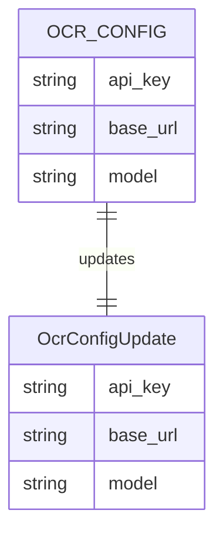

**图表来源**
- [src/math_learning/grader/ocr_cloud.py:19-23](file://src/math_learning/grader/ocr_cloud.py#L19-L23)
- [src/math_learning/web/main.py:149-153](file://src/math_learning/web/main.py#L149-L153)

**章节来源**
- [src/math_learning/core/generator.py:16-31](file://src/math_learning/core/generator.py#L16-L31)
- [src/math_learning/web/main.py:50-64](file://src/math_learning/web/main.py#L50-L64)
- [src/math_learning/grader/checker.py:15-35](file://src/math_learning/grader/checker.py#L15-L35)
- [src/math_learning/grader/ocr_cloud.py:19-23](file://src/math_learning/grader/ocr_cloud.py#L19-L23)

## 错误处理

### 后端错误处理机制

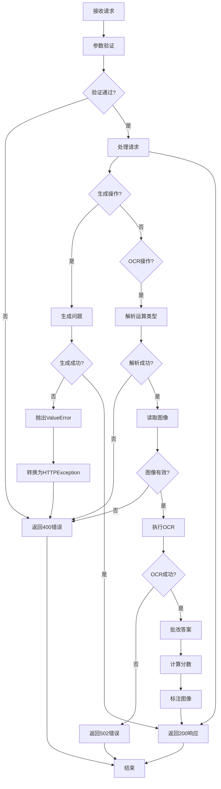

**图表来源**
- [src/math_learning/web/main.py:69-76](file://src/math_learning/web/main.py#L69-L76)
- [src/math_learning/web/main.py:189-203](file://src/math_learning/web/main.py#L189-L203)
- [src/math_learning/core/generator.py:83-90](file://src/math_learning/core/generator.py#L83-L90)

### 前端错误处理

前端实现了完整的错误处理机制：

- **网络错误**：捕获fetch异常
- **HTTP状态错误**：检查resp.ok属性
- **用户友好提示**：显示错误消息
- **状态恢复**：错误后重置加载状态
- **批改错误处理**：OCR失败时提供重试选项
- **OCR配置错误**：云端OCR密钥错误时提供清晰提示

**章节来源**
- [frontend/src/api.ts:26-29](file://frontend/src/api.ts#L26-L29)
- [frontend/src/App.tsx:16-24](file://frontend/src/App.tsx#L16-L24)

## 部署与运行

### Docker容器化部署

系统支持完整的Docker容器化部署：

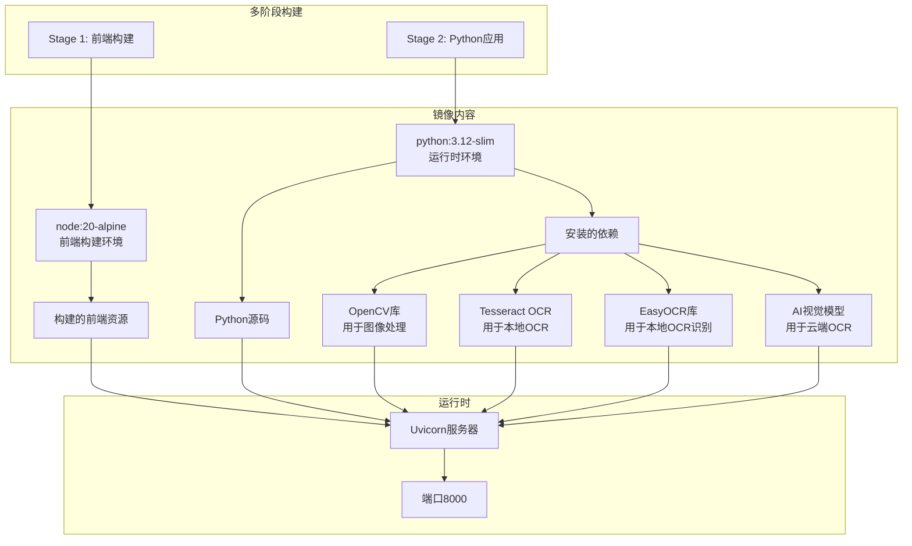

**图表来源**
- [Dockerfile:1-28](file://Dockerfile#L1-L28)

### 部署配置

#### 环境变量
- `TZ=Asia/Shanghai` (时区设置)
- `AI_VISION_API_KEY` (云端OCR API密钥)
- `AI_VISION_BASE_URL` (云端OCR基础URL)
- `AI_VISION_MODEL` (云端OCR模型)

#### 端口映射
- 容器端口: 8000
- 主机端口: 8000

#### 依赖服务
- Python 3.12+
- FastAPI 0.104+
- uvicorn 0.24+
- python-docx 1.1+
- opencv-python 4.8+
- numpy 1.24+
- tesseract 4.1+ (可选，用于本地OCR)
- easyocr 2.3+ (用于本地OCR)
- httpx 0.24+ (用于云端OCR)

**章节来源**
- [docker-compose.yml:1-9](file://docker-compose.yml#L1-L9)
- [pyproject.toml:10-14](file://pyproject.toml#L10-L14)

## 性能考虑

### 生成算法优化

1. **随机数生成**：使用独立的Random实例避免全局状态污染
2. **内存管理**：Word文档生成使用BytesIO内存缓冲
3. **批量处理**：单次请求最多生成200个题目
4. **缓存策略**：无持久化缓存，确保每次生成最新数据
5. **除法运算优化**：余数计算采用直接公式避免循环

### 前端性能优化

1. **状态管理**：React hooks实现高效状态更新
2. **条件渲染**：空状态和加载状态的智能显示
3. **事件处理**：防抖和节流机制减少不必要的API调用
4. **资源加载**：静态文件服务优化CDN缓存
5. **批改组件优化**：余数输入框按需显示
6. **图像预览**：URL.createObjectURL优化大文件预览

### 后端性能特性

1. **异步处理**：FastAPI异步I/O提升并发性能
2. **流式响应**：Word文档使用StreamingResponse降低内存占用
3. **CORS优化**：开发环境允许所有来源访问
4. **静态文件**：生产环境集成静态文件服务
5. **OCR优化**：支持本地和云端OCR，可根据负载选择
6. **OCR配置缓存**：云端OCR配置使用内存缓存

### OCR性能优化

1. **本地OCR优化**：EasyOCR懒加载，首次使用时初始化
2. **图像预处理**：自适应阈值和去噪提升识别准确率
3. **云端OCR优化**：异步HTTP客户端，超时控制60秒
4. **配置管理**：环境变量优先级，运行时动态更新

## 故障排除指南

### 常见问题诊断

#### API接口问题
- **404 Not Found**: 检查API路径是否正确
- **422 Validation Error**: 验证请求参数格式
- **500 Internal Server Error**: 查看服务器日志
- **502 Bad Gateway**: 检查云端OCR服务状态

#### 前端问题
- **无法连接服务器**: 检查CORS配置和网络连接
- **界面无响应**: 检查JavaScript错误控制台
- **样式缺失**: 确认静态文件服务正常运行
- **批改功能异常**: 检查OCR配置和图像格式
- **OCR配置更新失败**: 检查API密钥格式和网络连接

#### Docker部署问题
- **端口冲突**: 检查主机端口占用情况
- **依赖安装失败**: 清理pip缓存重新安装
- **构建失败**: 检查网络连接和镜像仓库可用性
- **OCR功能缺失**: 确认OpenCV和Tesseract安装
- **云端OCR密钥无效**: 检查环境变量设置

### 调试工具

#### 单元测试
系统包含完整的测试套件：
- 核心生成器测试
- Word文档生成测试
- 答案批改测试
- OCR功能测试
- API端点测试
- OCR配置测试
- 边界条件测试

#### 开发工具
- pytest单元测试框架
- ruff代码质量检查
- httpx异步HTTP客户端
- OpenCV图像处理调试
- EasyOCR本地OCR调试

**章节来源**
- [tests/test_generator.py:70-99](file://tests/test_generator.py#L70-L99)
- [tests/test_grader.py:61-111](file://tests/test_grader.py#L61-L111)

## 总结

本Web API接口系统提供了完整的数学练习题生成功能，现已扩展支持OCR自动批改，具有以下特点：

### 技术优势
- **模块化设计**：清晰的分层架构便于维护和扩展
- **类型安全**：Pydantic模型和TypeScript接口确保数据完整性
- **异步处理**：FastAPI提供高性能的异步API服务
- **容器化部署**：Docker多阶段构建简化部署流程
- **OCR集成**：支持本地和云端OCR识别
- **智能配置**：动态OCR配置管理
- **余数处理**：完整的除法运算批改功能

### 功能特性
- **灵活配置**：支持自定义题目数量和运算类型
- **多种输出**：JSON预览、Word文档下载和OCR批改
- **可重现性**：随机种子确保结果一致性
- **用户友好**：直观的React前端界面
- **余数输入**：批改界面支持商和余数分别输入
- **图像标注**：自动标注正确答案和错误标记
- **云端AI**：支持OpenAI兼容的AI视觉模型
- **本地OCR**：基于EasyOCR的离线识别能力

### 扩展建议
1. **数据库集成**：添加用户偏好和历史记录存储
2. **认证授权**：实现用户登录和权限管理
3. **国际化支持**：多语言界面和内容
4. **性能监控**：添加APM和日志分析工具
5. **API版本控制**：支持向后兼容的API演进
6. **移动端适配**：优化移动设备上的使用体验
7. **OCR模型优化**：支持更多OCR模型和自定义训练
8. **批改历史**：保存批改记录和学习分析

该系统为教育技术应用提供了良好的基础架构，易于根据具体需求进行定制和扩展。新增的OCR自动批改功能使得系统能够满足更广泛的数学教学需求，特别是在线教育和远程学习场景。云端和本地OCR的双重支持确保了系统的灵活性和可靠性。