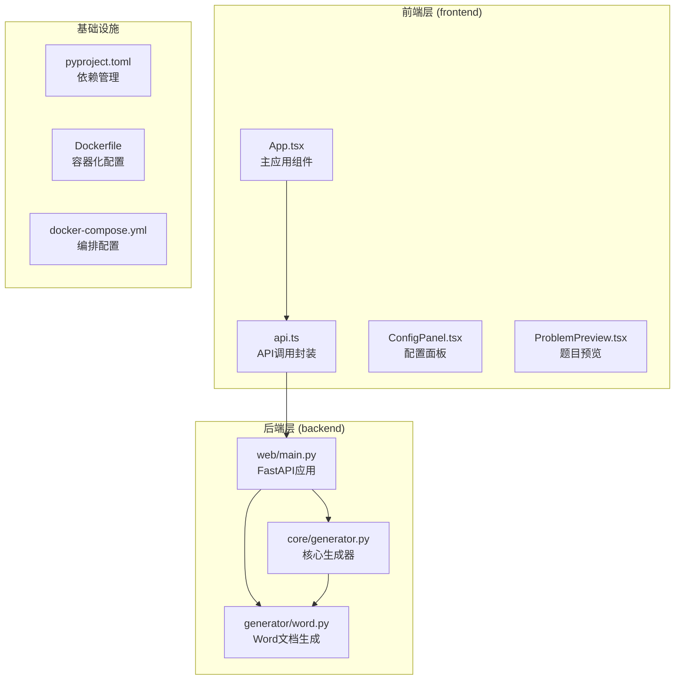
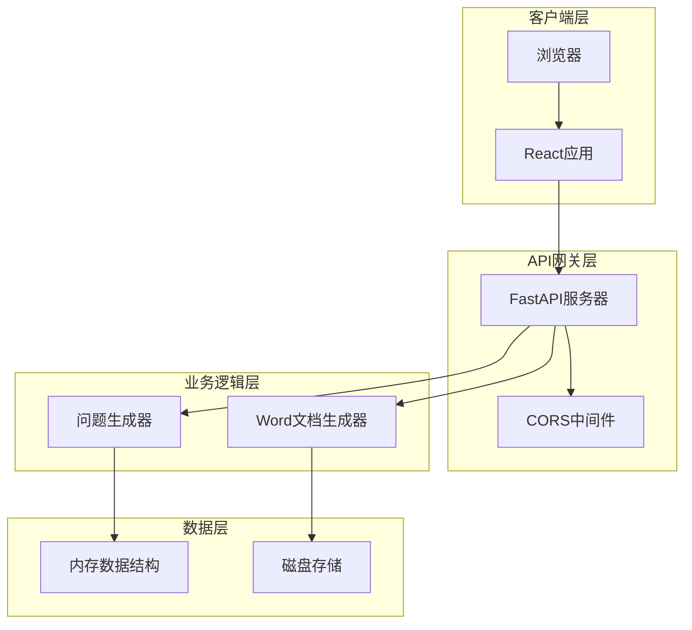
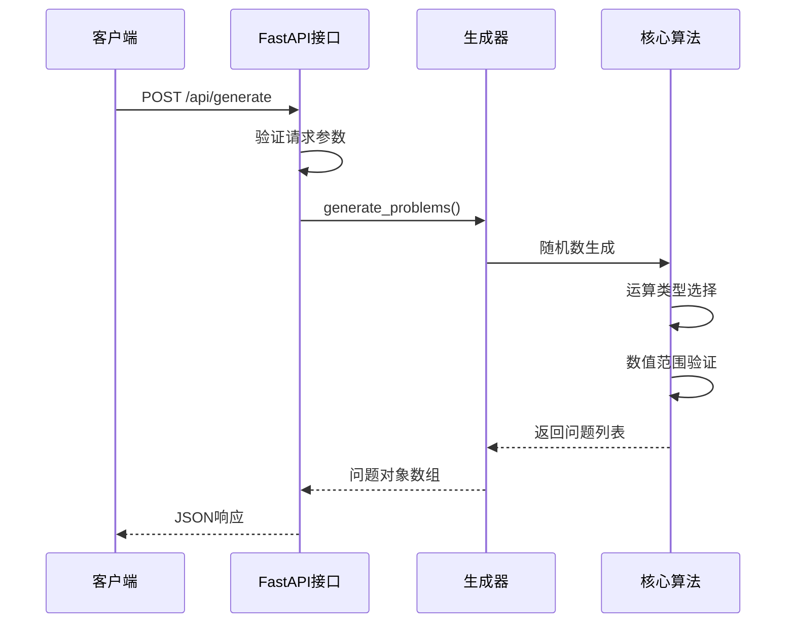
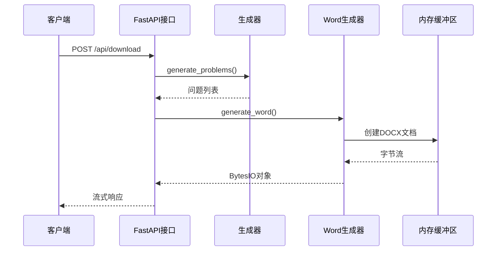
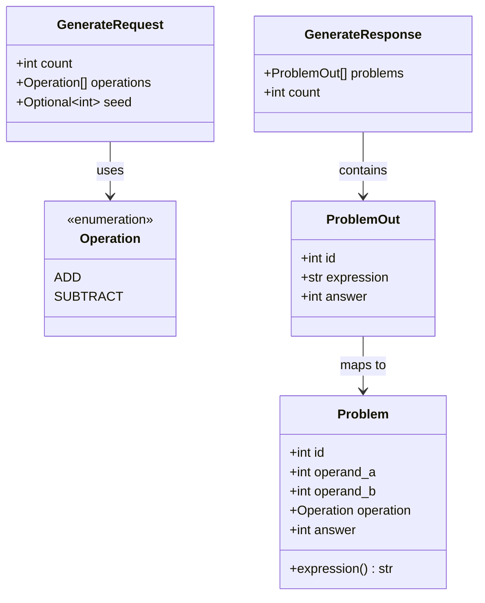
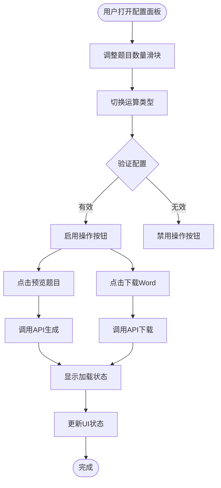
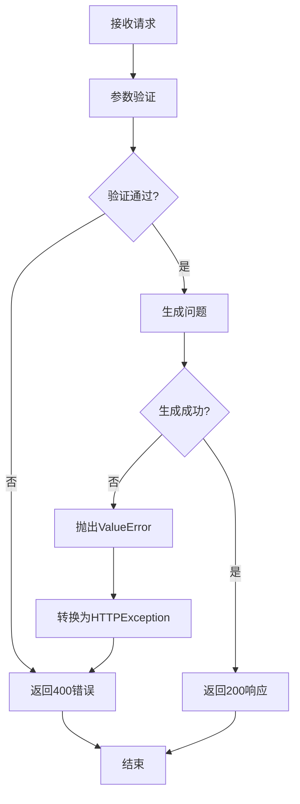
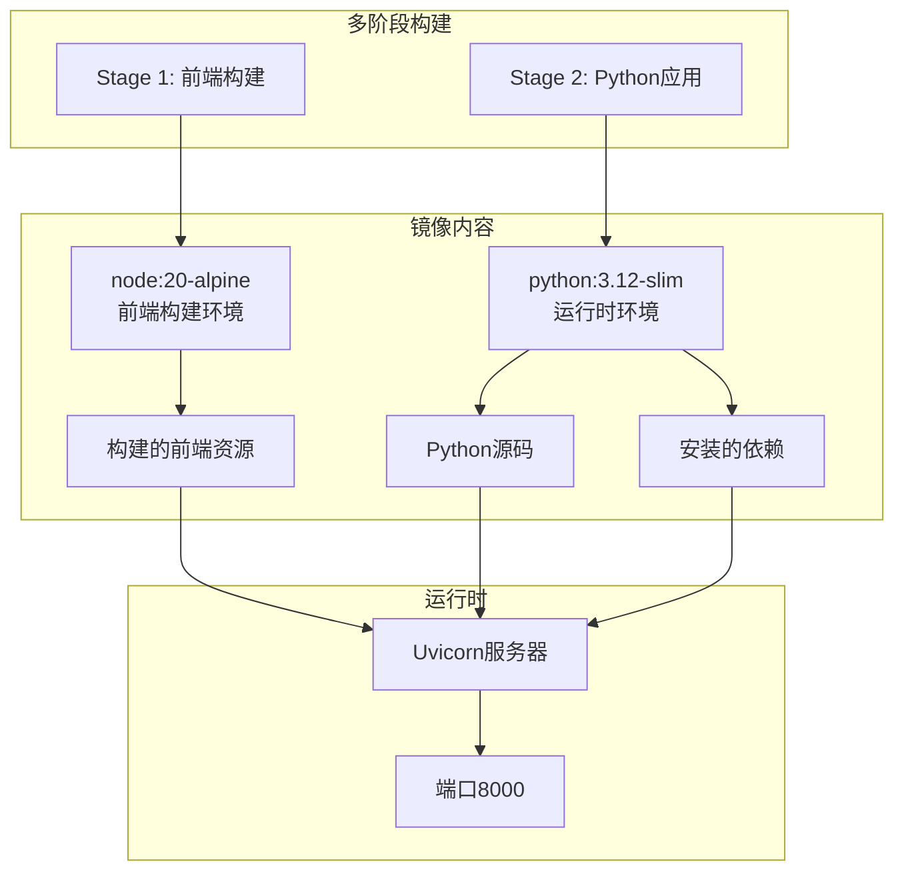

# Web API接口文档

<cite>
**本文档引用的文件**
- [src/math_learning/web/main.py](file://src/math_learning/web/main.py)
- [src/math_learning/core/generator.py](file://src/math_learning/core/generator.py)
- [src/math_learning/generator/word.py](file://src/math_learning/generator/word.py)
- [frontend/src/api.ts](file://frontend/src/api.ts)
- [frontend/src/App.tsx](file://frontend/src/App.tsx)
- [frontend/src/components/ConfigPanel.tsx](file://frontend/src/components/ConfigPanel.tsx)
- [frontend/src/components/ProblemPreview.tsx](file://frontend/src/components/ProblemPreview.tsx)
- [pyproject.toml](file://pyproject.toml)
- [Dockerfile](file://Dockerfile)
- [docker-compose.yml](file://docker-compose.yml)
- [tests/test_generator.py](file://tests/test_generator.py)
</cite>

## 目录
1. [简介](#简介)
2. [项目结构](#项目结构)
3. [核心组件](#核心组件)
4. [架构概览](#架构概览)
5. [详细组件分析](#详细组件分析)
6. [API接口规范](#api接口规范)
7. [数据模型](#数据模型)
8. [错误处理](#错误处理)
9. [部署与运行](#部署与运行)
10. [性能考虑](#性能考虑)
11. [故障排除指南](#故障排除指南)
12. [总结](#总结)

## 简介

这是一个基于Python FastAPI构建的数学练习题生成Web应用。该系统提供100以内的加减法口算题生成服务，支持在线预览和Word文档下载两种使用方式。应用采用前后端分离架构，后端提供RESTful API接口，前端使用React + TypeScript开发用户界面。

## 项目结构

项目采用模块化设计，主要分为以下层次：



**图表来源**
- [src/math_learning/web/main.py:1-102](file://src/math_learning/web/main.py#L1-L102)
- [src/math_learning/core/generator.py:1-102](file://src/math_learning/core/generator.py#L1-L102)
- [src/math_learning/generator/word.py:1-88](file://src/math_learning/generator/word.py#L1-L88)

**章节来源**
- [pyproject.toml:1-29](file://pyproject.toml#L1-L29)
- [Dockerfile:1-28](file://Dockerfile#L1-L28)
- [docker-compose.yml:1-9](file://docker-compose.yml#L1-L9)

## 核心组件

### 后端核心组件

#### FastAPI应用服务器
- 提供RESTful API接口
- 支持CORS跨域访问
- 集成静态文件服务（生产环境）
- 错误处理和异常管理

#### 数学问题生成器
- 支持加法和减法运算
- 随机种子控制可重现性
- 范围限制在100以内
- 数据类封装问题结构

#### Word文档生成器
- 使用python-docx库
- A4页面布局优化
- 四列网格排版
- 自定义字体和间距

**章节来源**
- [src/math_learning/web/main.py:18-26](file://src/math_learning/web/main.py#L18-L26)
- [src/math_learning/core/generator.py:11-31](file://src/math_learning/core/generator.py#L11-L31)
- [src/math_learning/generator/word.py:22-87](file://src/math_learning/generator/word.py#L22-L87)

### 前端核心组件

#### API调用封装
- 统一的HTTP请求处理
- 错误状态码检查
- Blob下载处理
- 类型安全的接口定义

#### 用户界面组件
- 配置面板（题目数量、运算类型）
- 题目预览网格
- 实时状态反馈
- 响应式设计

**章节来源**
- [frontend/src/api.ts:1-51](file://frontend/src/api.ts#L1-L51)
- [frontend/src/components/ConfigPanel.tsx:1-88](file://frontend/src/components/ConfigPanel.tsx#L1-L88)
- [frontend/src/components/ProblemPreview.tsx:1-38](file://frontend/src/components/ProblemPreview.tsx#L1-L38)

## 架构概览

系统采用经典的三层架构模式：



**图表来源**
- [src/math_learning/web/main.py:55-95](file://src/math_learning/web/main.py#L55-L95)
- [src/math_learning/core/generator.py:65-102](file://src/math_learning/core/generator.py#L65-L102)
- [src/math_learning/generator/word.py:22-87](file://src/math_learning/generator/word.py#L22-L87)

## 详细组件分析

### API接口实现

#### 生成题目接口


**图表来源**
- [src/math_learning/web/main.py:55-73](file://src/math_learning/web/main.py#L55-L73)
- [src/math_learning/core/generator.py:65-102](file://src/math_learning/core/generator.py#L65-L102)

#### 下载Word文档接口


**图表来源**
- [src/math_learning/web/main.py:76-95](file://src/math_learning/web/main.py#L76-L95)
- [src/math_learning/generator/word.py:22-87](file://src/math_learning/generator/word.py#L22-L87)

**章节来源**
- [src/math_learning/web/main.py:55-95](file://src/math_learning/web/main.py#L55-L95)

### 数据结构设计

#### 问题数据模型


**图表来源**
- [src/math_learning/core/generator.py:11-31](file://src/math_learning/core/generator.py#L11-L31)
- [src/math_learning/web/main.py:29-53](file://src/math_learning/web/main.py#L29-L53)

**章节来源**
- [src/math_learning/core/generator.py:16-31](file://src/math_learning/core/generator.py#L16-L31)
- [src/math_learning/web/main.py:29-53](file://src/math_learning/web/main.py#L29-L53)

### 前端交互流程

#### 配置面板组件


**图表来源**
- [frontend/src/components/ConfigPanel.tsx:10-87](file://frontend/src/components/ConfigPanel.tsx#L10-L87)
- [frontend/src/App.tsx:14-37](file://frontend/src/App.tsx#L14-L37)

**章节来源**
- [frontend/src/components/ConfigPanel.tsx:1-88](file://frontend/src/components/ConfigPanel.tsx#L1-L88)
- [frontend/src/App.tsx:1-63](file://frontend/src/App.tsx#L1-L63)

## API接口规范

### 接口概览

| 方法 | 路径 | 功能描述 | 请求体 | 响应体 |
|------|------|----------|--------|--------|
| POST | `/api/generate` | 生成数学题目并返回JSON | [GenerateRequest](#请求体规范) | [GenerateResponse](#响应体规范) |
| POST | `/api/download` | 生成Word文档并下载 | [GenerateRequest](#请求体规范) | Stream |

### 请求体规范

#### GenerateRequest
- `count`: number (1-200，默认20)
- `operations`: string[] (默认['add','subtract'])
- `seed`: number (可选，用于可重现性)

### 响应体规范

#### GenerateResponse
- `problems`: ProblemOut[]
- `count`: number

#### ProblemOut
- `id`: number
- `expression`: string (如："23 + 45 = ____")
- `answer`: number

### 错误响应

| 状态码 | 错误类型 | 描述 |
|--------|----------|------|
| 400 | Bad Request | 参数验证失败或业务逻辑错误 |
| 422 | Validation Error | 请求格式不正确 |
| 500 | Internal Server Error | 服务器内部错误 |

**章节来源**
- [src/math_learning/web/main.py:29-53](file://src/math_learning/web/main.py#L29-L53)
- [src/math_learning/web/main.py:55-95](file://src/math_learning/web/main.py#L55-L95)

## 数据模型

### 核心数据结构

#### 运算类型枚举
```mermaid
graph LR
Operation[Operation枚举] --> ADD[ADD = "add"]
Operation --> SUBTRACT[SUBTRACT = "subtract"]
```

#### 问题对象结构
```mermaid
erDiagram
PROBLEM {
int id PK
int operand_a
int operand_b
enum operation
int answer
computed expression
}
GENERATE_REQUEST {
int count
array operations
optional seed
}
PROBLEM_OUT {
int id
string expression
int answer
}
GENERATE_RESPONSE {
array problems
int count
}
GENERATE_REQUEST ||--o{ PROBLEM : generates
PROBLEM ||--o{ PROBLEM_OUT : maps to
PROBLEM_OUT ||--o{ GENERATE_RESPONSE : contains
```

**图表来源**
- [src/math_learning/core/generator.py:11-31](file://src/math_learning/core/generator.py#L11-L31)
- [src/math_learning/web/main.py:40-53](file://src/math_learning/web/main.py#L40-L53)

**章节来源**
- [src/math_learning/core/generator.py:16-31](file://src/math_learning/core/generator.py#L16-L31)
- [src/math_learning/web/main.py:40-53](file://src/math_learning/web/main.py#L40-L53)

## 错误处理

### 后端错误处理机制



**图表来源**
- [src/math_learning/web/main.py:58-65](file://src/math_learning/web/main.py#L58-L65)
- [src/math_learning/core/generator.py:83-90](file://src/math_learning/core/generator.py#L83-L90)

### 前端错误处理

前端实现了完整的错误处理机制：

- **网络错误**：捕获fetch异常
- **HTTP状态错误**：检查resp.ok属性
- **用户友好提示**：显示错误消息
- **状态恢复**：错误后重置加载状态

**章节来源**
- [frontend/src/api.ts:26-29](file://frontend/src/api.ts#L26-L29)
- [frontend/src/App.tsx:16-24](file://frontend/src/App.tsx#L16-L24)

## 部署与运行

### Docker容器化部署

系统支持完整的Docker容器化部署：



**图表来源**
- [Dockerfile:1-28](file://Dockerfile#L1-L28)

### 部署配置

#### 环境变量
- `TZ=Asia/Shanghai` (时区设置)

#### 端口映射
- 容器端口: 8000
- 主机端口: 8000

#### 依赖服务
- Python 3.12+
- FastAPI 0.104+
- uvicorn 0.24+
- python-docx 1.1+

**章节来源**
- [docker-compose.yml:1-9](file://docker-compose.yml#L1-L9)
- [pyproject.toml:10-14](file://pyproject.toml#L10-L14)

## 性能考虑

### 生成算法优化

1. **随机数生成**：使用独立的Random实例避免全局状态污染
2. **内存管理**：Word文档生成使用BytesIO内存缓冲
3. **批量处理**：单次请求最多生成200个题目
4. **缓存策略**：无持久化缓存，确保每次生成最新数据

### 前端性能优化

1. **状态管理**：React hooks实现高效状态更新
2. **条件渲染**：空状态和加载状态的智能显示
3. **事件处理**：防抖和节流机制减少不必要的API调用
4. **资源加载**：静态文件服务优化CDN缓存

### 后端性能特性

1. **异步处理**：FastAPI异步I/O提升并发性能
2. **流式响应**：Word文档使用StreamingResponse降低内存占用
3. **CORS优化**：开发环境允许所有来源访问
4. **静态文件**：生产环境集成静态文件服务

## 故障排除指南

### 常见问题诊断

#### API接口问题
- **404 Not Found**: 检查API路径是否正确
- **422 Validation Error**: 验证请求参数格式
- **500 Internal Server Error**: 查看服务器日志

#### 前端问题
- **无法连接服务器**: 检查CORS配置和网络连接
- **界面无响应**: 检查JavaScript错误控制台
- **样式缺失**: 确认静态文件服务正常运行

#### Docker部署问题
- **端口冲突**: 检查主机端口占用情况
- **依赖安装失败**: 清理pip缓存重新安装
- **构建失败**: 检查网络连接和镜像仓库可用性

### 调试工具

#### 单元测试
系统包含完整的测试套件：
- 核心生成器测试
- Word文档生成测试
- API端点测试
- 边界条件测试

#### 开发工具
- pytest单元测试框架
- ruff代码质量检查
- httpx异步HTTP客户端

**章节来源**
- [tests/test_generator.py:105-141](file://tests/test_generator.py#L105-L141)

## 总结

本Web API接口系统提供了完整的数学练习题生成功能，具有以下特点：

### 技术优势
- **模块化设计**：清晰的分层架构便于维护和扩展
- **类型安全**：Pydantic模型和TypeScript接口确保数据完整性
- **异步处理**：FastAPI提供高性能的异步API服务
- **容器化部署**：Docker多阶段构建简化部署流程

### 功能特性
- **灵活配置**：支持自定义题目数量和运算类型
- **多种输出**：JSON预览和Word文档下载双重模式
- **可重现性**：随机种子确保结果一致性
- **用户友好**：直观的React前端界面

### 扩展建议
1. **数据库集成**：添加用户偏好和历史记录存储
2. **认证授权**：实现用户登录和权限管理
3. **国际化支持**：多语言界面和内容
4. **性能监控**：添加APM和日志分析工具
5. **API版本控制**：支持向后兼容的API演进

该系统为教育技术应用提供了良好的基础架构，易于根据具体需求进行定制和扩展。