# Word文档生成器

<cite>
**本文档引用的文件**
- [src/math_learning/__init__.py](file://src/math_learning/__init__.py)
- [src/math_learning/core/generator.py](file://src/math_learning/core/generator.py)
- [src/math_learning/generator/word.py](file://src/math_learning/generator/word.py)
- [src/math_learning/web/main.py](file://src/math_learning/web/main.py)
- [tests/test_generator.py](file://tests/test_generator.py)
- [pyproject.toml](file://pyproject.toml)
- [Dockerfile](file://Dockerfile)
- [docker-compose.yml](file://docker-compose.yml)
- [frontend/src/App.tsx](file://frontend/src/App.tsx)
- [frontend/src/components/ConfigPanel.tsx](file://frontend/src/components/ConfigPanel.tsx)
- [frontend/src/components/ProblemPreview.tsx](file://frontend/src/components/ProblemPreview.tsx)
- [frontend/src/api.ts](file://frontend/src/api.ts)
- [frontend/package.json](file://frontend/package.json)
- [frontend/vite.config.ts](file://frontend/vite.config.ts)
</cite>

## 目录
1. [简介](#简介)
2. [项目结构](#项目结构)
3. [核心组件](#核心组件)
4. [架构概览](#架构概览)
5. [详细组件分析](#详细组件分析)
6. [依赖关系分析](#依赖关系分析)
7. [性能考虑](#性能考虑)
8. [故障排除指南](#故障排除指南)
9. [结论](#结论)

## 简介

Word文档生成器是一个基于Python和React的数学练习题生成系统，专门用于创建100以内的加减法口算练习题。该系统提供了完整的Web界面，允许用户自定义题目数量、运算类型，并一键生成可直接打印的Word文档。

系统采用前后端分离架构，后端使用FastAPI提供RESTful API，前端使用React构建用户界面，支持实时预览和批量下载功能。

## 项目结构

该项目采用模块化设计，主要分为以下几个核心部分：

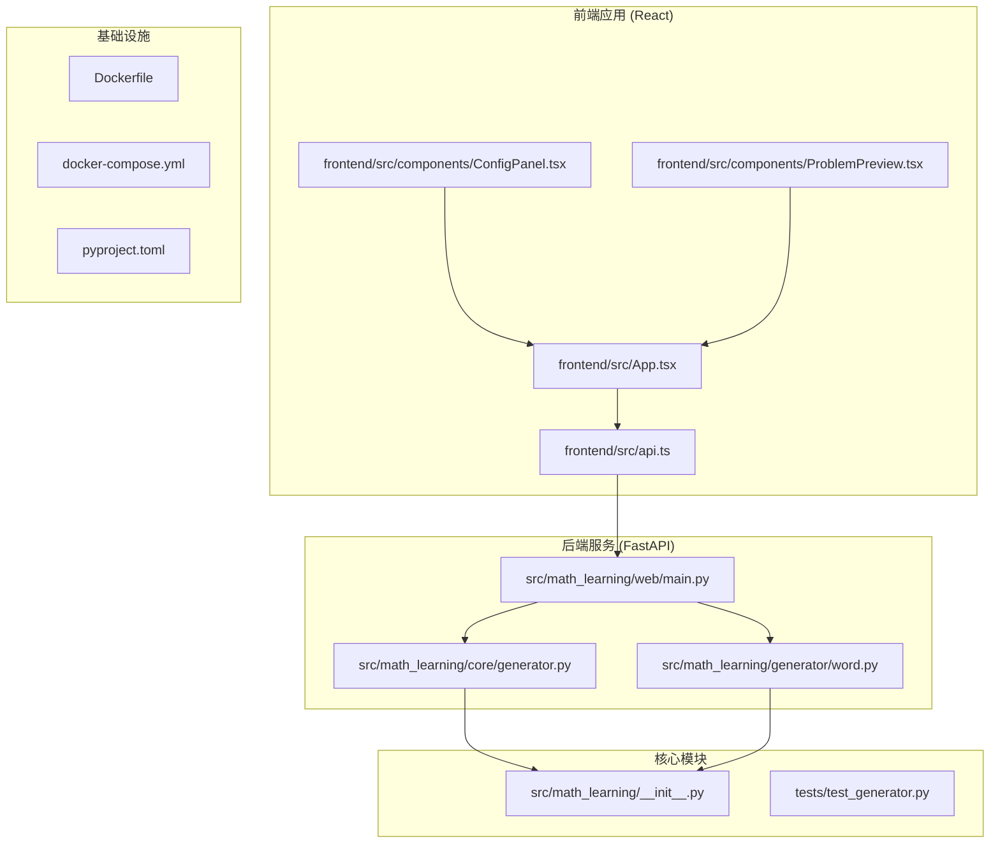

**图表来源**
- [frontend/src/App.tsx:1-63](file://frontend/src/App.tsx#L1-L63)
- [src/math_learning/web/main.py:1-102](file://src/math_learning/web/main.py#L1-L102)
- [src/math_learning/core/generator.py:1-102](file://src/math_learning/core/generator.py#L1-L102)

**章节来源**
- [frontend/src/App.tsx:1-63](file://frontend/src/App.tsx#L1-L63)
- [src/math_learning/web/main.py:1-102](file://src/math_learning/web/main.py#L1-L102)
- [pyproject.toml:1-29](file://pyproject.toml#L1-L29)

## 核心组件

### 数学问题生成器

系统的核心是数学问题生成器，负责创建符合要求的加减法练习题：

- **支持范围**: 1到100之间的整数运算
- **运算类型**: 加法和减法两种基本运算
- **随机性控制**: 支持种子参数确保结果可重现
- **格式化输出**: 自动生成标准的数学表达式格式

### Word文档生成器

专门用于将生成的数学问题转换为专业的Word文档：

- **布局设计**: 4列网格布局，适合打印和手写
- **字体设置**: 使用等宽字体确保数字对齐
- **页面配置**: A4纸张尺寸，合理的边距设置
- **信息标注**: 包含标题、个人信息栏和生成信息

### Web API服务

基于FastAPI构建的RESTful服务接口：

- **JSON预览**: 提供即时的题目预览功能
- **文档下载**: 支持批量生成和下载Word文档
- **CORS支持**: 内置跨域资源共享配置
- **错误处理**: 完善的异常处理和状态码返回

**章节来源**
- [src/math_learning/core/generator.py:16-102](file://src/math_learning/core/generator.py#L16-L102)
- [src/math_learning/generator/word.py:22-88](file://src/math_learning/generator/word.py#L22-L88)
- [src/math_learning/web/main.py:55-96](file://src/math_learning/web/main.py#L55-L96)

## 架构概览

系统采用分层架构设计，实现了清晰的关注点分离：

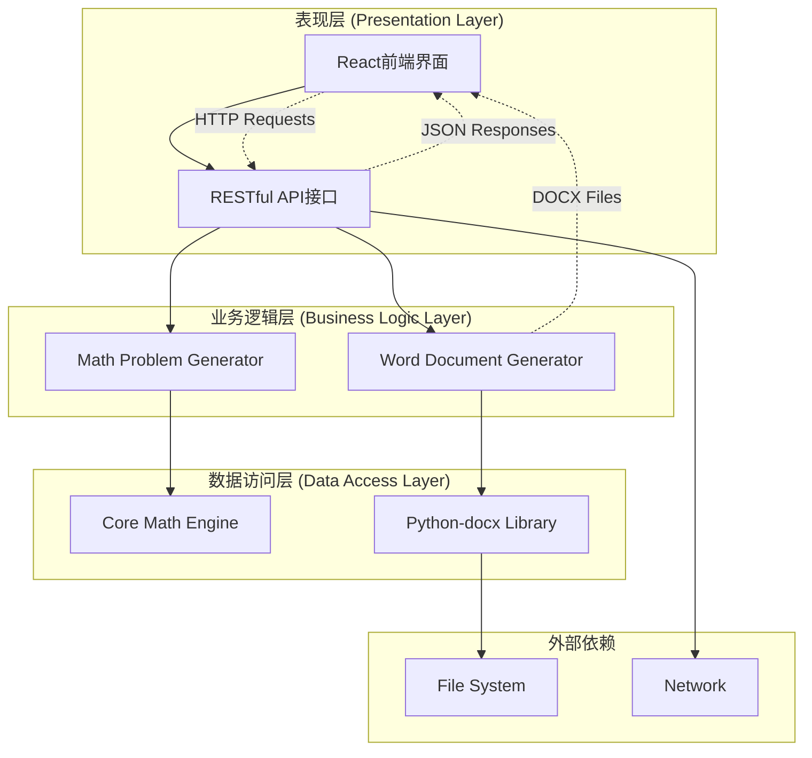

**图表来源**
- [src/math_learning/web/main.py:18-102](file://src/math_learning/web/main.py#L18-L102)
- [src/math_learning/core/generator.py:65-102](file://src/math_learning/core/generator.py#L65-L102)
- [src/math_learning/generator/word.py:22-88](file://src/math_learning/generator/word.py#L22-L88)

### 数据流图

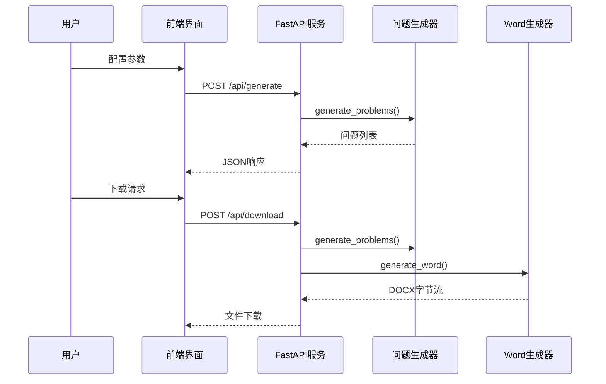

**图表来源**
- [src/math_learning/web/main.py:55-96](file://src/math_learning/web/main.py#L55-L96)
- [src/math_learning/core/generator.py:65-102](file://src/math_learning/core/generator.py#L65-L102)
- [src/math_learning/generator/word.py:22-88](file://src/math_learning/generator/word.py#L22-L88)

## 详细组件分析

### 数学问题生成器 (Problem Generator)

该组件负责创建符合教育要求的数学练习题：

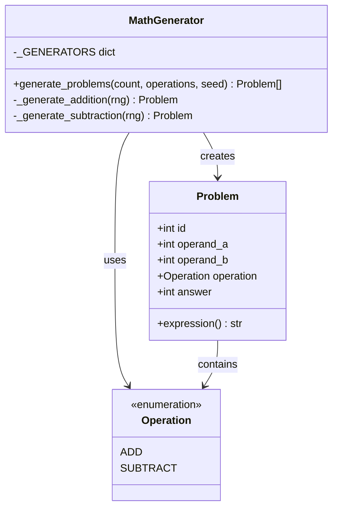

**图表来源**
- [src/math_learning/core/generator.py:11-102](file://src/math_learning/core/generator.py#L11-L102)

#### 核心算法流程

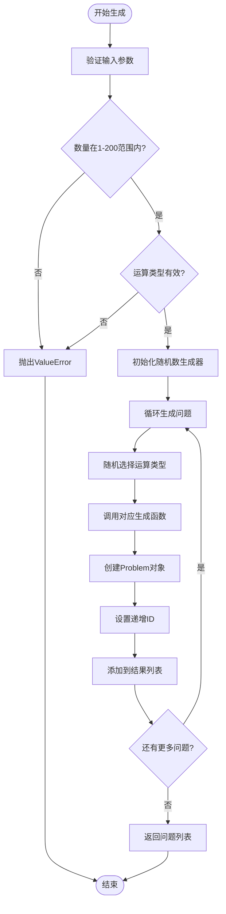

**图表来源**
- [src/math_learning/core/generator.py:65-102](file://src/math_learning/core/generator.py#L65-L102)

**章节来源**
- [src/math_learning/core/generator.py:16-102](file://src/math_learning/core/generator.py#L16-L102)

### Word文档生成器 (Document Generator)

专门处理Word文档创建的组件：

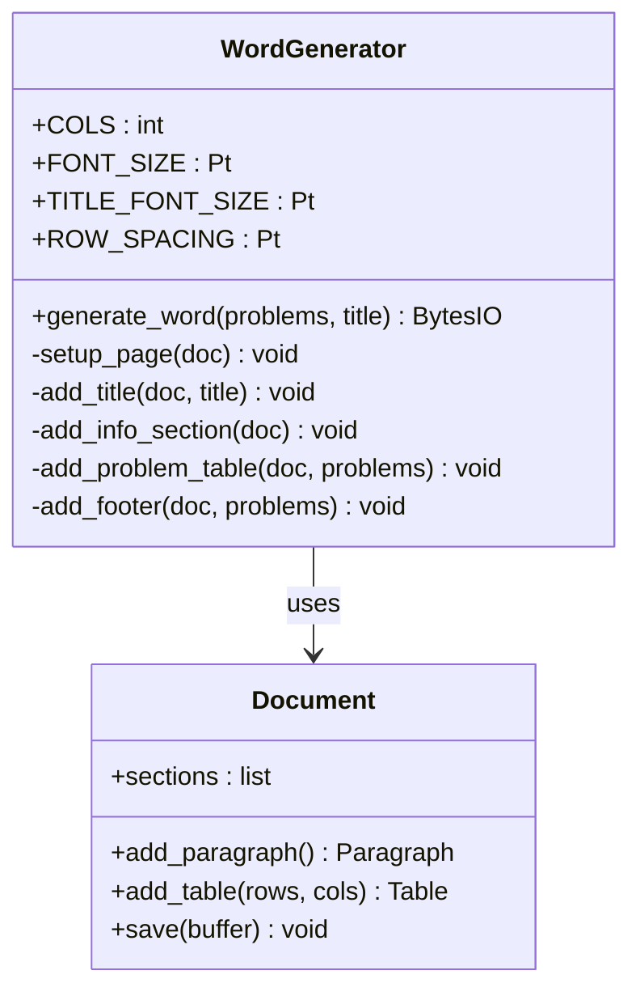

**图表来源**
- [src/math_learning/generator/word.py:15-88](file://src/math_learning/generator/word.py#L15-L88)

#### 文档布局算法

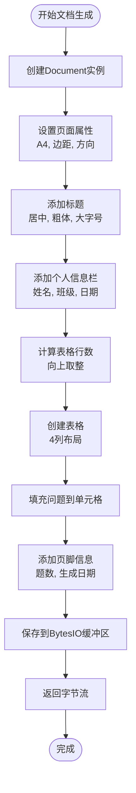

**图表来源**
- [src/math_learning/generator/word.py:22-88](file://src/math_learning/generator/word.py#L22-L88)

**章节来源**
- [src/math_learning/generator/word.py:22-88](file://src/math_learning/generator/word.py#L22-L88)

### Web API服务 (FastAPI)

提供RESTful接口的服务层：

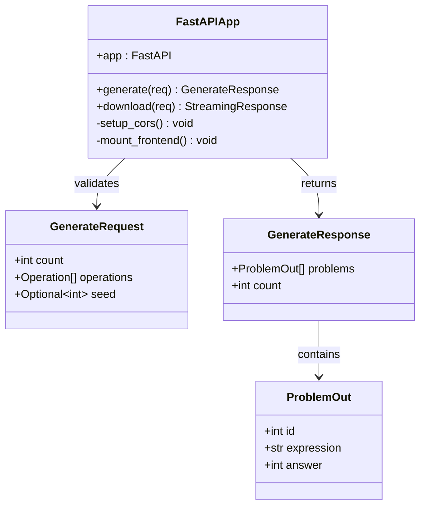

**图表来源**
- [src/math_learning/web/main.py:18-96](file://src/math_learning/web/main.py#L18-L96)

#### API端点流程

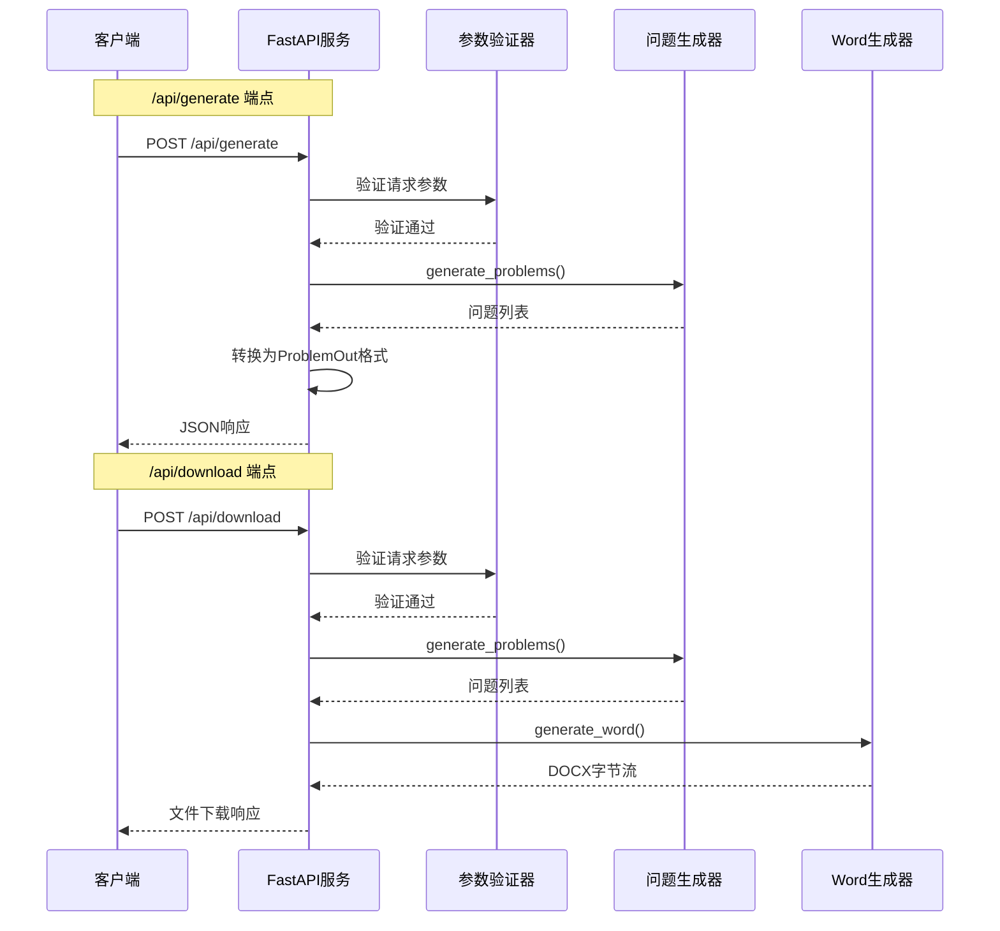

**图表来源**
- [src/math_learning/web/main.py:55-96](file://src/math_learning/web/main.py#L55-L96)

**章节来源**
- [src/math_learning/web/main.py:18-96](file://src/math_learning/web/main.py#L18-L96)

### 前端用户界面

React构建的现代化用户界面：

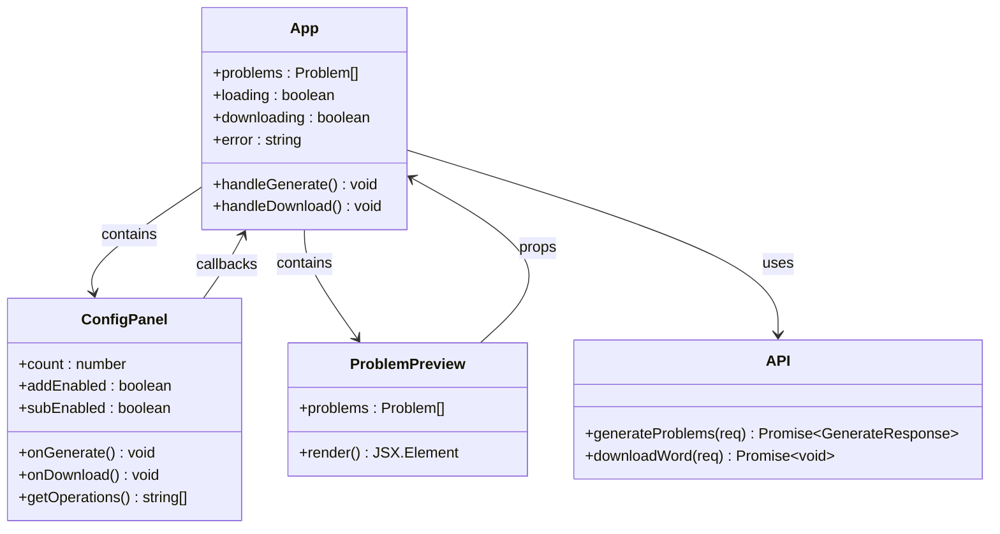

**图表来源**
- [frontend/src/App.tsx:8-63](file://frontend/src/App.tsx#L8-L63)
- [frontend/src/components/ConfigPanel.tsx:10-88](file://frontend/src/components/ConfigPanel.tsx#L10-L88)
- [frontend/src/components/ProblemPreview.tsx:7-38](file://frontend/src/components/ProblemPreview.tsx#L7-L38)

#### 用户交互流程

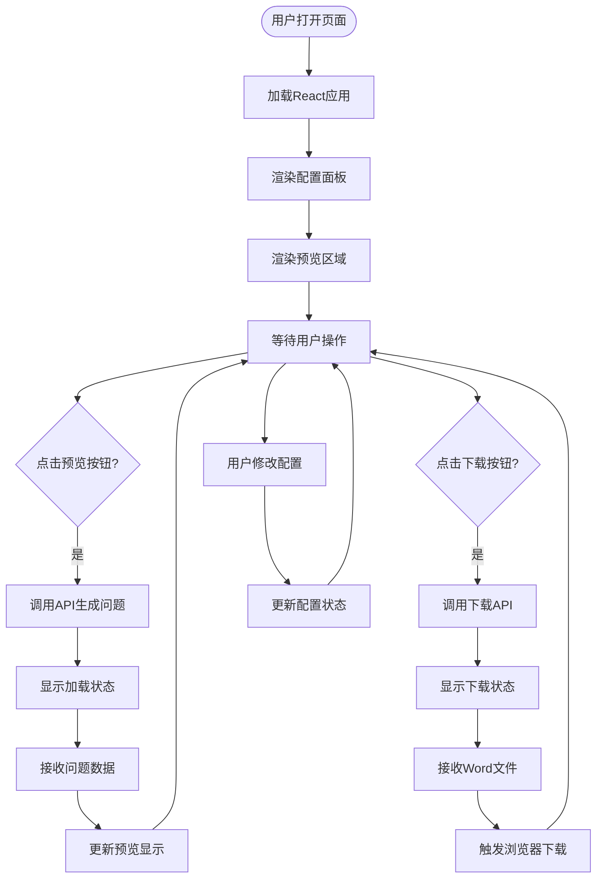

**图表来源**
- [frontend/src/App.tsx:14-37](file://frontend/src/App.tsx#L14-L37)
- [frontend/src/components/ConfigPanel.tsx:15-20](file://frontend/src/components/ConfigPanel.tsx#L15-L20)

**章节来源**
- [frontend/src/App.tsx:1-63](file://frontend/src/App.tsx#L1-L63)
- [frontend/src/components/ConfigPanel.tsx:1-88](file://frontend/src/components/ConfigPanel.tsx#L1-L88)
- [frontend/src/components/ProblemPreview.tsx:1-38](file://frontend/src/components/ProblemPreview.tsx#L1-L38)
- [frontend/src/api.ts:20-51](file://frontend/src/api.ts#L20-L51)

## 依赖关系分析

### Python后端依赖

系统使用现代化的Python生态系统：

```mermaid
graph TB
subgraph "核心依赖"
FASTAPI[fastapi>=0.104.0]
UVICORN[uvicorn[standard]>=0.24.0]
DOCX[python-docx>=1.1.0]
end
subgraph "开发依赖"
PYTEST[pytest>=7.0]
RUFF[ruff>=0.1.0]
HTTPX[httpx>=0.25.0]
end
subgraph "运行时环境"
PYTHON[Python>=3.10]
PIP[pip]
end
PYTHON --> FASTAPI
PYTHON --> UVICORN
PYTHON --> DOCX
PYTHON --> PYTEST
PYTHON --> RUFF
PYTHON --> HTTPX
PIP --> FASTAPI
PIP --> UVICORN
PIP --> DOCX
PIP --> PYTEST
PIP --> RUFF
PIP --> HTTPX
```

**图表来源**
- [pyproject.toml:10-21](file://pyproject.toml#L10-L21)

### 前端依赖

React前端应用的依赖管理：

```mermaid
graph TB
subgraph "运行时依赖"
REACT[react^18.3.1]
REACTDOM[react-dom^18.3.1]
end
subgraph "开发工具"
TYPESCRIPT[typescript~5.6.2]
VITE[vite^6.0.0]
REACT_PLUGIN[@vitejs/plugin-react^4.3.4]
TYPES_REACT[@types/react^18.3.12]
TYPES_REACTDOM[@types/react-dom^18.3.1]
end
subgraph "构建工具"
TSC[tsc -b]
VITE_BUILD[vite build]
end
REACT --> TYPES_REACT
REACTDOM --> TYPES_REACTDOM
TYPESCRIPT --> VITE_BUILD
VITE --> REACT_PLUGIN
TSC --> VITE_BUILD
```

**图表来源**
- [frontend/package.json:11-21](file://frontend/package.json#L11-L21)

### Docker容器化部署

多阶段Docker构建优化：

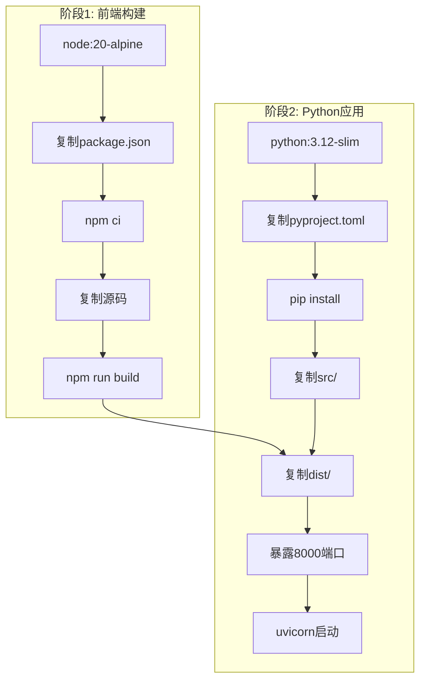

**图表来源**
- [Dockerfile:1-28](file://Dockerfile#L1-L28)

**章节来源**
- [pyproject.toml:1-29](file://pyproject.toml#L1-L29)
- [frontend/package.json:1-23](file://frontend/package.json#L1-L23)
- [Dockerfile:1-28](file://Dockerfile#L1-L28)

## 性能考虑

### 生成性能优化

系统在多个层面进行了性能优化：

- **内存效率**: 使用生成器模式避免一次性加载大量数据
- **缓存策略**: Word文档生成使用BytesIO缓冲区减少磁盘I/O
- **并发处理**: FastAPI异步处理请求，支持高并发场景
- **资源复用**: 随机数生成器按需创建，避免不必要的实例化

### 前端性能优化

React应用的性能特性：

- **状态管理**: 使用React Hooks进行高效的状态更新
- **渲染优化**: 条件渲染避免不必要的组件重绘
- **网络优化**: 使用fetch API进行高效的HTTP通信
- **内存管理**: 及时清理事件监听器和定时器

### 部署性能

Docker容器化的优势：

- **镜像优化**: 多阶段构建减少最终镜像大小
- **资源隔离**: 容器化部署确保环境一致性
- **扩展性**: 支持水平扩展和负载均衡
- **快速启动**: 轻量级容器启动时间短

## 故障排除指南

### 常见问题及解决方案

#### 后端服务问题

**问题**: API端点返回400错误
- **原因**: 请求参数验证失败
- **解决**: 检查count参数范围(1-200)，operations列表不为空

**问题**: Word文档生成失败
- **原因**: python-docx库版本不兼容
- **解决**: 更新到支持的版本或检查依赖安装

#### 前端界面问题

**问题**: 预览功能无法正常工作
- **原因**: CORS配置问题或API连接失败
- **解决**: 检查Vite代理配置和后端CORS设置

**问题**: 下载功能异常
- **原因**: 浏览器阻止弹窗或文件流处理错误
- **解决**: 允许弹窗并检查Blob对象创建

#### Docker部署问题

**问题**: 容器启动失败
- **原因**: 端口冲突或依赖安装失败
- **解决**: 检查端口占用和网络连接

**问题**: 前端静态文件无法访问
- **原因**: 构建路径配置错误
- **解决**: 确认dist目录存在且路径正确

### 调试技巧

1. **日志监控**: 使用uvicorn的日志功能查看请求详情
2. **API测试**: 使用curl或Postman测试API端点
3. **浏览器调试**: 利用React DevTools检查组件状态
4. **网络监控**: 检查浏览器开发者工具中的网络请求

**章节来源**
- [src/math_learning/web/main.py:64-65](file://src/math_learning/web/main.py#L64-L65)
- [frontend/src/api.ts:26-29](file://frontend/src/api.ts#L26-L29)

## 结论

Word文档生成器是一个设计精良的教育工具系统，具有以下突出特点：

### 技术优势

- **模块化设计**: 清晰的分层架构便于维护和扩展
- **前后端分离**: 现代化的技术栈确保良好的用户体验
- **容器化部署**: Docker多阶段构建提供高效的部署方案
- **全面测试**: 完整的单元测试覆盖核心功能

### 功能特色

- **灵活配置**: 支持自定义题目数量和运算类型
- **专业输出**: 生成符合教学要求的Word文档
- **实时预览**: 前端即时反馈提升用户体验
- **批量下载**: 一键生成和下载满足教学需求

### 扩展建议

1. **国际化支持**: 添加多语言界面和内容
2. **高级功能**: 支持更多运算类型和难度级别
3. **用户管理**: 添加用户账户和进度跟踪功能
4. **云端存储**: 集成云存储服务便于分享和协作

该系统为数学教育提供了实用的技术解决方案，既满足了当前的教学需求，又为未来的功能扩展奠定了坚实基础。