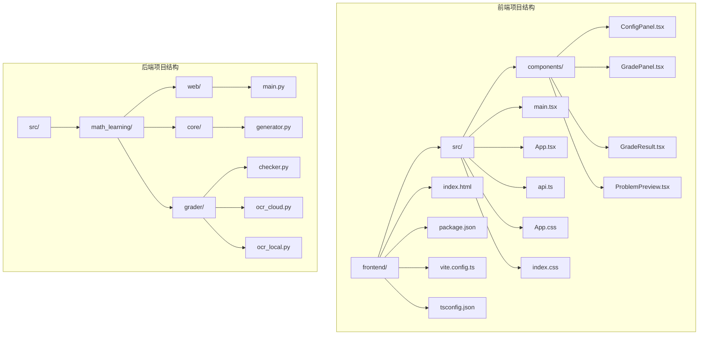
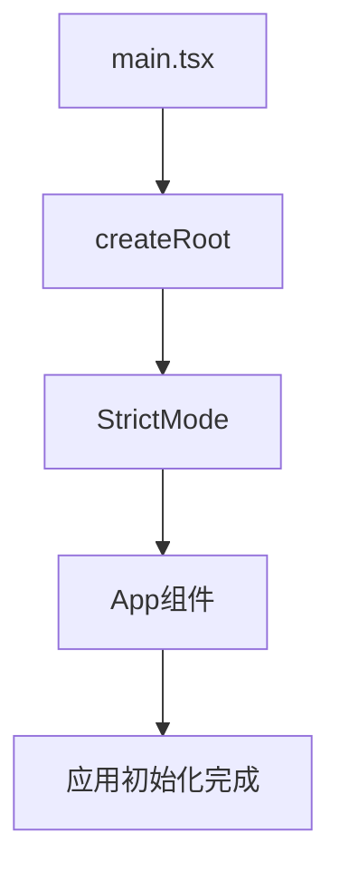
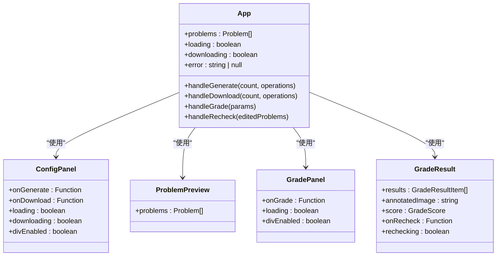
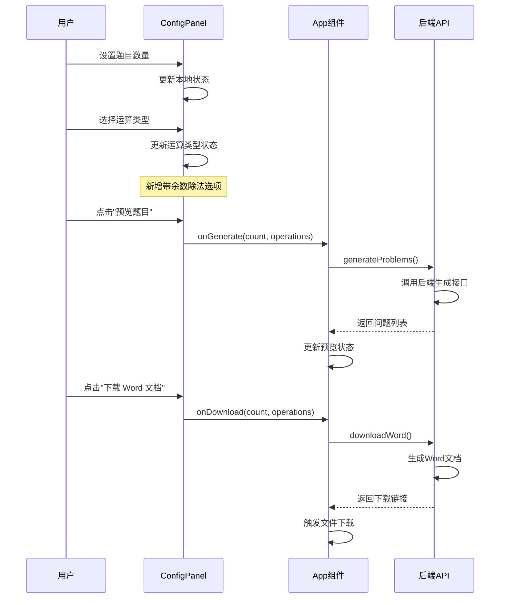
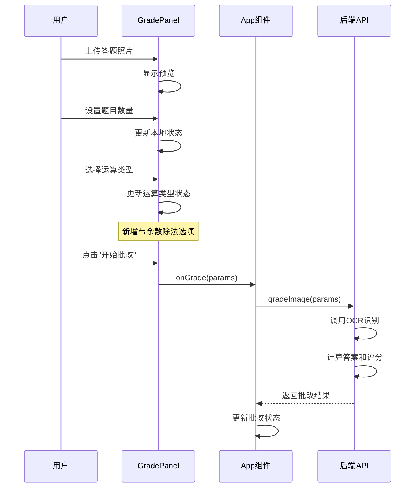
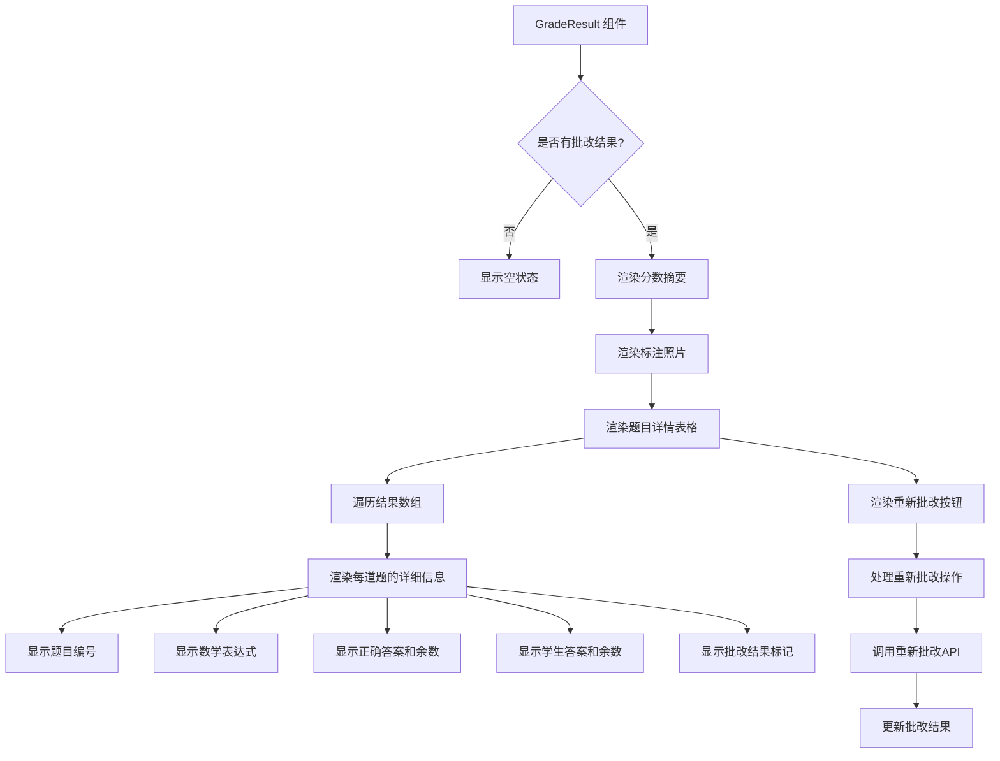
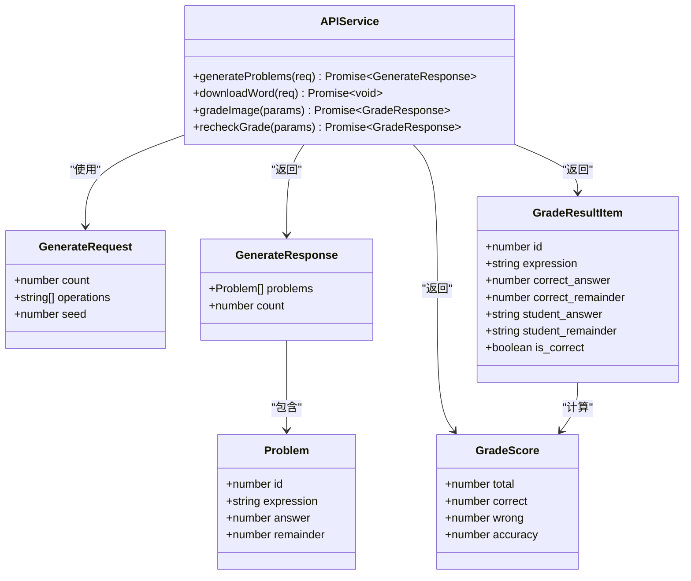

# 前端用户界面

<cite>
**本文档引用的文件**
- [frontend/src/main.tsx](file://frontend/src/main.tsx)
- [frontend/src/App.tsx](file://frontend/src/App.tsx)
- [frontend/src/components/ConfigPanel.tsx](file://frontend/src/components/ConfigPanel.tsx)
- [frontend/src/components/GradePanel.tsx](file://frontend/src/components/GradePanel.tsx)
- [frontend/src/components/GradeResult.tsx](file://frontend/src/components/GradeResult.tsx)
- [frontend/src/components/ProblemPreview.tsx](file://frontend/src/components/ProblemPreview.tsx)
- [frontend/src/api.ts](file://frontend/src/api.ts)
- [frontend/src/App.css](file://frontend/src/App.css)
- [frontend/src/index.css](file://frontend/src/index.css)
- [frontend/package.json](file://frontend/package.json)
- [frontend/vite.config.ts](file://frontend/vite.config.ts)
- [frontend/tsconfig.json](file://frontend/tsconfig.json)
- [src/math_learning/web/main.py](file://src/math_learning/web/main.py)
- [src/math_learning/core/generator.py](file://src/math_learning/core/generator.py)
- [src/math_learning/generator/word.py](file://src/math_learning/generator/word.py)
- [src/math_learning/grader/checker.py](file://src/math_learning/grader/checker.py)
- [Dockerfile](file://Dockerfile)
- [docker-compose.yml](file://docker-compose.yml)
- [pyproject.toml](file://pyproject.toml)
</cite>

## 目录
1. [简介](#简介)
2. [项目结构](#项目结构)
3. [核心组件](#核心组件)
4. [架构概览](#架构概览)
5. [详细组件分析](#详细组件分析)
6. [依赖关系分析](#依赖关系分析)
7. [性能考虑](#性能考虑)
8. [故障排除指南](#故障排除指南)
9. [结论](#结论)

## 简介

这是一个基于 React 和 TypeScript 的数学学习练习题生成器前端应用。该应用允许用户生成 100 以内的加减法口算题，并支持导出为 Word 文档格式。应用采用现代化的前端技术栈，包括 Vite 构建工具、React Hooks 状态管理、TypeScript 类型安全以及响应式设计。

**更新** 新增带余数除法功能，允许用户生成包含有余数除法的数学练习题。

## 项目结构

前端项目采用模块化组织方式，主要包含以下目录结构：



**图表来源**
- [frontend/src/main.tsx:1-11](file://frontend/src/main.tsx#L1-L11)
- [frontend/src/App.tsx:1-146](file://frontend/src/App.tsx#L1-L146)
- [src/math_learning/web/main.py:1-102](file://src/math_learning/web/main.py#L1-L102)

**章节来源**
- [frontend/src/main.tsx:1-11](file://frontend/src/main.tsx#L1-L11)
- [frontend/src/App.tsx:1-146](file://frontend/src/App.tsx#L1-L146)
- [frontend/package.json:1-23](file://frontend/package.json#L1-L23)

## 核心组件

### 应用入口点

应用的启动文件负责初始化 React 应用并渲染根组件：



**图表来源**
- [frontend/src/main.tsx:6-10](file://frontend/src/main.tsx#L6-L10)

### 主应用组件

主应用组件 `App` 负责管理全局状态和协调各个子组件：



**图表来源**
- [frontend/src/App.tsx:12-97](file://frontend/src/App.tsx#L12-L97)
- [frontend/src/components/ConfigPanel.tsx:10-98](file://frontend/src/components/ConfigPanel.tsx#L10-L98)
- [frontend/src/components/GradePanel.tsx:15-173](file://frontend/src/components/GradePanel.tsx#L15-L173)
- [frontend/src/components/GradeResult.tsx:12-108](file://frontend/src/components/GradeResult.tsx#L12-L108)

**章节来源**
- [frontend/src/App.tsx:1-146](file://frontend/src/App.tsx#L1-L146)

## 架构概览

应用采用前后端分离的架构模式，前端通过 API 接口与后端进行通信：

```mermaid
graph TB
subgraph "前端层"
A[React 应用] --> B[ConfigPanel 组件]
A --> C[GradePanel 组件]
A --> D[ProblemPreview 组件]
A --> E[GradeResult 组件]
A --> F[API 调用]
end
subgraph "网络层"
F --> G[/api/generate]
F --> H[/api/download]
F --> I[/api/grade]
F --> J[/api/grade/recheck]
end
subgraph "后端层"
G --> K[FastAPI 应用]
H --> K
I --> K
J --> K
K --> L[问题生成器]
K --> M[Word 文档生成器]
K --> N[答案批改器]
N --> O[OCR 识别器]
N --> P[评分计算器]
end
subgraph "数据层"
L --> Q[随机数生成]
M --> R[DOCX 库]
O --> S[PaddleOCR]
O --> T[云端AI视觉模型]
P --> U[图像标注]
end
```

**图表来源**
- [frontend/src/api.ts:21-125](file://frontend/src/api.ts#L21-L125)
- [src/math_learning/web/main.py:55-95](file://src/math_learning/web/main.py#L55-L95)

## 详细组件分析

### 配置面板组件

配置面板组件提供用户交互界面，允许设置题目数量和运算类型：



**图表来源**
- [frontend/src/components/ConfigPanel.tsx:10-98](file://frontend/src/components/ConfigPanel.tsx#L10-L98)
- [frontend/src/App.tsx:31-54](file://frontend/src/App.tsx#L31-L54)
- [frontend/src/api.ts:21-51](file://frontend/src/api.ts#L21-L51)

**章节来源**
- [frontend/src/components/ConfigPanel.tsx:1-98](file://frontend/src/components/ConfigPanel.tsx#L1-L98)

### 批改面板组件

批改面板组件用于上传学生答题照片并进行智能批改：



**图表来源**
- [frontend/src/components/GradePanel.tsx:15-173](file://frontend/src/components/GradePanel.tsx#L15-L173)
- [frontend/src/App.tsx:56-97](file://frontend/src/App.tsx#L56-L97)
- [frontend/src/api.ts:79-108](file://frontend/src/api.ts#L79-L108)

**章节来源**
- [frontend/src/components/GradePanel.tsx:1-173](file://frontend/src/components/GradePanel.tsx#L1-L173)

### 成绩结果组件

成绩结果组件展示批改后的详细信息和统计结果：



**图表来源**
- [frontend/src/components/GradeResult.tsx:12-108](file://frontend/src/components/GradeResult.tsx#L12-L108)

**章节来源**
- [frontend/src/components/GradeResult.tsx:1-108](file://frontend/src/components/GradeResult.tsx#L1-L108)

### 问题预览组件

问题预览组件负责展示生成的数学题目：

```mermaid
flowchart TD
A[ProblemPreview 组件] --> B{是否有问题数据?}
B --> |否| C[显示空状态提示]
B --> |是| D[渲染预览容器]
D --> E[渲染标题和信息]
D --> F[创建网格布局]
F --> G[遍历问题数组]
G --> H[渲染每个问题单元格]
H --> I[显示问题编号]
H --> J[显示数学表达式]
Note over J : 带余数除法显示格式为 "a ÷ b = 商 …… 余数"
D --> K[渲染页脚信息]
```

**图表来源**
- [frontend/src/components/ProblemPreview.tsx:7-37](file://frontend/src/components/ProblemPreview.tsx#L7-L37)

**章节来源**
- [frontend/src/components/ProblemPreview.tsx:1-38](file://frontend/src/components/ProblemPreview.tsx#L1-L38)

### API 通信层

API 层负责处理前端与后端的通信：



**图表来源**
- [frontend/src/api.ts:3-18](file://frontend/src/api.ts#L3-L18)
- [frontend/src/api.ts:21-125](file://frontend/src/api.ts#L21-L125)

**章节来源**
- [frontend/src/api.ts:1-126](file://frontend/src/api.ts#L1-L126)

## 依赖关系分析

### 前端依赖

前端项目使用现代化的开发工具链：

```mermaid
graph LR
subgraph "运行时依赖"
A[react ^18.3.1]
B[react-dom ^18.3.1]
end
subgraph "开发时依赖"
C[@types/react ^18.3.12]
D[@types/react-dom ^18.3.1]
E[@vitejs/plugin-react ^4.3.4]
F[typescript ~5.6.2]
G[vite ^6.0.0]
end
subgraph "构建配置"
H[tsconfig.json]
I[vite.config.ts]
J[package.json]
end
```

**图表来源**
- [frontend/package.json:11-22](file://frontend/package.json#L11-L22)
- [frontend/tsconfig.json:2-18](file://frontend/tsconfig.json#L2-L18)
- [frontend/vite.config.ts:1-19](file://frontend/vite.config.ts#L1-L19)

### 后端依赖

后端服务依赖于 FastAPI 框架和相关工具：

```mermaid
graph LR
subgraph "核心依赖"
A[fastapi >=0.104.0]
B[uvicorn[standard] >=0.24.0]
C[python-docx >=1.1.0]
end
subgraph "可选开发依赖"
D[pytest >=7.0]
E[ruff >=0.1.0]
F[httpx >=0.25.0]
end
subgraph "构建配置"
G[pyproject.toml]
H[Dockerfile]
I[docker-compose.yml]
end
```

**图表来源**
- [pyproject.toml:10-21](file://pyproject.toml#L10-L21)
- [Dockerfile:1-28](file://Dockerfile#L1-L28)

**章节来源**
- [frontend/package.json:1-23](file://frontend/package.json#L1-L23)
- [pyproject.toml:1-29](file://pyproject.toml#L1-L29)

## 性能考虑

### 前端性能优化

1. **状态管理优化**：使用 React Hooks 进行局部状态管理，避免不必要的重渲染
2. **响应式设计**：采用 CSS Grid 和媒体查询实现移动端适配
3. **构建优化**：Vite 提供快速的开发服务器和高效的生产构建
4. **带余数除法优化**：新增的除法功能不影响现有性能，但需要额外的OCR识别处理

### 后端性能优化

1. **内存效率**：使用生成器模式处理大量数据
2. **并发处理**：FastAPI 支持异步请求处理
3. **资源管理**：合理管理 Word 文档生成的内存使用
4. **OCR性能**：支持本地和云端OCR模式，可根据需求选择最优方案

## 故障排除指南

### 常见问题及解决方案

1. **API 请求失败**
   - 检查后端服务是否正常运行
   - 验证代理配置是否正确
   - 查看浏览器开发者工具中的网络请求

2. **题目生成异常**
   - 确认输入参数范围（1-200 道题）
   - 检查运算类型选择是否有效
   - 验证随机种子设置
   - **新增**：带余数除法功能需要确保除数在2-9范围内

3. **Word 文档下载问题**
   - 确认浏览器允许文件下载
   - 检查网络连接稳定性
   - 验证文档生成过程是否完成

4. **OCR识别问题**
   - 确认图片质量足够清晰
   - 检查OCR模式设置（本地/云端）
   - 验证云端API Key配置
   - **新增**：带余数除法的OCR需要同时识别商和余数

**章节来源**
- [frontend/src/App.tsx:31-54](file://frontend/src/App.tsx#L31-L54)
- [frontend/src/App.tsx:56-97](file://frontend/src/App.tsx#L56-L97)

## 结论

这个数学学习练习题生成器前端应用展现了现代 Web 开发的最佳实践。通过清晰的组件分离、类型安全的 TypeScript 实现、以及高效的构建工具链，应用提供了良好的用户体验和可维护性。

**更新** 新增的带余数除法功能进一步丰富了应用的数学练习能力，支持更全面的除法运算训练。该功能通过以下方式实现：

1. **前端界面**：在配置面板和批改面板中新增带余数除法的勾选选项
2. **数据结构**：扩展问题和答案的数据结构以支持余数字段
3. **后端支持**：新增专门的问题生成器和答案检查器
4. **OCR集成**：支持同时识别商和余数的OCR处理

应用的主要优势包括：
- 清晰的架构设计和模块化组织
- 完善的错误处理和用户反馈机制
- 响应式设计确保多设备兼容性
- 高效的 API 通信和状态管理
- 完整的开发和部署工具链
- **新增**：全面的带余数除法数学练习功能

未来可以考虑的功能增强包括：添加更多运算类型的选项、支持自定义题目格式、实现离线缓存功能、优化OCR识别准确率等。