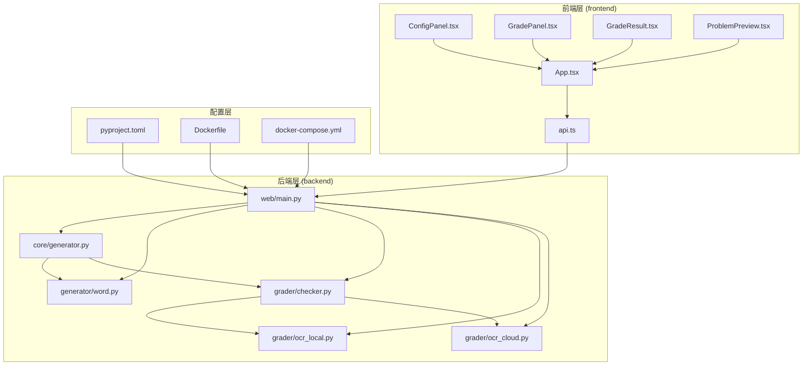
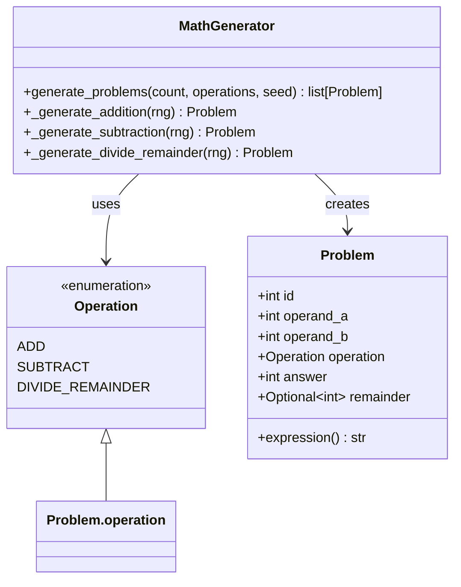
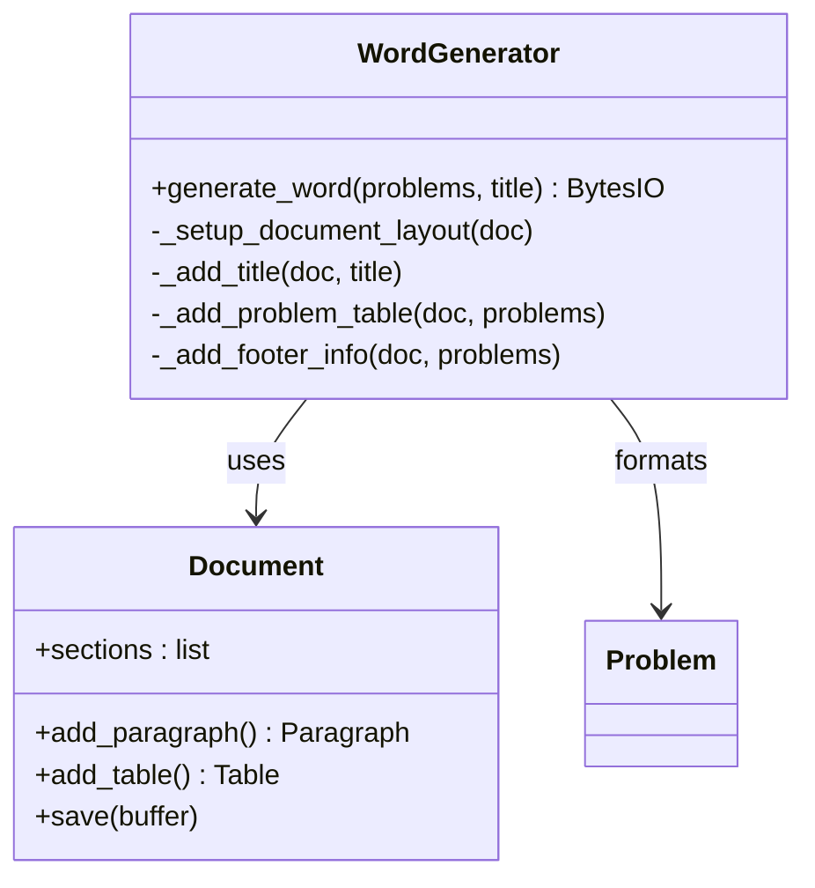
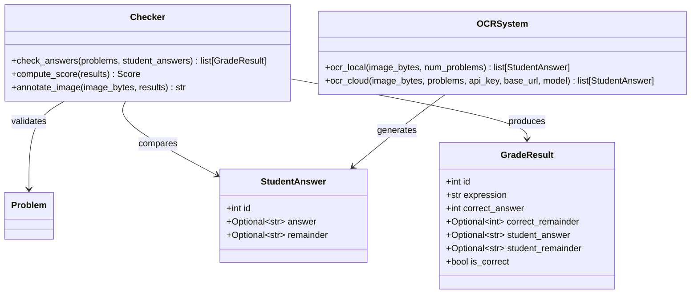
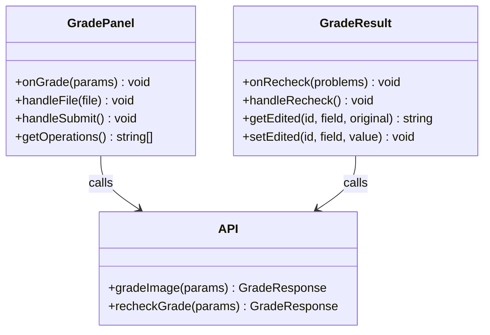
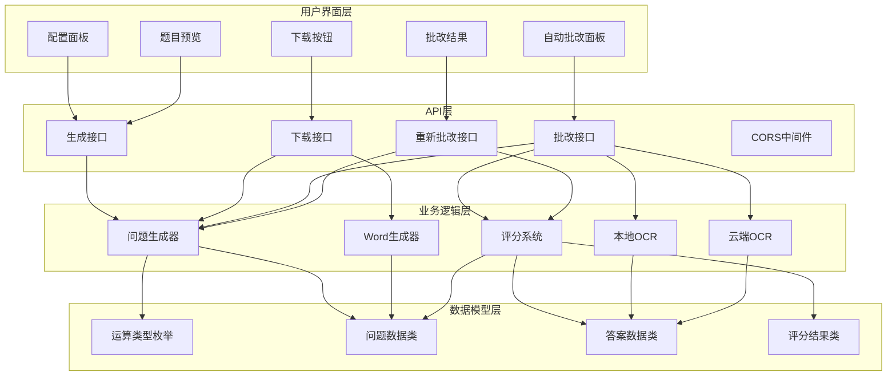
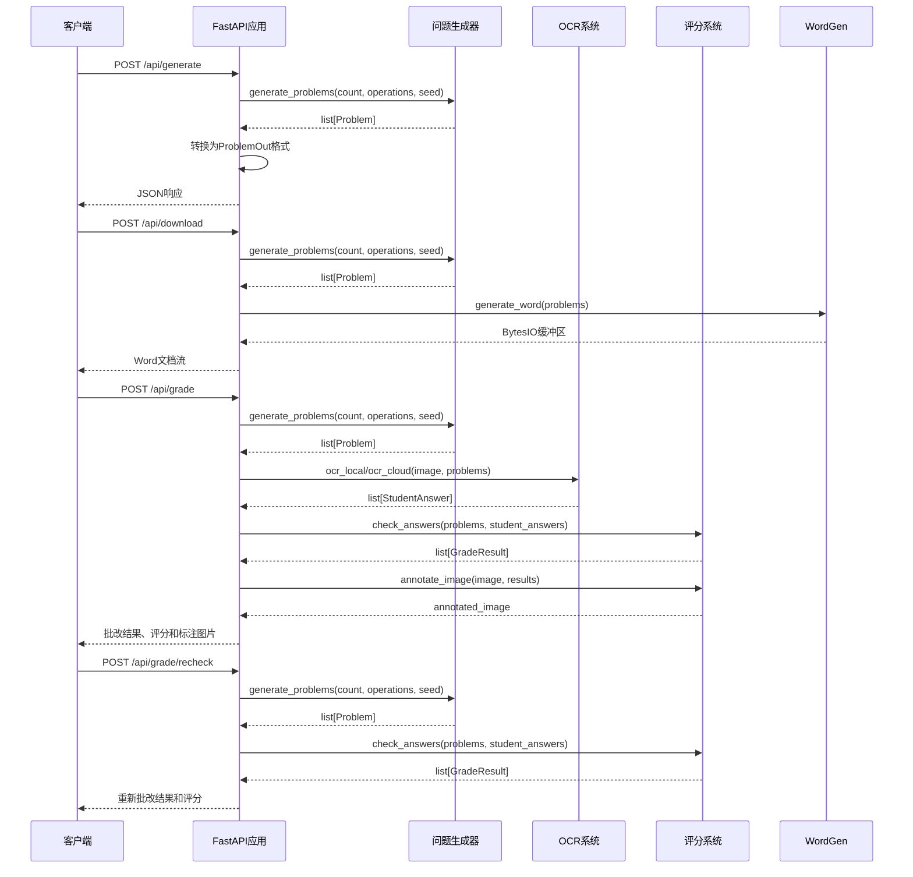
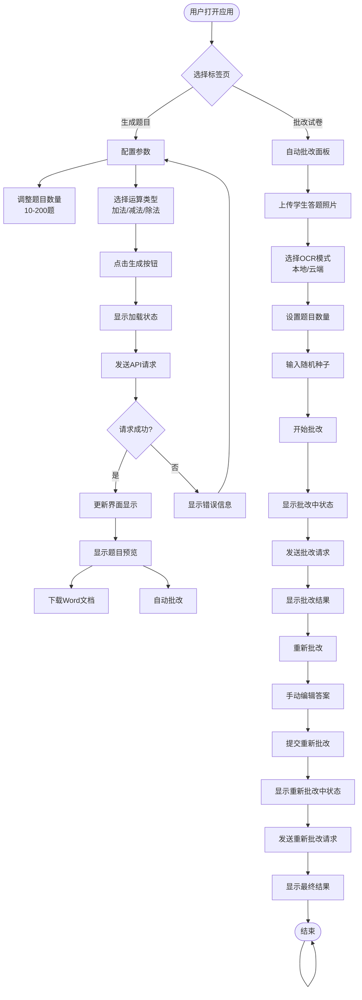
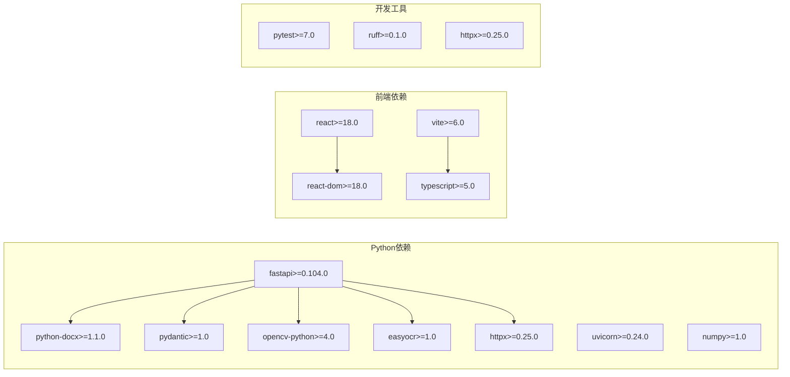
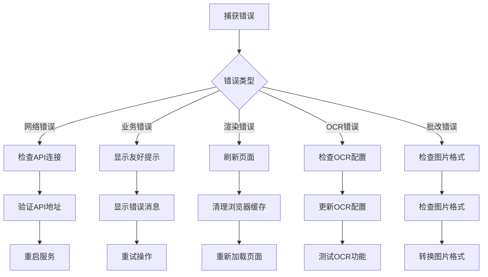

# 核心生成器

<cite>
**本文档引用的文件**
- [src/math_learning/core/generator.py](file://src/math_learning/core/generator.py)
- [src/math_learning/generator/word.py](file://src/math_learning/generator/word.py)
- [src/math_learning/web/main.py](file://src/math_learning/web/main.py)
- [tests/test_generator.py](file://tests/test_generator.py)
- [tests/test_grader.py](file://tests/test_grader.py)
- [src/math_learning/grader/checker.py](file://src/math_learning/grader/checker.py)
- [src/math_learning/grader/ocr_cloud.py](file://src/math_learning/grader/ocr_cloud.py)
- [src/math_learning/grader/ocr_local.py](file://src/math_learning/grader/ocr_local.py)
- [frontend/src/App.tsx](file://frontend/src/App.tsx)
- [frontend/src/components/ConfigPanel.tsx](file://frontend/src/components/ConfigPanel.tsx)
- [frontend/src/components/GradePanel.tsx](file://frontend/src/components/GradePanel.tsx)
- [frontend/src/components/GradeResult.tsx](file://frontend/src/components/GradeResult.tsx)
- [frontend/src/components/ProblemPreview.tsx](file://frontend/src/components/ProblemPreview.tsx)
- [frontend/src/api.ts](file://frontend/src/api.ts)
- [pyproject.toml](file://pyproject.toml)
- [Dockerfile](file://Dockerfile)
- [docker-compose.yml](file://docker-compose.yml)
</cite>

## 更新摘要
**变更内容**
- 新增带余数除法操作类型（DIVIDE_REMAINDER）
- 扩展Problem数据类以支持余数字段
- 添加带余数除法问题生成器和约束验证
- 更新表达式格式化逻辑以支持除法格式
- 增强评分系统以处理除法的商和余数
- 新增GradePanel和GradeResult组件实现自动批改功能
- 集成OCR自动批改系统，支持本地EasyOCR和云端AI视觉模型
- 实现重新批改功能，允许手动修正OCR结果
- 更新前端和API以支持新的运算类型和自动批改流程

## 目录
1. [简介](#简介)
2. [项目结构](#项目结构)
3. [核心组件](#核心组件)
4. [架构概览](#架构概览)
5. [详细组件分析](#详细组件分析)
6. [依赖关系分析](#依赖关系分析)
7. [性能考虑](#性能考虑)
8. [故障排除指南](#故障排除指南)
9. [结论](#结论)

## 简介

这是一个基于Python和React的数学学习项目，专注于生成100以内的加减法和带余数除法口算练习题。项目采用前后端分离架构，后端使用FastAPI提供RESTful API服务，前端使用React构建用户界面，支持在线预览、Word文档下载和OCR自动批改功能。

该系统的核心功能包括：
- 数学问题生成（加法、减法和带余数除法）
- Word文档格式化输出
- 在线预览和批量下载
- 可配置的问题数量和运算类型
- 随机种子确保结果可重现
- 智能评分系统支持除法的商和余数
- OCR自动批改功能，支持本地和云端识别模式
- 重新批改功能，允许手动修正答案

## 项目结构

项目采用模块化设计，主要分为四个核心部分：

**图表来源**
- [frontend/src/App.tsx:1-146](file://frontend/src/App.tsx#L1-L146)
- [src/math_learning/web/main.py:1-310](file://src/math_learning/web/main.py#L1-L310)
- [src/math_learning/core/generator.py:1-129](file://src/math_learning/core/generator.py#L1-L129)

**章节来源**
- [frontend/src/App.tsx:1-146](file://frontend/src/App.tsx#L1-L146)
- [src/math_learning/web/main.py:1-310](file://src/math_learning/web/main.py#L1-L310)
- [pyproject.toml:1-29](file://pyproject.toml#L1-L29)

## 核心组件

### 数学问题生成器

核心生成器负责创建符合教育要求的数学问题，确保所有计算结果都在100以内且满足基本的数学规则。现已支持三种运算类型：加法、减法和带余数除法。

**图表来源**
- [src/math_learning/core/generator.py:11-129](file://src/math_learning/core/generator.py#L11-L129)

### Word文档生成器

专门负责将生成的数学问题转换为格式化的Word文档，支持自定义标题和页面布局。现在能够正确处理带余数除法问题的特殊格式。

**图表来源**
- [src/math_learning/generator/word.py:22-88](file://src/math_learning/generator/word.py#L22-L88)

### 自动批改系统

增强的自动批改系统集成了OCR识别和智能评分功能，支持本地EasyOCR和云端AI视觉模型两种识别方式，并能分别验证除法的商和余数。

**图表来源**
- [src/math_learning/grader/checker.py:15-228](file://src/math_learning/grader/checker.py#L15-L228)
- [src/math_learning/grader/ocr_local.py:150-172](file://src/math_learning/grader/ocr_local.py#L150-L172)
- [src/math_learning/grader/ocr_cloud.py:85-167](file://src/math_learning/grader/ocr_cloud.py#L85-L167)

### 自动批改前端组件

新增的GradePanel和GradeResult组件提供了完整的自动批改用户界面，支持图片上传、OCR模式选择和批改结果显示。

**图表来源**
- [frontend/src/components/GradePanel.tsx:15-173](file://frontend/src/components/GradePanel.tsx#L15-L173)
- [frontend/src/components/GradeResult.tsx:12-108](file://frontend/src/components/GradeResult.tsx#L12-L108)
- [frontend/src/api.ts:79-125](file://frontend/src/api.ts#L79-L125)

**章节来源**
- [src/math_learning/core/generator.py:16-129](file://src/math_learning/core/generator.py#L16-L129)
- [src/math_learning/generator/word.py:1-88](file://src/math_learning/generator/word.py#L1-L88)
- [src/math_learning/grader/checker.py:1-228](file://src/math_learning/grader/checker.py#L1-L228)
- [frontend/src/components/GradePanel.tsx:1-173](file://frontend/src/components/GradePanel.tsx#L1-L173)
- [frontend/src/components/GradeResult.tsx:1-108](file://frontend/src/components/GradeResult.tsx#L1-L108)

## 架构概览

系统采用分层架构设计，实现了清晰的关注点分离。现在支持三种运算类型的统一处理流程和完整的自动批改功能：

**图表来源**
- [src/math_learning/web/main.py:18-310](file://src/math_learning/web/main.py#L18-L310)
- [src/math_learning/core/generator.py:11-129](file://src/math_learning/core/generator.py#L11-L129)

## 详细组件分析

### 后端API服务

FastAPI提供了高性能的RESTful API服务，支持CORS跨域访问和静态文件托管。现在支持三种运算类型的统一处理和完整的自动批改流程。

**图表来源**
- [src/math_learning/web/main.py:55-310](file://src/math_learning/web/main.py#L55-L310)
- [src/math_learning/core/generator.py:65-129](file://src/math_learning/core/generator.py#L65-L129)

### 前端交互组件

React组件提供了直观的用户界面，支持实时配置、预览和自动批改功能。现在支持三种运算类型的动态选择和完整的批改工作流程。

**图表来源**
- [frontend/src/App.tsx:12-146](file://frontend/src/App.tsx#L12-L146)
- [frontend/src/components/ConfigPanel.tsx:15-88](file://frontend/src/components/ConfigPanel.tsx#L15-L88)
- [frontend/src/components/GradePanel.tsx:15-173](file://frontend/src/components/GradePanel.tsx#L15-L173)

**章节来源**
- [src/math_learning/web/main.py:18-310](file://src/math_learning/web/main.py#L18-L310)
- [frontend/src/App.tsx:1-146](file://frontend/src/App.tsx#L1-L146)
- [frontend/src/components/ConfigPanel.tsx:1-88](file://frontend/src/components/ConfigPanel.tsx#L1-L88)
- [frontend/src/components/GradePanel.tsx:1-173](file://frontend/src/components/GradePanel.tsx#L1-L173)
- [frontend/src/components/GradeResult.tsx:1-108](file://frontend/src/components/GradeResult.tsx#L1-L108)

## 依赖关系分析

项目依赖关系清晰明确，遵循了模块化设计原则。新增的自动批改功能增强了系统的教育价值和实用性。

**图表来源**
- [pyproject.toml:10-21](file://pyproject.toml#L10-L21)

**章节来源**
- [pyproject.toml:1-29](file://pyproject.toml#L1-L29)
- [frontend/package.json:11-22](file://frontend/package.json#L11-L22)

## 性能考虑

### 内存优化策略

1. **流式响应处理**：Word文档生成使用BytesIO缓冲区，避免大文件内存占用
2. **按需生成**：问题生成在API调用时进行，减少不必要的计算
3. **分页布局**：Word文档采用表格布局，支持大量问题的高效展示
4. **图像批改优化**：评分系统使用numpy数组进行高效的图像处理
5. **OCR结果缓存**：OCR系统支持懒加载和单例模式，减少资源消耗

### 并发处理能力

- FastAPI基于异步I/O，能够处理高并发请求
- 问题生成算法时间复杂度O(n)，其中n为问题数量
- Word文档生成支持流式传输，降低服务器内存压力
- 图像批改系统优化了OpenCV操作的性能
- OCR云端接口使用异步HTTP客户端，提高响应速度

### 缓存机制

当前版本未实现缓存，但可以考虑：
- 对于相同配置的重复请求，可实现短期缓存
- 大量重复问题的去重处理
- OCR结果的临时存储
- 标注图片的缓存机制

## 故障排除指南

### 常见问题及解决方案

#### API错误处理

| 错误类型 | 状态码 | 描述 | 解决方案 |
|---------|--------|------|----------|
| 参数验证错误 | 422 | 请求参数不符合约束 | 检查count范围(1-200)，operations不能为空 |
| 业务逻辑错误 | 400 | 生成逻辑异常 | 验证随机种子和运算类型配置 |
| 服务器内部错误 | 500 | 未知服务器错误 | 检查日志文件和依赖安装 |
| OCR错误 | 502 | 云端OCR失败 | 检查API密钥和网络连接 |
| OCR错误 | 500 | 本地OCR失败 | 检查EasyOCR安装和模型文件 |

#### 前端错误处理

**图表来源**
- [frontend/src/App.tsx:12-146](file://frontend/src/App.tsx#L12-L146)
- [frontend/src/api.ts:20-50](file://frontend/src/api.ts#L20-L50)

#### Docker部署问题

1. **构建失败**：检查网络连接和镜像源配置
2. **端口冲突**：修改docker-compose.yml中的端口映射
3. **权限问题**：确保Docker服务正常运行
4. **OpenCV依赖**：确保系统已安装OpenCV相关库
5. **EasyOCR模型**：首次运行时可能需要下载模型文件

**章节来源**
- [tests/test_generator.py:105-141](file://tests/test_generator.py#L105-L141)
- [frontend/src/api.ts:20-50](file://frontend/src/api.ts#L20-L50)

## 结论

该数学学习项目展现了良好的软件工程实践，现已支持带余数除法功能和完整的自动批改系统，具有以下特点：

### 技术优势
- **模块化设计**：清晰的分层架构便于维护和扩展
- **类型安全**：Python类型注解和Pydantic模型确保数据完整性
- **测试覆盖**：完善的单元测试和集成测试保证代码质量
- **容器化部署**：Docker支持简化部署流程
- **智能批改**：支持除法的商和余数分别验证
- **多模式OCR**：支持本地EasyOCR和云端AI视觉模型
- **用户友好**：直观的React界面和流畅的交互体验

### 功能特性
- **教育导向**：专注于100以内加减法和带余数除法的实用练习
- **输出多样化**：支持在线预览、Word文档下载和自动批改
- **配置灵活**：可调节题目数量和运算类型
- **评分精确**：支持除法的商和余数分别评分
- **批改智能**：支持重新批改和手动修正
- **OCR识别**：支持本地和云端两种识别模式

### 改进建议
1. **性能优化**：实现API缓存和数据库持久化
2. **功能扩展**：支持更多运算类型和难度级别
3. **国际化**：添加多语言支持
4. **统计功能**：记录用户练习历史和进度
5. **个性化设置**：支持用户自定义题目格式和样式
6. **移动端适配**：优化移动端用户体验
7. **批改历史**：保存和查看历史批改记录

该项目为数学教育应用提供了一个优秀的参考实现，新增的带余数除法功能和自动批改系统显著提升了系统的教育价值和实用性，代码结构清晰、功能完整，适合进一步的功能扩展和维护。