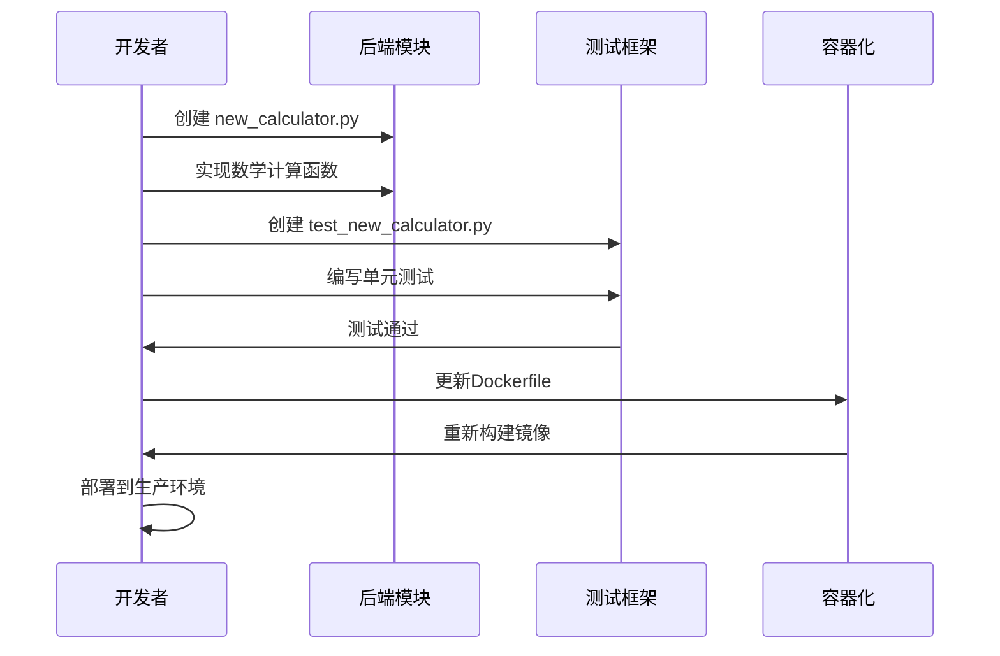

# 项目结构

<cite>
**本文档引用的文件**
- [pyproject.toml](file://pyproject.toml)
- [.gitignore](file://.gitignore)
- [src/math_learning/__init__.py](file://src/math_learning/__init__.py)
- [src/math_learning/core/generator.py](file://src/math_learning/core/generator.py)
- [src/math_learning/generator/word.py](file://src/math_learning/generator/word.py)
- [src/math_learning/web/main.py](file://src/math_learning/web/main.py)
- [tests/test_generator.py](file://tests/test_generator.py)
- [Dockerfile](file://Dockerfile)
- [docker-compose.yml](file://docker-compose.yml)
- [frontend/package.json](file://frontend/package.json)
</cite>

## 更新摘要
**变更内容**
- 新增核心数学问题生成器模块分析
- 添加Word文档生成功能说明
- 详细描述FastAPI Web服务架构
- 更新技术栈选择和依赖关系
- 新增Docker容器化部署配置
- 完善前端React/Vite架构说明

## 目录结构概览

数学学习项目采用现代化的全栈架构设计，包含Python后端、React前端和Docker容器化部署。项目结构清晰，模块职责明确，体现了完整的软件工程最佳实践。

```mermaid
graph TB
subgraph "项目根目录"
Root[项目根目录]
subgraph "后端源代码"
Src[src/]
MathLearning[src/math_learning/]
Core[core/]
Generator[generator/]
Web[web/]
InitPy[src/math_learning/__init__.py]
End
subgraph "前端源代码"
Frontend[frontend/]
FrontendSrc[frontend/src/]
Components[frontend/src/components/]
AppTsx[frontend/src/App.tsx]
ApiTs[frontend/src/api.ts]
End
subgraph "测试目录"
Tests[tests/]
TestGenerator[tests/test_generator.py]
End
subgraph "配置文件"
PyProject[pyproject.toml]
Dockerfile[Dockerfile]
DockerCompose[docker-compose.yml]
GitIgnore[.gitignore]
End
End
Root --> Src
Root --> Frontend
Root --> Tests
Root --> PyProject
Root --> Dockerfile
Root --> DockerCompose
Root --> GitIgnore
Src --> MathLearning
MathLearning --> Core
MathLearning --> Generator
MathLearning --> Web
MathLearning --> InitPy
Frontend --> FrontendSrc
FrontendSrc --> Components
FrontendSrc --> AppTsx
FrontendSrc --> ApiTs
Tests --> TestGenerator
```

**图表来源**
- [pyproject.toml:1-29](file://pyproject.toml#L1-L29)
- [src/math_learning/core/generator.py:1-102](file://src/math_learning/core/generator.py#L1-L102)
- [src/math_learning/generator/word.py:1-88](file://src/math_learning/generator/word.py#L1-L88)
- [src/math_learning/web/main.py:1-102](file://src/math_learning/web/main.py#L1-L102)
- [tests/test_generator.py:1-141](file://tests/test_generator.py#L1-L141)

## 核心组件分析

### 源代码包结构

项目采用标准的Python包结构，所有源代码都位于`src/`目录下，实现了清晰的模块化设计。

#### 主包结构
- **src/math_learning/**: 主要的数学学习包
- **src/math_learning/core/**: 核心算法实现
- **src/math_learning/generator/**: 文档生成器
- **src/math_learning/web/**: Web服务层
- **src/math_learning/__init__.py**: 包初始化文件，定义包版本信息

#### 包初始化文件功能
- 定义`__version__`变量，用于包版本管理
- 提供包级别的文档字符串
- 作为包的入口点，支持从外部导入

**章节来源**
- [src/math_learning/__init__.py:1-4](file://src/math_learning/__init__.py#L1-L4)

### 核心数学问题生成器

#### 核心模块 (`core/generator.py`)
实现了数学问题的生成逻辑，支持加法和减法运算。

**主要功能特性**:
- **Operation枚举**: 定义支持的运算类型（ADD, SUBTRACT）
- **Problem数据类**: 表示单个数学问题，包含操作数、运算符和答案
- **表达式格式化**: 自动生成格式化的数学表达式
- **随机数生成**: 支持种子参数确保可重现性
- **范围验证**: 确保生成的问题符合数学规则

**章节来源**
- [src/math_learning/core/generator.py:1-102](file://src/math_learning/core/generator.py#L1-L102)

### Word文档生成器

#### 文档生成模块 (`generator/word.py`)
基于python-docx库创建格式化的Word文档。

**主要功能特性**:
- **布局设计**: 固定4列网格布局，适合口算练习
- **页面设置**: A4纸张尺寸，合理的边距设置
- **样式配置**: 字体大小、对齐方式和间距控制
- **标题模板**: 包含姓名、班级、日期等信息区域
- **页脚信息**: 显示题目数量和生成日期

**章节来源**
- [src/math_learning/generator/word.py:1-88](file://src/math_learning/generator/word.py#L1-L88)

### FastAPI Web服务

#### Web服务层 (`web/main.py`)
提供RESTful API接口，支持问题生成和Word文档下载。

**主要功能特性**:
- **FastAPI框架**: 现代化的异步Web框架
- **CORS支持**: 开发环境的跨域资源共享配置
- **请求验证**: Pydantic模型验证输入参数
- **响应格式**: 标准化的JSON响应结构
- **静态文件服务**: 生产环境的前端资源托管

**章节来源**
- [src/math_learning/web/main.py:1-102](file://src/math_learning/web/main.py#L1-L102)

## 测试框架准备

测试目录结构完整，涵盖了单元测试、集成测试和API测试。

#### 测试包结构
- **tests/**: 测试代码根目录
- **tests/test_generator.py**: 数学问题生成器测试

#### 测试覆盖范围
- **核心算法测试**: 生成器的正确性和边界条件
- **Word文档测试**: 文档生成的有效性和格式
- **API接口测试**: FastAPI端点的功能和错误处理
- **参数验证测试**: 输入参数的验证和错误响应

**章节来源**
- [tests/test_generator.py:1-141](file://tests/test_generator.py#L1-L141)

## 配置文件详解

### pyproject.toml 配置文件

该项目使用现代Python打包配置文件，替代传统的setup.py和setup.cfg。

#### 构建系统配置
- **build-backend**: 使用setuptools构建后端
- **requires**: 指定构建依赖（setuptools>=68.0, wheel）

#### 项目元数据配置
- **name**: "math-learning" - 项目名称
- **version**: "0.1.0" - 初始版本号
- **description**: "A math learning project" - 项目描述
- **requires-python**: ">=3.10" - Python版本要求

#### 依赖管理
- **dependencies**: 运行时依赖
  - fastapi>=0.104.0: Web框架
  - uvicorn[standard]>=0.24.0: ASGI服务器
  - python-docx>=1.1.0: Word文档处理
- **optional-dependencies.dev**: 开发依赖组
  - pytest>=7.0: 测试框架
  - ruff>=0.1.0: 代码格式化和质量检查工具
  - httpx>=0.25.0: HTTP客户端测试

#### 包发现配置
- **tool.setuptools.packages.find.where**: ["src"] - 指定包查找路径
- **tool.ruff**: 代码风格配置
  - line-length: 88 - 行长度限制
  - target-version: py310 - 目标Python版本

**章节来源**
- [pyproject.toml:1-29](file://pyproject.toml#L1-L29)

### .gitignore 版本控制配置

版本控制忽略文件确保不会提交不必要的文件到Git仓库。

#### Python相关忽略
- `__pycache__/`: 编译后的Python字节码缓存
- `*.py[cod]`: 编译后的Python文件
- `*.egg-info/`: 打包信息目录

#### 分发和构建产物
- `dist/`: 分发包输出目录
- `build/`: 构建输出目录
- `*.egg`: 打包产物

#### 虚拟环境
- `.venv/`, `venv/`, `env/`: 常见虚拟环境目录

#### IDE和操作系统
- `.idea/`, `.vscode/`: IDE配置
- `.DS_Store`, `Thumbs.db`: 操作系统文件

#### 测试和代码质量
- `.pytest_cache/`: pytest缓存
- `.coverage`, `htmlcov/`: 覆盖率报告
- `.ruff_cache/`: Ruff代码检查缓存

#### 前端构建产物
- `frontend/node_modules/`: Node.js依赖
- `frontend/dist/`: 前端构建输出

**章节来源**
- [.gitignore:1-39](file://.gitignore#L1-L39)

## 技术栈选择分析

### 后端技术栈

#### Python生态系统
- **FastAPI**: 现代化的异步Web框架，提供自动API文档
- **Pydantic**: 数据验证和序列化，确保API输入输出的正确性
- **python-docx**: Word文档生成，支持复杂的文档格式化

#### 开发工具链
- **Ruff**: 高性能的代码格式化和质量检查工具
- **pytest**: 功能强大的测试框架，支持异步测试

### 前端技术栈

#### React/Vite架构
- **React 18.3.1**: 用户界面库，支持并发特性和更好的性能
- **TypeScript**: 类型安全的JavaScript超集
- **Vite**: 现代化的构建工具，提供快速的开发体验

#### 开发环境
- **React DOM**: 用户界面渲染
- **@types/react**: React类型定义
- **@vitejs/plugin-react**: Vite的React插件

**章节来源**
- [frontend/package.json:1-23](file://frontend/package.json#L1-L23)

## Docker容器化部署

### 多阶段构建流程

#### 前端构建阶段
- **Node.js Alpine镜像**: 轻量级的前端构建环境
- **npm ci**: 安装依赖，使用淘宝镜像加速
- **Vite构建**: 生产环境的前端资源构建

#### Python应用阶段
- **Python 3.12 Slim**: 轻量级Python运行时
- **依赖安装**: 使用阿里云镜像加速pip安装
- **源码复制**: 复制Python源代码和构建好的前端资源

#### 运行配置
- **端口暴露**: 8000端口
- **Uvicorn**: ASGI服务器，支持异步请求处理
- **时区配置**: 上海时区设置

**章节来源**
- [Dockerfile:1-28](file://Dockerfile#L1-L28)

### docker-compose配置

#### 服务定义
- **math-learning**: 主要服务名称
- **端口映射**: 8000:8000
- **重启策略**: unless-stopped
- **环境变量**: 时区设置

**章节来源**
- [docker-compose.yml:1-9](file://docker-compose.yml#L1-L9)

## 标准Python包结构最佳实践

### 目录组织原则

1. **src/目录结构**: 将所有源代码放在src/目录下，避免与包名冲突
2. **功能模块化**: 按功能领域划分模块，如core、generator、web
3. **独立的测试目录**: tests/目录与源代码分离，便于测试发现
4. **明确的包边界**: 每个包都有清晰的职责划分
5. **版本控制隔离**: .gitignore排除构建产物和缓存文件

### 包设计模式

#### 包初始化策略
- 在`__init__.py`中定义包级别的常量和版本信息
- 提供包的公共接口
- 支持从包外导入

#### 模块化设计
- 将相关功能组织在同一个包内
- 使用清晰的模块命名
- 保持模块间的低耦合高内聚

## 版本控制策略

### Git工作流程

1. **分支管理**: 建议使用功能分支开发，主分支保持稳定
2. **提交规范**: 使用清晰的提交消息，描述变更内容
3. **标签管理**: 发布版本时创建Git标签
4. **持续集成**: 集成CI/CD流程进行自动化测试

### 文件管理策略

#### 忽略规则分类
- **编译产物**: 自动排除Python字节码和打包文件
- **开发环境**: 排除IDE和编辑器特定文件
- **临时文件**: 忽略缓存和日志文件
- **虚拟环境**: 不提交虚拟环境文件
- **前端构建**: 排除node_modules和dist目录

## 开发工作流程

### 本地开发环境设置

1. **Python环境**: 使用Python 3.10+创建隔离环境
2. **安装依赖**: `pip install -e ".[dev]"` 安装开发包
3. **前端环境**: 在frontend目录安装Node.js依赖
4. **代码检查**: 使用Ruff进行代码质量检查
5. **单元测试**: 使用pytest运行测试套件

### 容器化开发

1. **Docker构建**: `docker-compose build` 构建镜像
2. **服务启动**: `docker-compose up` 启动服务
3. **开发调试**: 通过8000端口访问应用
4. **热重载**: 前端Vite支持实时刷新

### 代码质量保证

#### 代码格式化
- 使用Ruff统一代码风格
- 遵循PEP 8编码规范
- 维持适当的行长度限制

#### 测试驱动开发
- 编写测试用例验证功能
- 使用pytest框架进行测试
- 维持高覆盖率的测试套件

## 实际扩展指南

### 添加新模块的步骤

#### 步骤1：创建模块文件
在相应的包目录下创建新的Python模块文件：
- 命名遵循Python命名约定（小写字母和下划线）
- 文件扩展名为`.py`
- 包含适当的文档字符串和类型注解

#### 步骤2：更新包初始化
在`src/math_learning/__init__.py`中：
- 导入新模块或类
- 更新包的公共接口
- 维护版本信息

#### 步骤3：编写测试文件
在`tests/`目录下创建对应的测试文件：
- 文件命名以`test_`前缀开头
- 使用pytest装饰器标记测试函数
- 编写完整的测试用例

#### 步骤4：更新配置文件
根据需要更新相关配置文件：
- `pyproject.toml`: 添加运行时依赖
- `docker-compose.yml`: 添加新的服务配置
- `frontend/package.json`: 添加前端依赖

### 示例：添加数学计算模块



**图表来源**
- [pyproject.toml:10-14](file://pyproject.toml#L10-L14)
- [tests/test_generator.py:1-141](file://tests/test_generator.py#L1-L141)

### 添加测试文件的标准流程

#### 测试文件命名规范
- 使用`test_`前缀命名测试文件
- 与被测试模块同名或相关联
- 避免使用特殊字符和空格

#### 测试用例组织
- 使用pytest装饰器标记测试函数
- 编写清晰的测试描述
- 覆盖正常和异常情况
- 使用参数化测试提高效率

#### 测试数据管理
- 使用fixtures管理测试数据
- 保持测试数据的独立性
- 清理测试产生的临时数据

## 性能考虑

### 代码组织优化

#### 模块加载性能
- 避免循环导入
- 使用延迟导入减少启动时间
- 优化包导入顺序

#### 内存使用优化
- 及时释放不需要的对象
- 使用生成器处理大数据集
- 避免全局状态污染

### 构建和分发优化

#### 包大小控制
- 移除未使用的依赖
- 优化资源文件大小
- 使用压缩技术减少包体积

#### 安装性能
- 减少安装时的计算开销
- 优化依赖解析过程
- 提供预编译的二进制文件

### 前端性能优化

#### 构建优化
- Vite的快速开发服务器
- 按需加载和代码分割
- 生产环境的资源压缩

#### 运行时优化
- React的虚拟DOM优化
- TypeScript的编译时检查
- 最小化的运行时依赖

## 故障排除指南

### 常见问题解决

#### 包导入问题
- 确保`src/`目录在Python路径中
- 检查包初始化文件的正确性
- 验证模块路径的相对性

#### 测试运行失败
- 检查pytest配置是否正确
- 验证测试文件命名规范
- 确认测试依赖已正确安装

#### 构建错误
- 检查Python版本兼容性
- 验证构建依赖的版本
- 确认打包配置正确

#### Docker部署问题
- 检查镜像构建日志
- 验证端口映射配置
- 确认环境变量设置

### 调试技巧

#### 日志记录
- 使用标准logging模块记录调试信息
- 设置适当的日志级别
- 输出关键执行路径的信息

#### 错误处理
- 实现优雅的错误处理机制
- 提供有意义的错误消息
- 记录错误堆栈跟踪

## 结论

数学学习项目采用了现代化的全栈架构设计，结合了Python后端的强大功能和React前端的用户体验。项目结构清晰，模块职责明确，技术栈选择合理，为数学教育应用的开发提供了坚实的技术基础。

### 项目优势

1. **完整的功能模块**: 核心算法、文档生成、Web服务、前端界面
2. **现代化技术栈**: FastAPI、React、Vite、Docker
3. **完善的测试体系**: 单元测试、集成测试、API测试
4. **容器化部署**: 多阶段构建，生产环境友好
5. **版本控制友好**: 全面的.gitignore配置，便于协作开发

### 扩展建议

1. **功能模块化**: 按数学领域进一步细分功能模块
2. **数据库集成**: 添加用户管理和进度跟踪功能
3. **国际化支持**: 多语言界面和内容支持
4. **移动端适配**: 响应式设计和移动端优化
5. **监控和日志**: 添加应用性能监控和错误追踪

这个项目结构为数学学习应用的开发奠定了坚实的基础，支持未来的功能扩展和技术演进，体现了现代软件工程的最佳实践。